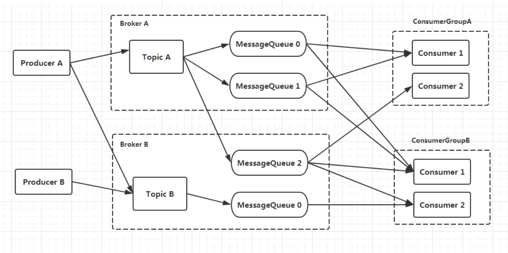
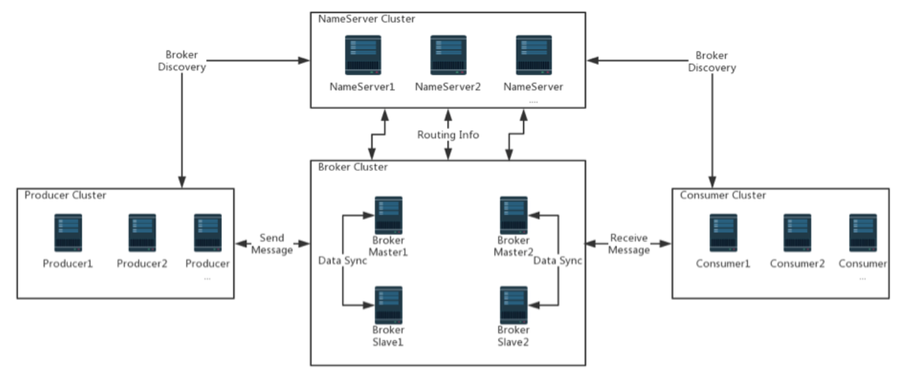
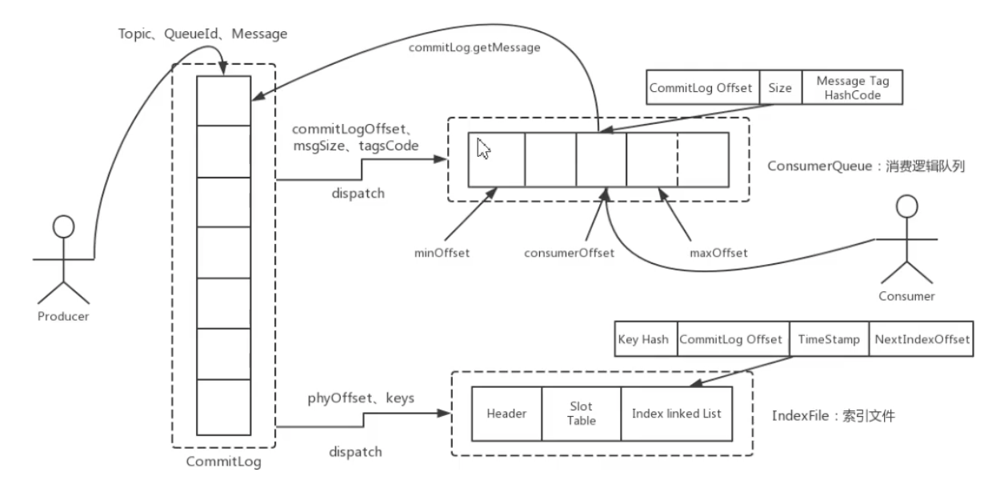
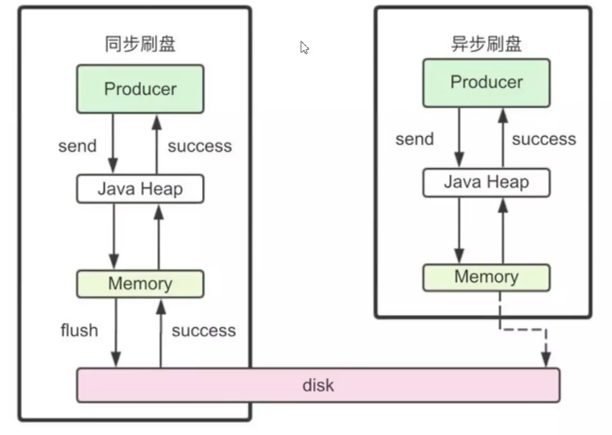

# 一、基础概念

相关文档在源码工程中都有

## 1.1 生产者

生产者发送业务系统产生的消息给broker。RocketMQ提供了多种发送方式：同步的、异步的、单向的。

### 1.1.1 生产者组

具有相同角色的生产者被分到一组。假如原始的生产者在事务后崩溃，broker会联系同一生产者组中的不同生产者实例，继续提交或回滚事务。这就要求生产者也必须有服务功能，也就是server端，提供给broker在事务中进行回查。

## 1.2 消费者

一个消费者从broker拉取信息，并将信息返还给应用。为了我们应用的正确性，提供了两种消费者类型：

### 1.2.1 拉取式消费者

拉式消费者从broker拉取消息，一旦一批消息被拉取，用户应用系统将发起消费过程。

### 1.2.2 推送式消费者

推式消费者，从另一方面讲，囊括了消息的拉取、消费过程，并保持了内部的其他工作，留下了一个回调
接口给终端用户去实现，实现在消息到达时要执行的内容。

### 1.2.3 消费者组

具有相同角色的消费者被组在一起，称为消费者组。它是一个伟大的概念，它完成了负载均衡和容错的目标。
就消费消息而言，它是非常容易的。**一个消费组中的消费者实例必须有确定的相同的订阅topic。**

## 1.3 Topic

Topic是一个消息的目录，在这个目录中，生产者传送消息，消费者拉取消息，是一个逻辑概念，表示一类消息。Topic与生产者和消费者之间的关系非常的宽松。明确的，一个Topic可以有0、1个或多个生产者向它发送消息。相反的，一个生产者可以发送不同Topic的消息。在消费者方面，一个Topic可以被0、1个或多个消费者组订阅。相似的，一个消费者组可以订阅1个或多个Topic，只要组内的消费者实例保持订阅的一致性。

## 1.4 Message（消息）

消息是被传递的信息。一个消息必须有一个Topic，它可以理解为信件上的地址。一个消息也可以有一个可选的tag，和额外的key-value对。例如：你可以设置业务中的键到你的消息中，在broker服务中查找消息，以便在开发期间诊断问题。tag可以理解为一个子topic，而额外的key-value可以理解为自己设置的消息属性，消费的时候可以用来过滤。

## 1.5 消息队列

Topic被分割成一个或多个消息队列。队列分为三种角色：异步主、同步主、从。如果你不能容忍消息丢失，我们建议你部署同步主，并加一个从队列。如果你容忍丢失，但你希望队列总是可用，你可以部署异步主和从队列。如果你想最简单，你只需要一个异步主，不需要从队列。

消息保存磁盘的方式也有两种，推荐使用的是异步保存，同步保存是昂贵的并会导致性能损失，如果你想要可靠性，我们推荐你使用同步主+从的方式。

消息队列是实际存放消息的结构，分布在broker上面。一个topic对应多个分布在不同broker上面的消息队列

## 1.6 Tag（标签）

标签，用另外一个词来说，就是子主题，为用户提供额外的灵活性。具有相同Topic的消息可以有不同的tag。

## 1.7 Broker（队列）

Broker是RocketMQ的一个主要组件，它接收生产者发送的消息，存储它们并准备处理消费者的拉取请求。它也存储消息相关的元数据，包括消费组，消费成功的偏移量，主题、队列的信息。

## 1.8 名称服务

名称服务充当路由消息的功能。Broker Server会在启动时向所有的Name Server注册自己的服务信息，并且后续通过心跳请求的方式来保证这个服务的实时性。生产者或消费者能够通过名称服务查找各主题相应的Broker IP列表，多个Namesrv实例组成集群，但相互独立，没有信息交换。类似于spring eureka注册中心或zookeeper。

## 1.9 基本模型

```
Producer  -->  Topic  --> Consumer
```

实际生产中会复杂很多





这里注意，生产者也需要在某个组中，并且还要提供给broker在事务中回查的服务功能。


# 二、消息存储

## 2.1 何时存储消息

分布式队列因为有高可靠性的要求，所以数据要进行持久化存储。

1、MQ收到一条消息后，需要向生产者返回一个ACK响应，并将消息存储起来

2、MQ Push 一条消息给消费者后，等待消费者的ACK响应，需要将消息标记为已消费。如果没有标记为消费，MQ会不断尝试往消费者推送这条消息

3、MQ需要定期删除一些过期的消息，这样才能保证服务一直可用


## 2.2 消息存储介质

RocketMQ采用的是类似于Kafka的文件存储机制，即直接用磁盘文件来保存消息，二不需要借助MySQL这一类存储工具。

### 2.2.1 磁盘保存文件慢吗？

磁盘如果使用得当，速度完全可以匹配上网络的传输速度。目前的高性能磁盘，顺序写速度可以达到600MB/s，超过了一般网卡的速度。但是磁盘随机写的速度大概只有100KB/s，和顺序写速度的性能相差太多。因为有如此巨大的速度差别，好的消息队列系统会比普通的消息队列系统快很多个数量级。RocketMQ的消息用顺序写保证了消息存储的速度。

磁盘正常情况下我们在使用的时候需要寻址，找到一块能写入的扇区，然后写入，如果一次性由于数据太大放不下，那就得另外寻址存入。而这里的顺序写入就是预先占用一大块磁盘扇区，然后写入的时候就顺序写入，不需要每次寻址，这样速度就大大提高了。

### 2.2.2 零拷贝技术加速文件读写

Linux操作系统分为用户态和内核态，文件操作、网络操作需要涉及这两种形态的切换，免不了进行数据复制。一台服务器把本机磁盘文件的内容发送到客户端，一般分为两个步骤：

1、read：读取本地文件内容

2、write：将读取到内容通过网络发送出去

这两个看似简单的操作，实际进行了四次数据复制，分别是：

1、从磁盘复制数据到内核态内存

2、从内核态内存复制到用户态内存

3、然后从用户态内存复制到网络驱动的内核态内存

4、最后是从网络驱动的内核态内存复制到网卡中进行传输

而通过使用mmap的方式，可以省去向用户态的内存复制（而只是复制一个内存地址，也就是省去了上面的第二步，然后执行完相关逻辑后直接从内核态内存复制到网络驱动的内核态内存中），提高速度。这种机制在java中是通过NIO包中的MappedByteBuffer实现的。RocketMQ充分利用了上述特性，也就是所谓的“零拷贝”技术，提高消息存盘和网络发送的速度。这里注意：采用MappedByteBuffer这种内存映射的方式有几个限制，其中之一是一次只能映射1.5～2G的文件到用户态的虚拟内存，这也是为何RocketMQ默认设置单个CommitLog日志数据文件为1G的原因了。当然还有一种更快的方式，就是SendFile技术，这种方式就是直接走DMA，没有大小限制，但是不能对文件进行一些逻辑操作。

### 2.2.3 异步刷盘


# 三、消息存储结构

RocketMQ消息的存储分为三部分（在之前的配置文件中都有配置相应的路径）：

CommitLog：存储消息的元数据。所有消息都会顺序存入到CommitLog文件当中。其由多个文件组成，每个文件固定大小为1G。以第一条消息的偏移量为文件名

ConsumerQueue：存储消息在CommitLog的索引。一个MessageQueue一个文件，记录当前MessageQueue被哪些消费者组消费到了哪一条CommitLog。

IndexFile：为消息查询提供了一种通过key或时间区间来查询消息的方法，这种通过IndexFile来查找消息的方法不影响发送与消费消息的主流程



消费的时候可以从开始和结尾开始消费，此时通过ConsumerQueue中的相关参数就可以实现，同时还可以配置从某个时间点进行消费，消费的时候还可以进行过滤，此时就用到了IndexFile。

```
yj@yj:~/rocketmq/store_master$ ls index/
20210726125223797
yj@yj:~/rocketmq/store_master$ ls commitlog/
00000000000000000000
yj@yj:~/rocketmq/store_master$ ls consumequeue/
BatchTopicTest  OrderTopic  RMQ_SYS_TRACE_TOPIC  TopicTest
```

一般来说消息会轮询的发给多个broker上面的多个MessageQueue，但是这种情况下消费的时候消息是不能保证顺序的，如果要保证顺序，那么消息就需要配置往某个broker上面的某个MessageQueue上面发，这样在消费的时候就可以保证顺序了。

而消费的时候一个broker上面的某个MessageQueue上面的消息只能由消费者组中的某个消费者消费，这样才能保证消费的offset偏移。而消费又分为集群消费和广播消费，广播消费就是消费某个Topic下面所有MessageQueue上面的消费，而集群消费就会进行平均分配给集群中的消费者进行消费，当然平均的方式有多种，可以通过consumer的属性进行设置。


# 四、刷盘机制



如图所示，这里有同步刷盘和异步刷盘两种方式，可以通过配置文件中的flushDiskTYpe进行配置（默认为异步）。两种方式都是在消息过来之后将其存入到缓存，同步方式就是先存入到硬盘，然后响应，而异步方式就是存入到缓存之后直接返回，另外有线程去将内存中的数据存入到硬盘中，这种方式效率较高，但是如果还未将数据从内存存入到硬盘时断电，则有可能导致消息丢失。


# 五、消息重试

消息在发送过程中出现异常，导致没有被消费，此时broker会自动创建一个重试的队列，所有需要重试的消息都放在这里，等待后面重试，重试的次数默认是16次，如果16次后还是失败了，那么将这个消息存入一个死信队列中。当然这个次数也是可以配置的。死信队列需要自己手动处理。

死信队列的特征：

1、一个死信队列对应一个ConsumeGroup，而不是对应某个消费者实例

2、如果一个ConsumeGroup没有产生死信队列，RocketMQ就不会为其创建相应的死信队列

3、一个死信队列包含了这个ConsumeGroup立的所有死信消息，而不区分该消息属于哪个Topic

4、死信队列中的消息不回再被消费者正常消费

5、死信队列的有效期跟正常消息相同。默认三天，对应broker.conf中的fileReservedTime属性。超过这个最长时间的消息都会被删除，而不管消费是否消费过。

通常，一条消息进入了死信队列，意味着消息再消费处理的过程中出现了比较严重的错误，并且无法自行恢复。此时，一般需要人工查看死信队列中的消息，对错误原因进行排查，然后对死信消息进行处理，如转发到正常的Topic重新进行消费或者丢弃。

注意：默认创建出来的死信队列，其中的消息是无法读取的，在控制台和消费者中都无法读取，因为这些默认的死信队列，他们的权限perm被设置成了2:禁读（2:禁读，4:禁写，6:可读写），需要手动配置为6才能被消息。


# 六、消息幂等

在MQ系统中，对于消息幂等有三种实现语义

1、at most once 最多一次：每条消息最多只会被消费一次。可以直接使用异步发送、sendOneWay就可以

2、at least once 至少一次：每次消费至少会被消费一次。同步发送、事务消息等很多方式可以实现

3、exactly once 刚好一次：每条消息都会被确定的消费一次。这个是一种比较难以保证的，RocketMQ无法保证此方式，但是阿里云商业版有支持。建议使用业务标识如订单号来标识

**消息幂等的必要性：**

1、发送时消息重复

当一条消息已被成功发送到服务端并完成持久化，此时出现了网络闪断或者客户端宕机，导致服务端对客户端应答失败。如果此时生产者意识到消息发送失败并尝试再次发送消息，消费者后续还会收到两条内容相同并且MessageID也相同的消息

2、投递时消息重复

消息消费的场景下，消息已投递到消费者并完成业务处理，当客户端给服务端反馈应答的时候网络闪断，为了保证消息至少被消费一次，消息队列的服务端将在网络恢复后再次尝试投递之前已被处理过的消息，消费者后续会收到两条内容相同并且MessageID相同的消息

3、负载均衡时消息重复（包括但不限于网络抖动、Broker重启以及订阅方式应用重启）

当消息队列的Broker或客户端重启、扩容或缩容时，会出发Rebalance，此时消费者可能会收到重复消息

**处理方式：**

从上面的分析中，在RocketMQ中，是无法保证每个消息只被投递一次的，所以要在业务上自行来保证消息消费的幂等性。而要处理这个问题，RocketMQ的每条消息都有一个唯一的MessageId，这个参数在多次投递过程中是不会改变的，所以业务上可以使用这个MessageId来作为判断幂等的依据。但是这个MessageId是无法保证全局唯一的，也会有冲突的情况。所以在一些对幂等性要求严格的场景，最好是使用业务上唯一的标识，比如订单号等。


