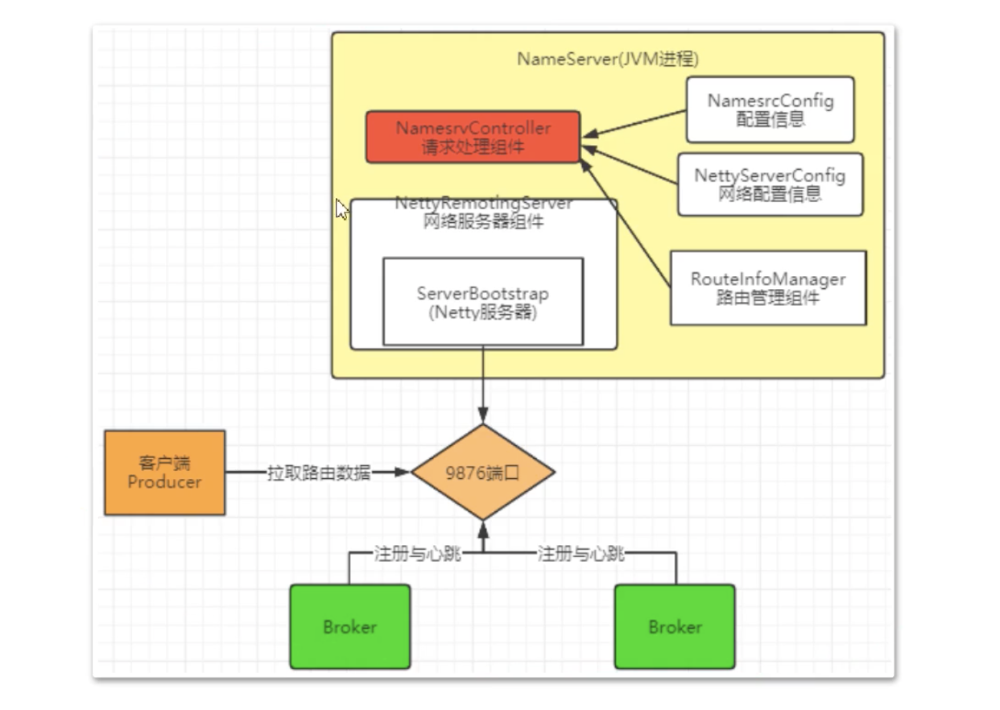

# 一、基本说明

这里使用的是`4.5.1`版本代码进行分析

工程打开后首先需要将`distribution`模块下面的`conf`目录拷贝一份到根目录，然后`namesrv`启动的时候默认会从环境变量下面去找配置，需要在启动配置处配置环境变量

```
ROCKETMQ_HOME=/Users/YJ/study/java-work/rocketmq
```

然后就可以启动`namesrv`模块了。


对于broker模块，可以通过BrokerStartup来进行启动，当然也需要配置启动环境变量

```
// Programe arguments指定配置文件
-c /Users/YJ/study/java-work/rocketmq/conf/broker.conf
// Envirenment varialbes
ROCKETMQ_HOME=/Users/YJ/study/java-work/rocketmq;NAMESRV_ADDR=127.0.0.1:9876
```

启动后就可以使用之前测试使用的例子进行测试了，只是需要将服务地址修改一下


几个核心的模块

- **namesrv**：命名发现服务，broker 服务的管理与路由
- **broker**：核心组件，接收 `producer`发送的消息和消息的存储与`consumer` 的消息消费
- **client**：客户端实现，`producer`和 `consumer`的实现模块
- **store**：存储层实现，消息持久化、索引服务、高可用 HA 服务实现
- **remoting**：通信层实现，基于 Netty 的底层封装，服务间的交互通讯都依赖此模块
- **filter**：消息过滤服务，相当于在`broker`和`consumer`中间加入了一个 filter 代理
- **common**：模块间通用的功能类、方法、配置文件、常量等
- **tools**：命令管理工具，提供了消息查询、topic 管理等功能
- **example**：官方提供的例子，对典型的功能比如 order message，push consumer，pull consumer 的用法进行了示范


# 二、源码分析

## 2.1 NameServer



### 2.1.1 启动

```java
public static NamesrvController main0(String[] args) {
  try {
    NamesrvController controller = createNamesrvController(args);
    start(controller);
    // ...
```

在此方法中主要的内容就是NamesrvController的构建和启动。

**构建nameServer**

```java
public NamesrvController(NamesrvConfig namesrvConfig, NettyServerConfig nettyServerConfig) {
  this.namesrvConfig = namesrvConfig;
  this.nettyServerConfig = nettyServerConfig;
  this.kvConfigManager = new KVConfigManager(this);
  this.routeInfoManager = new RouteInfoManager();
  this.brokerHousekeepingService = new BrokerHousekeepingService(this);
  this.configuration = new Configuration(
    log,
    this.namesrvConfig, this.nettyServerConfig
  );
  this.configuration.setStorePathFromConfig(this.namesrvConfig, "configStorePath");
}
```

可以看到构建nameServer主要是设置一些配置，主要有自己本身的配置信息和Netty服务的配置信息，同时会将-c指定的配置文件信息设置进来

```java
controller.getConfiguration().registerConfig(properties);
```

**启动nameServer**

```java
public static NamesrvController start(final NamesrvController controller) throws Exception {
  // nameServer初始化
  boolean initResult = controller.initialize();
  if (!initResult) {
    controller.shutdown();
    System.exit(-3);
  }

  // 设置nameServer关闭回调
  Runtime.getRuntime().addShutdownHook(new ShutdownHookThread(log, new Callable<Void>() {
    @Override
    public Void call() throws Exception {
      controller.shutdown();
      return null;
    }
  }));

  // 启动nameServer
  controller.start();
  return controller;
}
```

**初始化**

```java
public boolean initialize() {

  // 加载 KV 配置
  this.kvConfigManager.load();

  // 创建Netty网络对象
  this.remotingServer = new NettyRemotingServer(this.nettyServerConfig, this.brokerHousekeepingService);
  // Netty工作线程池
  this.remotingExecutor =
    Executors.newFixedThreadPool(nettyServerConfig.getServerWorkerThreads(), new ThreadFactoryImpl("RemotingExecutorThread_"));

  this.registerProcessor();

  // 定时任务，对broker进行检测，延迟5s执行，每10s检测一次，移除不活跃对broker
  this.scheduledExecutorService.scheduleAtFixedRate(new Runnable() {

    @Override
    public void run() {
      NamesrvController.this.routeInfoManager.scanNotActiveBroker();
    }
  }, 5, 10, TimeUnit.SECONDS);

  // nameServer每隔10分钟打印一次KV配置
  this.scheduledExecutorService.scheduleAtFixedRate(new Runnable() {

    @Override
    public void run() {
      NamesrvController.this.kvConfigManager.printAllPeriodically();
    }
  }, 1, 10, TimeUnit.MINUTES);
	// ....
  return true;
}
```

**启动**

```java
public void start() throws Exception {
  // 启动netty服务器
  this.remotingServer.start();

  if (this.fileWatchService != null) {
    this.fileWatchService.start();
  }
}
```


### 2.1.2 路由

**路由元信息**


## 2.2 Broker启动


## 2.3 Broker注册


## 2.4 Producer


## 2.5 消息存储


## 2.6 Consumer


## 2.7 延迟消费


