# 一、基本说明

这里使用的是`4.5.1`版本代码进行分析

工程打开后首先需要将`distribution`模块下面的`conf`目录拷贝一份到根目录，然后`namesrv`启动的时候默认会从环境变量下面去找配置，需要在启动配置处配置环境变量

```
ROCKETMQ_HOME=/Users/YJ/study/java-work/rocketmq
```

然后就可以启动`namesrv`模块了。


对于broker模块，可以通过BrokerStartup来进行启动，当然也需要配置启动环境变量

```
// Programe arguments指定配置文件
-c /Users/YJ/study/java-work/rocketmq/conf/broker.conf
// Envirenment varialbes
ROCKETMQ_HOME=/Users/YJ/study/java-work/rocketmq;NAMESRV_ADDR=127.0.0.1:9876
```

启动后就可以使用之前测试使用的例子进行测试了，只是需要将服务地址修改一下，可以使用quickstart中的例子进行测试。这里先启动consumer，然后再启动producer。可以对源码进行调试。


几个核心的模块

- **namesrv**：命名发现服务，broker 服务的管理与路由
- **broker**：核心组件，接收 `producer`发送的消息和消息的存储与`consumer` 的消息消费
- **client**：客户端实现，`producer`和 `consumer`的实现模块
- **store**：存储层实现，消息持久化、索引服务、高可用 HA 服务实现
- **remoting**：通信层实现，基于 Netty 的底层封装，服务间的交互通讯都依赖此模块
- **filter**：消息过滤服务，相当于在`broker`和`consumer`中间加入了一个 filter 代理
- **common**：模块间通用的功能类、方法、配置文件、常量等
- **tools**：命令管理工具，提供了消息查询、topic 管理等功能
- **example**：官方提供的例子，对典型的功能比如 order message，push consumer，pull consumer 的用法进行了示范


# 二、源码分析

## 2.1 NameServer


### 2.1.1 启动

```java
public static NamesrvController main0(String[] args) {
  try {
    NamesrvController controller = createNamesrvController(args);
    start(controller);
    // ...
```

在此方法中主要的内容就是NamesrvController的构建和启动。

**构建nameServer**

```java
public NamesrvController(NamesrvConfig namesrvConfig, NettyServerConfig nettyServerConfig) {
  this.namesrvConfig = namesrvConfig;
  this.nettyServerConfig = nettyServerConfig;
  this.kvConfigManager = new KVConfigManager(this);
  this.routeInfoManager = new RouteInfoManager();
  this.brokerHousekeepingService = new BrokerHousekeepingService(this);
  this.configuration = new Configuration(log,this.namesrvConfig, this.nettyServerConfig
  );
  this.configuration.setStorePathFromConfig(this.namesrvConfig, "configStorePath");
}
```

可以看到构建nameServer主要是设置一些配置，主要有自己本身的配置信息和Netty服务的配置信息，同时会将-c指定的配置文件信息设置进来

```java
controller.getConfiguration().registerConfig(properties);
```

**启动nameServer**

```java
public static NamesrvController start(final NamesrvController controller) throws Exception {
  // nameServer初始化
  boolean initResult = controller.initialize();
  if (!initResult) {
    controller.shutdown();
    System.exit(-3);
  }

  // 设置nameServer关闭回调
  Runtime.getRuntime().addShutdownHook(new ShutdownHookThread(log, new Callable<Void>() {
    @Override
    public Void call() throws Exception {
      controller.shutdown();
      return null;
    }
  }));

  // 启动nameServer
  controller.start();
  return controller;
}
```

**初始化**

```java
public boolean initialize() {

  // 加载 KV 配置
  this.kvConfigManager.load();

  // 创建Netty网络对象
  this.remotingServer = new NettyRemotingServer(this.nettyServerConfig, this.brokerHousekeepingService);
  // Netty工作线程池
  this.remotingExecutor =
    Executors.newFixedThreadPool(nettyServerConfig.getServerWorkerThreads(), new ThreadFactoryImpl("RemotingExecutorThread_"));

  this.registerProcessor();

  // 定时任务，对broker进行检测，延迟5s执行，每10s检测一次，移除不活跃对broker
  this.scheduledExecutorService.scheduleAtFixedRate(new Runnable() {
    @Override
    public void run() {
      NamesrvController.this.routeInfoManager.scanNotActiveBroker();
    }
  }, 5, 10, TimeUnit.SECONDS);

  // nameServer每隔10分钟打印一次KV配置
  this.scheduledExecutorService.scheduleAtFixedRate(new Runnable() {

    @Override
    public void run() {
      NamesrvController.this.kvConfigManager.printAllPeriodically();
    }
  }, 1, 10, TimeUnit.MINUTES);
	// ....
  return true;
}
```

**启动**

```java
public void start() throws Exception {
  // 启动netty服务器
  this.remotingServer.start();

  if (this.fileWatchService != null) {
    this.fileWatchService.start();
  }
}
```


### 2.1.2 路由

**路由元信息**

```java
public class RouteInfoManager {
    // Topic 消息队列路由信息，消息发送时根据路由表进行负载均衡
    private final HashMap<String/* topic */, List<QueueData>> topicQueueTable;
    // Broker 基础信息， 包含 brokerName、 所属集群名称 、 主备 Broker 地址
    private final HashMap<String/* brokerName */, BrokerData> brokerAddrTable;
    // Broker 集群信息，存储集群中所有 Broker 名称
    private final HashMap<String/* clusterName */, Set<String/* brokerName */>> clusterAddrTable;
    // Broker 状态信息 。 NameServer 每次收到心跳包时会 替换该信息
    private final HashMap<String/* brokerAddr */, BrokerLiveInfo> brokerLiveTable;
    // Broker上的 FilterServer列表，用于类模式消息过滤
    private final HashMap<String/* brokerAddr */, List<String>/* Filter Server */> filterServerTable;
}
public class QueueData implements Comparable<QueueData> {
    // broker名字
    private String brokerName;
    // topic被读取的队列数
    private int readQueueNums;
    // topic消息写入的队列数
    private int writeQueueNums;
    // 读写权限
    private int perm;
    // 同步标记
    private int topicSynFlag;
}
public class BrokerData implements Comparable<BrokerData> {
    // broker所属集群名字
    private String cluster;
    // broker名字
    private String brokerName;
    // brokerId=0表示Master，大于0表示Slave
    private HashMap<Long/* brokerId */, String/* broker address */> brokerAddrs;
}
class BrokerLiveInfo {
    //NameServer上次收到心跳包时间
    private long lastUpdateTimestamp;
    private DataVersion dataVersion;
    private Channel channel;
    //master地址，初次请求是值为空，slave向NameServer注册后返回
    private String haServerAddr;
```


### 2.1.3 服务状态管理

**一种方式是主动探测：**

主动探测是由路由方（比如 NameServer）发起的，每一个被路由方（比如 Broker）需要打开一个端口，然后路由方每隔一段时间（比如 30 秒）探测这些端口是否可用，如果可用就认为服务器正常，否则认为服务不可用，就把服务从列表中删除。这种方式存在的问题就**路由方压力可能过大**，如果被路由方部署的实例较多时，那么每次探测的成本会比较高，探测的时间也比较长，可能会导致路由方可能不能正常工作。

**另一种就是心跳模式：**

心跳模式不在是路由方发起了，改成被路由方每隔一段时间向路由方发送心跳包，路由方记录被路由方的心跳包，包括服务器IP、上报时间等。每一次上报后，更新对应的信息。路由方启动一个定时器，定期检测当前时间和节点，最近续约时间的差值，如果达到一个阈值（比如说90秒），那么认为这个服务节点不可用。

现在大部分需要服务状态管理的中间件，都采用**心跳模式**，没有太多的缺陷，也不会对服务器造成多大的压力。在 RocketMQ 中 NameServer 与 Broker 的通信也是采用 **心跳模式**。

对于broker的心跳机制后面再说，这里先看nameServer机制，之前nameServer初始化的时候注册过broker检测定时任务，每10s执行一次，具体逻辑如下

```java
public void scanNotActiveBroker() {
  Iterator<Entry<String, BrokerLiveInfo>> it = this.brokerLiveTable.entrySet().iterator();
  while (it.hasNext()) {
    Entry<String, BrokerLiveInfo> next = it.next();
    long last = next.getValue().getLastUpdateTimestamp();
    // 120s不活跃，则移除
    if ((last + BROKER_CHANNEL_EXPIRED_TIME) < System.currentTimeMillis()) {
      RemotingUtil.closeChannel(next.getValue().getChannel());
      it.remove();
      log.warn("The broker channel expired, {} {}ms", next.getKey(), BROKER_CHANNEL_EXPIRED_TIME);
      this.onChannelDestroy(next.getKey(), next.getValue().getChannel());
    }
  }
}
```

逻辑比较简单。


## 2.2 Broker启动

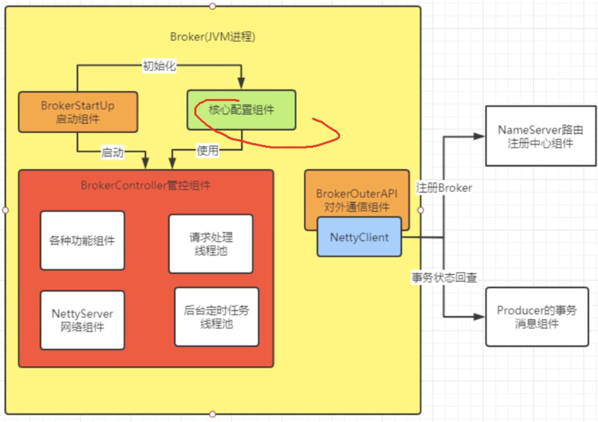

```java
// BrokerStartup.java, BrokerController.java
public static void main(String[] args) {
  start(createBrokerController(args));
}
public static BrokerController start(BrokerController controller) {
  try {
    // 这里注册所有的broker
    controller.start();
    //......
    return null;
  }
public void start() throws Exception {
    this.registerBrokerAll(true, false, true);
    this.scheduledExecutorService.scheduleAtFixedRate(new Runnable() {

      @Override
      public void run() {
        try {
          BrokerController.this.registerBrokerAll(true, false, brokerConfig.isForceRegister());
        } catch (Throwable e) {
          log.error("registerBrokerAll Exception", e);
        }
      }
    }, 1000 * 10, Math.max(10000, Math.min(brokerConfig.getRegisterNameServerPeriod(), 60000)), TimeUnit.MILLISECONDS);
  }

public static BrokerController createBrokerController(String[] args) {
    System.setProperty(RemotingCommand.REMOTING_VERSION_KEY, Integer.toString(MQVersion.CURRENT_VERSION));

    // 设置发送缓存大小
    if (null == System.getProperty(NettySystemConfig.COM_ROCKETMQ_REMOTING_SOCKET_SNDBUF_SIZE)) {
      NettySystemConfig.socketSndbufSize = 131072;
    }
    // 设置接收缓存大小
    if (null == System.getProperty(NettySystemConfig.COM_ROCKETMQ_REMOTING_SOCKET_RCVBUF_SIZE)) {
      NettySystemConfig.socketRcvbufSize = 131072;
    }

    try {
      //PackageConflictDetect.detectFastjson();
      //......

      // 核心配置信息
      final BrokerConfig brokerConfig = new BrokerConfig();
      // 作为服务端需要接收消息
      final NettyServerConfig nettyServerConfig = new NettyServerConfig();
      // 作为客户端需要发送心跳，需要处理事务消息
      final NettyClientConfig nettyClientConfig = new NettyClientConfig();

      // TSL相关
      nettyClientConfig.setUseTLS(Boolean.parseBoolean(System.getProperty(TLS_ENABLE,
                                                                          String.valueOf(TlsSystemConfig.tlsMode == TlsMode.ENFORCING))));
      // 设置监听端口
      nettyServerConfig.setListenPort(10911);
      final MessageStoreConfig messageStoreConfig = new MessageStoreConfig();

      if (BrokerRole.SLAVE == messageStoreConfig.getBrokerRole()) {
        int ratio = messageStoreConfig.getAccessMessageInMemoryMaxRatio() - 10;
        messageStoreConfig.setAccessMessageInMemoryMaxRatio(ratio);
      }

      // 启动一个broker的时候通过-c指定配置文件路径
      if (commandLine.hasOption('c')) {
        String file = commandLine.getOptionValue('c');
        if (file != null) {
          configFile = file;
          InputStream in = new BufferedInputStream(new FileInputStream(file));
          properties = new Properties();
          properties.load(in);

          properties2SystemEnv(properties);
          MixAll.properties2Object(properties, brokerConfig);
          MixAll.properties2Object(properties, nettyServerConfig);
          MixAll.properties2Object(properties, nettyClientConfig);
          MixAll.properties2Object(properties, messageStoreConfig);

          BrokerPathConfigHelper.setBrokerConfigPath(file);
          in.close();
        }
      }

      //......

      // 从配种文件中获取nameServer地址信息
      String namesrvAddr = brokerConfig.getNamesrvAddr();
      if (null != namesrvAddr) {
        try {
          String[] addrArray = namesrvAddr.split(";");
          for (String addr : addrArray) {
            RemotingUtil.string2SocketAddress(addr);
          }
        } catch (Exception e) {
          System.out.printf(
            "The Name Server Address[%s] illegal, please set it as follows, \"127.0.0.1:9876;192.168.0.1:9876\"%n",
            namesrvAddr);
          System.exit(-3);
        }
      }
      // ......
      // 创建controller
      final BrokerController controller = new BrokerController(
        brokerConfig,
        nettyServerConfig,
        nettyClientConfig,
        messageStoreConfig);
      // remember all configs to prevent discard
      controller.getConfiguration().registerConfig(properties);

      // 初始化
      boolean initResult = controller.initialize();
      if (!initResult) {
        controller.shutdown();
        System.exit(-3);
      }

      // 设置回调方法
      Runtime.getRuntime().addShutdownHook(new Thread(new Runnable() {
        private volatile boolean hasShutdown = false;
        private AtomicInteger shutdownTimes = new AtomicInteger(0);

        @Override
        public void run() {
          synchronized (this) {
            log.info("Shutdown hook was invoked, {}", this.shutdownTimes.incrementAndGet());
            if (!this.hasShutdown) {
              this.hasShutdown = true;
              long beginTime = System.currentTimeMillis();
              controller.shutdown();
              long consumingTimeTotal = System.currentTimeMillis() - beginTime;
              log.info("Shutdown hook over, consuming total time(ms): {}", consumingTimeTotal);
            }
          }
        }
      }, "ShutdownHook"));
      return controller;
    } catch (Throwable e) {
      e.printStackTrace();
      System.exit(-1);
    }
    return null;
  }
```

这里主要关注初始化操作

```java
public boolean initialize() throws CloneNotSupportedException {
  // 从硬盘加载配置文件
  boolean result = this.topicConfigManager.load();
  result = result && this.consumerOffsetManager.load();
  result = result && this.subscriptionGroupManager.load();
  result = result && this.consumerFilterManager.load();

  if (result) {
    try {
      // 消息存储管理组件
      this.messageStore = new DefaultMessageStore(this.messageStoreConfig,
                                                  this.brokerStatsManager, this.messageArrivingListener, this.brokerConfig);
      if (messageStoreConfig.isEnableDLegerCommitLog()) {
        DLedgerRoleChangeHandler roleChangeHandler =
          new DLedgerRoleChangeHandler(this, (DefaultMessageStore) messageStore);
        ((DLedgerCommitLog)((DefaultMessageStore) messageStore).getCommitLog())
        .getdLedgerServer().getdLedgerLeaderElector()
          .addRoleChangeHandler(roleChangeHandler);
      }
      // broker统计组件
      this.brokerStats = new BrokerStats((DefaultMessageStore) this.messageStore);
      //load plugin
      MessageStorePluginContext context =
        new MessageStorePluginContext(messageStoreConfig, brokerStatsManager, messageArrivingListener, brokerConfig);
      this.messageStore = MessageStoreFactory.build(context, this.messageStore);
      this.messageStore.getDispatcherList()
        .addFirst(new CommitLogDispatcherCalcBitMap(this.brokerConfig, this.consumerFilterManager));
    } catch (IOException e) {
      result = false;
      log.error("Failed to initialize", e);
    }
  }

  result = result && this.messageStore.load();

  if (result) {
    // Netty网络配置加载
    this.remotingServer = new xxxxx(this.nettyServerConfig, this.clientHousekeepingService);
    NettyServerConfig fastConfig = (NettyServerConfig) this.nettyServerConfig.clone();
    fastConfig.setListenPort(nettyServerConfig.getListenPort() - 2);
    this.fastRemotingServer = new NettyRemotingServer(fastConfig, this.clientHousekeepingService);

    // 发送线程池
    this.sendMessageExecutor = new BrokerFixedThreadPoolExecutor(
      this.brokerConfig.getSendMessageThreadPoolNums(),
      this.brokerConfig.getSendMessageThreadPoolNums(),
      1000 * 60,
      TimeUnit.MILLISECONDS,
      this.sendThreadPoolQueue,
      new ThreadFactoryImpl("SendMessageThread_"));
    // 消息接收线程池，处理consume推送请求
    this.pullMessageExecutor = new BrokerFixedThreadPoolExecutor(
      this.brokerConfig.getPullMessageThreadPoolNums(),
      this.brokerConfig.getPullMessageThreadPoolNums(),
      1000 * 60,
      TimeUnit.MILLISECONDS,
      this.pullThreadPoolQueue,
      new ThreadFactoryImpl("PullMessageThread_"));
    // 消息查询线程池
    this.queryMessageExecutor = new BrokerFixedThreadPoolExecutor(
      this.brokerConfig.getQueryMessageThreadPoolNums(),
      this.brokerConfig.getQueryMessageThreadPoolNums(),
      1000 * 60,
      TimeUnit.MILLISECONDS,
      this.queryThreadPoolQueue,
      new ThreadFactoryImpl("QueryMessageThread_"));

    // 命令管理线程池
    this.adminBrokerExecutor =
      Executors.newFixedThreadPool(this.brokerConfig.getAdminBrokerThreadPoolNums(), new ThreadFactoryImpl(
        "AdminBrokerThread_"));

    // 客户端线程池
    this.clientManageExecutor = new ThreadPoolExecutor(
      this.brokerConfig.getClientManageThreadPoolNums(),
      this.brokerConfig.getClientManageThreadPoolNums(),
      1000 * 60,
      TimeUnit.MILLISECONDS,
      this.clientManagerThreadPoolQueue,
      new ThreadFactoryImpl("ClientManageThread_"));

    // 心跳管理线程池
    this.heartbeatExecutor = new BrokerFixedThreadPoolExecutor(
      this.brokerConfig.getHeartbeatThreadPoolNums(),
      this.brokerConfig.getHeartbeatThreadPoolNums(),
      1000 * 60,
      TimeUnit.MILLISECONDS,
      this.heartbeatThreadPoolQueue,
      new ThreadFactoryImpl("HeartbeatThread_", true));

    // 事务结束线程池
    this.endTransactionExecutor = new BrokerFixedThreadPoolExecutor(
      this.brokerConfig.getEndTransactionThreadPoolNums(),
      this.brokerConfig.getEndTransactionThreadPoolNums(),
      1000 * 60,
      TimeUnit.MILLISECONDS,
      this.endTransactionThreadPoolQueue,
      new ThreadFactoryImpl("EndTransactionThread_"));

    // 消费者管理线程池
    this.consumerManageExecutor =
      Executors.newFixedThreadPool(this.brokerConfig.getConsumerManageThreadPoolNums(), new ThreadFactoryImpl(
        "ConsumerManageThread_"));
    // 注册
    this.registerProcessor();

    final long initialDelay = UtilAll.computNextMorningTimeMillis() - System.currentTimeMillis();
    final long period = 1000 * 60 * 60 * 24;
    // broker相关统计任务
    this.scheduledExecutorService.scheduleAtFixedRate(new Runnable() {
      @Override
      public void run() {
        try {
          BrokerController.this.getBrokerStats().record();
        } catch (Throwable e) {
          log.error("schedule record error.", e);
        }
      }
    }, initialDelay, period, TimeUnit.MILLISECONDS);

    // consume消费offset持久化到硬盘任务
    this.scheduledExecutorService.scheduleAtFixedRate(new Runnable() {
      @Override
      public void run() {
        try {
          BrokerController.this.consumerOffsetManager.persist();
        } catch (Throwable e) {
          log.error("schedule persist consumerOffset error.", e);
        }
      }
    }, 1000 * 10, this.brokerConfig.getFlushConsumerOffsetInterval(), TimeUnit.MILLISECONDS);

    // 将consume到filter持久化，同时也可以看出过滤策略是用在broker上面的
    this.scheduledExecutorService.scheduleAtFixedRate(new Runnable() {
      @Override
      public void run() {
        try {
          BrokerController.this.consumerFilterManager.persist();
        } catch (Throwable e) {
          log.error("schedule persist consumer filter error.", e);
        }
      }
    }, 1000 * 10, 1000 * 10, TimeUnit.MILLISECONDS);

    //......

    // 设置nameServer的地址列表，可以通过本地加载，也可以通过远程请求加载
    if (this.brokerConfig.getNamesrvAddr() != null) {
      this.brokerOuterAPI.updateNameServerAddressList(this.brokerConfig.getNamesrvAddr());
      log.info("Set user specified name server address: {}", this.brokerConfig.getNamesrvAddr());
    } else if (this.brokerConfig.isFetchNamesrvAddrByAddressServer()) {
      this.scheduledExecutorService.scheduleAtFixedRate(new Runnable() {

        @Override
        public void run() {
          try {
            BrokerController.this.brokerOuterAPI.fetchNameServerAddr();
          } catch (Throwable e) {
            log.error("ScheduledTask fetchNameServerAddr exception", e);
          }
        }
      }, 1000 * 10, 1000 * 60 * 2, TimeUnit.MILLISECONDS);
    }
    //......
    // 这里使用了SPI机制，就是加载通过文件配置的实现（继承共同的一个接口）
    initialTransaction();
    initialAcl();
    initialRpcHooks();
  }
  return result;
}
```

启动方法中主要是向nameServer注册broker信息

## 2.3 Broker注册

RocketMQ路由注册是通过 Broker与 NameServer的心跳功能实现的。 Broker启动时向集群中所有的 NameServer发送心跳包, 每隔 30s 向集群中所有 NameServer 发送心跳包，NameServer收到Broker心跳包时会更新brokerLiveTable缓存中BrokerLivelnfo的 lastUpdateTimestamp，然后 NameServer每隔 10s扫描 brokerLiveTable，如果连续 120s没 有收到心跳包， NameServer将移除该 Broker的路由信息同时关闭 Socket连接。

```java
public void start() throws Exception {
    this.registerBrokerAll(true, false, true);
    this.scheduledExecutorService.scheduleAtFixedRate(new Runnable() {
      @Override
      public void run() {
        try {
          BrokerController.this.registerBrokerAll(true, false, brokerConfig.isForceRegister());
        } catch (Throwable e) {
          log.error("registerBrokerAll Exception", e);
        }
      }
    }, 1000 * 10, Math.max(10000, Math.min(brokerConfig.getRegisterNameServerPeriod(), 60000)), TimeUnit.MILLISECONDS);
}

public synchronized void registerBrokerAll(final boolean checkOrderConfig, boolean oneway, boolean forceRegister) {
  // Topic相关配置信息
  TopicConfigSerializeWrapper topicConfigWrapper = this.getTopicConfigManager().buildTopicConfigSerializeWrapper();

  if (!PermName.isWriteable(this.getBrokerConfig().getBrokerPermission())
      || !PermName.isReadable(this.getBrokerConfig().getBrokerPermission())) {
    ConcurrentHashMap<String, TopicConfig> topicConfigTable = new ConcurrentHashMap<String, TopicConfig>();
    for (TopicConfig topicConfig : topicConfigWrapper.getTopicConfigTable().values()) {
      TopicConfig tmp =
        new TopicConfig(topicConfig.getTopicName(), topicConfig.getReadQueueNums(), topicConfig.getWriteQueueNums(),
                        this.brokerConfig.getBrokerPermission());
      topicConfigTable.put(topicConfig.getTopicName(), tmp);
    }
    topicConfigWrapper.setTopicConfigTable(topicConfigTable);
  }

  // 这里先判断是否需要注册，如果需要则进行注册
  if (forceRegister || needRegister(this.brokerConfig.getBrokerClusterName(),
                                    this.getBrokerAddr(),
                                    this.brokerConfig.getBrokerName(),
                                    this.brokerConfig.getBrokerId(),
                                    this.brokerConfig.getRegisterBrokerTimeoutMills())) {
    doRegisterBrokerAll(checkOrderConfig, oneway, topicConfigWrapper);
  }
}

private boolean needRegister(final String clusterName,
                             final String brokerAddr,
                             final String brokerName,
                             final long brokerId,
                             final int timeoutMills) {

  TopicConfigSerializeWrapper topicConfigWrapper = this.getTopicConfigManager().buildTopicConfigSerializeWrapper();
  // 这里是向nameServer发送请求，确认是否需要注册
  List<Boolean> changeList = brokerOuterAPI.needRegister(clusterName, brokerAddr, brokerName, brokerId, topicConfigWrapper, timeoutMills);
  boolean needRegister = false;
  for (Boolean changed : changeList) {
    if (changed) {
      needRegister = true;
      break;
    }
  }
  return needRegister;
}
// 这里会遍历所有的nameServer注册broker
private void doRegisterBrokerAll(boolean checkOrderConfig, boolean oneway,
                                 TopicConfigSerializeWrapper topicConfigWrapper) {
  List<RegisterBrokerResult> registerBrokerResultList = this.brokerOuterAPI.registerBrokerAll(
    this.brokerConfig.getBrokerClusterName(),
    this.getBrokerAddr(),
    this.brokerConfig.getBrokerName(),
    this.brokerConfig.getBrokerId(),
    this.getHAServerAddr(),
    topicConfigWrapper,
    this.filterServerManager.buildNewFilterServerList(),
    oneway,
    this.brokerConfig.getRegisterBrokerTimeoutMills(),
    this.brokerConfig.isCompressedRegister());
  //......
}
```

- filterServerList。 消息过滤服务器列表 。
- topicConfigWrapper。 主题配置， topicConfigWrapper 内部封装的是 TopicConfig­Manager 中的 topicConfigTable，内部存储的是 Broker启动时默认的一些 `Topic, MixAll.SELF TEST_TOPIC、 MixAll.DEFAULT一TOPIC ( AutoCreateTopic- Enable=true )., MixAll.BENCHMARK TOPIC 、 MixAll.OFFSET MOVED EVENT 、 BrokerConfig#brokerClusterName 、 BrokerConfig#brokerName `。 Broker中 Topic 默认存储在`${Rocket_Home}/store/config/topic.json `中 。


**NameServer处理心跳包**

当boker心跳发送过来时，DefaulRequestProcessor中processRequest方法接收到，然后根据具体的请求命令完成对心跳包的处理。`org.apache.rocketmq.namesrv.processor.DefaultRequestProcessor` 网络处理器解析请求类型， 如果请求类型为 `RequestCode.REGISTER_BROKER`，则请求最终转发到 `RouteInfoManager#registerBroker`。

```java
public RegisterBrokerResult registerBroker(
  final String clusterName,
  final String brokerAddr,
  final String brokerName,
  final long brokerId,
  final String haServerAddr,
  final TopicConfigSerializeWrapper topicConfigWrapper,
  final List<String> filterServerList,
  final Channel channel) {
  RegisterBrokerResult result = new RegisterBrokerResult();
  try {
    try {
      // 加锁，防止并发修改RouteInfoManager路由表
      this.lock.writeLock().lockInterruptibly();

      // 从集群中获取所有broker，判断集群是否存在，不存在则创建一个
      // clusterAddrTable: HashMap<String/* clusterName */, Set<String/* brokerName */>>
      Set<String> brokerNames = this.clusterAddrTable.get(clusterName);
      if (null == brokerNames) {
        brokerNames = new HashSet<String>();
        this.clusterAddrTable.put(clusterName, brokerNames);
      }
      brokerNames.add(brokerName);

      // 维护BrokerData信息，首先从brokerAddrTable根据BrokerName尝试获取Broker信息，如果不存在，则新建
      // BrokerData并放入到 brokerAddrTable, registerFirst设置为true;如果存在 ，
      // 直接替换原先的，registerFirst设置为false，表示非第一次注册
      boolean registerFirst = false;
      BrokerData brokerData = this.brokerAddrTable.get(brokerName);
      if (null == brokerData) {
        registerFirst = true;
        // 集群名称，broker名称，<brokerId, broker地址>
        brokerData = new BrokerData(clusterName, brokerName, new HashMap<Long, String>());
        this.brokerAddrTable.put(brokerName, brokerData);
      }
      Map<Long, String> brokerAddrsMap = brokerData.getBrokerAddrs();
      //Switch slave to master: first remove <1, IP:PORT> in namesrv, then add <0, IP:PORT>
      //The same IP:PORT must only have one record in brokerAddrTable
      Iterator<Entry<Long, String>> it = brokerAddrsMap.entrySet().iterator();
      while (it.hasNext()) {
        Entry<Long, String> item = it.next();
        // 如果信息不一致，则需要移除
        if (null != brokerAddr && brokerAddr.equals(item.getValue()) && brokerId != item.getKey()) {
          it.remove();
        }
      }

      // 将新的信息存入替换老的
      String oldAddr = brokerData.getBrokerAddrs().put(brokerId, brokerAddr);
      // 最初registerFirst为false，如果没有老的地址，则为true，表示首次注册，否则表示非首次注册
      registerFirst = registerFirst || (null == oldAddr);

      // topic配置不为空，且为master broker
      if (null != topicConfigWrapper && MixAll.MASTER_ID == brokerId) {
        // 若topic配置有变化或者是首次注册
        if (this.isBrokerTopicConfigChanged(brokerAddr, topicConfigWrapper.getDataVersion())
            || registerFirst) {
          ConcurrentMap<String, TopicConfig> tcTable =
            topicConfigWrapper.getTopicConfigTable();
          if (tcTable != null) {
            for (Map.Entry<String, TopicConfig> entry : tcTable.entrySet()) {
              // 创建或更新Topic路由元数据，填充topicQueueTable
              this.createAndUpdateQueueData(brokerName, entry.getValue());
            }
          }
        }
      }

      // 更新broker实时存活的信息
      BrokerLiveInfo prevBrokerLiveInfo = this.brokerLiveTable.put(brokerAddr,                    
           new BrokerLiveInfo(System.currentTimeMillis(),                                                               
                              topicConfigWrapper.getDataVersion(), 
                              channel, haServerAddr));
      if (null == prevBrokerLiveInfo) {
        log.info("new broker registered, {} HAServer: {}", brokerAddr, haServerAddr);
      }

      // 注册 Broker 的过滤器Server地址列表，一个 Broker上会关联多个 FilterServer 消息过滤服务器
      if (filterServerList != null) {
        if (filterServerList.isEmpty()) {
          this.filterServerTable.remove(brokerAddr);
        } else {
          this.filterServerTable.put(brokerAddr, filterServerList);
        }
      }

      if (MixAll.MASTER_ID != brokerId) {
        String masterAddr = brokerData.getBrokerAddrs().get(MixAll.MASTER_ID);
        if (masterAddr != null) {
          BrokerLiveInfo brokerLiveInfo = this.brokerLiveTable.get(masterAddr);
          if (brokerLiveInfo != null) {
            result.setHaServerAddr(brokerLiveInfo.getHaServerAddr());
            result.setMasterAddr(masterAddr);
          }
        }
      }
    } finally {
      this.lock.writeLock().unlock();
    }
  } catch (Exception e) {
    log.error("registerBroker Exception", e);
  }

  return result;
}
```

NameServe 与 Broker 保持长连接， Broker 状态存储在 brokerLiveTable 中， NameServer 每收到一个心跳包，将更新 brokerLiveTable 中关于 Broker 的状态信息以及路 由表( topicQueueTable、 brokerAddrTable、 brokerLiveTable、 filterServerTable)。 更新上述 路由表( HashTable)使用了锁粒度较少的读写锁ReadWriteLock，允许多个消息发送者( Producer)并发读， 保证消息发送时的高并发 。 但同一时刻 NameServer 只处理一个 Broker 心跳包，多个心跳 包请求串行执行 。 这也是读写锁经典使用场景，更多关于读写锁的信息，可以参考博文 : http://blog.csdn.net/prestigeding/article/details/53286756


**NameServer路由删除**

Broker 每隔 30s 向 NameServer 发送一个心跳包，心跳包中包含 BrokerId、Broker地址、Broker名称、 Broker所属集群名称、Broker关联的 FilterServer列表。 但是如果 Broker宕机 ， NameServer无法收到心跳包，此时 NameServer如何来剔除这些失效的 Broker 呢? NameServer会每隔 10s 扫描 brokerLiveTable状态表，如果 BrokerLive 的 lastUpdateTimestamp 的时间戳距当前时间超过 120s，则认为 Broker失效，移除该 Broker, 关闭与Broker连接，并同时更新topicQueueTable、 brokerAddrTable、 brokerLiveTable、 filterServerTable。

RocktMQ 有两个触发点来触发路由删除 

1) NameServer定时扫描 brokerLiveTable检测上次心跳包与 当前系统时间的时间差， 如果时间戳大于 120s，则需要移除该 Broker 信息 。
2) Broker在正常被关闭的情况下，会执行 unregisterBroker指令。 由于不管是何种方式触发的路由删除，路由删除的方法都是一样的，就是从 topic­QueueTable、 brokerAddrTable、 brokerLiveTable、 filterServerTable删除与该 Broker相关的 信息，但 RocketMQ 这两种方式维护路由信息时会抽取公共代码。

在nameServer初始化的时候会有broker扫描任务

```java
public void scanNotActiveBroker() {
  Iterator<Entry<String, BrokerLiveInfo>> it = this.brokerLiveTable.entrySet().iterator();
  while (it.hasNext()) {
    Entry<String, BrokerLiveInfo> next = it.next();
    long last = next.getValue().getLastUpdateTimestamp();
    // 120s不活跃，则移除
    if ((last + BROKER_CHANNEL_EXPIRED_TIME) < System.currentTimeMillis()) {
      RemotingUtil.closeChannel(next.getValue().getChannel());
      it.remove();
      log.warn("The broker channel expired, {} {}ms", next.getKey(), BROKER_CHANNEL_EXPIRED_TIME);
      this.onChannelDestroy(next.getKey(), next.getValue().getChannel());
    }
  }
}
```

在onChannelDestroy方法中就是将该需要移除的broker信息从各个管理类中移除掉。同时如果一个Topic中只包含待移除掉broker的队列的话，从路由表总删除该Topic


**路由发现**

生产者在发送消息时，会先从NameServer查询topic对应的路由信息。当然生产者客户端不发送消息的时候NameServer也不会主动推送，因为RocketMQ路由发现是非实时的，当Topic路由出现变化后，客户端需要定时拉取主题最新的路由。根据主题名称拉取路由信息的命令编码为 `GET_ROUTEINTO_BY_TOPIC`。具体生产者的请求流程后面再看，这里先看NameServer的处理。

同样是由DefaulRequestProcessor接收到请求，根据具体的命令`GET_ROUTEINTO_BY_TOPIC`来进行处理

```java
case RequestCode.GET_ROUTEINTO_BY_TOPIC:
	return this.getRouteInfoByTopic(ctx, request);
```

首先来看下路由信息

```java
public class TopicRouteData extends RemotingSerializable {
    // 顺序消息配置内容，来自于kvConfig
    private String orderTopicConf;
    // topic队列元数据
    private List<QueueData> queueDatas;
    // topic分布的broker元数据
    private List<BrokerData> brokerDatas;
    // broker上面过滤服务器列表
    private HashMap<String/* brokerAddr */, List<String>/* Filter Server */> filterServerTable;
```

```java
public RemotingCommand getRouteInfoByTopic(ChannelHandlerContext ctx,
                                               RemotingCommand request) throws RemotingCommandException {
      final RemotingCommand response = RemotingCommand.createResponseCommand(null);
      final GetRouteInfoRequestHeader requestHeader =
        (GetRouteInfoRequestHeader) request.decodeCommandCustomHeader(GetRouteInfoRequestHeader.class);

      // 这里就是从NamerServer中的相关路由表中构造一个TopicRouteData
      TopicRouteData topicRouteData = this.namesrvController.getRouteInfoManager().pickupTopicRouteData(requestHeader.getTopic());

      if (topicRouteData != null) {
        // 如果找到主题对应的路由信息并且该主题为顺序消息，则从 NameServer KVconfig 中获取关于顺序消息相关的配置填充路由信息 。
        // 如果找不到路由信息 CODE 则使用 TOPIC NOT_EXISTS ，表示没有找到对应的路由 。
        if (this.namesrvController.getNamesrvConfig().isOrderMessageEnable()) {
          String orderTopicConf =
            this.namesrvController.getKvConfigManager()
            .getKVConfig(NamesrvUtil.NAMESPACE_ORDER_TOPIC_CONFIG, 	
                         requestHeader.getTopic());
          topicRouteData.setOrderTopicConf(orderTopicConf);
        }

        byte[] content = topicRouteData.encode();
        response.setBody(content);
        response.setCode(ResponseCode.SUCCESS);
        response.setRemark(null);
        return response;
      }

      response.setCode(ResponseCode.TOPIC_NOT_EXIST);
      response.setRemark("No topic route info in name server for the topic: " + requestHeader.getTopic()
                         + FAQUrl.suggestTodo(FAQUrl.APPLY_TOPIC_URL));
      return response;
    }
```

顺序消息有分区有序或全局有序，相关消息顺序性可以参考

```http
https://www.cnblogs.com/hzmark/p/orderly_message.html
```


## 2.4 Producer

这里可以随便找一个简单的例子进行查看，如`org.apache.rocketmq.example.quickstart.Producer`

```java
public class Producer {
    public static void main(String[] args) throws MQClientException, InterruptedException {
        DefaultMQProducer producer = new DefaultMQProducer("ProducerGroup");
        producer.setNamesrvAddr("192.168.67.2:9876;192.168.67.3:9876");
        producer.start();
        for (int i = 0; i < 10; i++) {
            try {
                Message msg = new Message("TopicTest" /* Topic */,
                    "TagA" /* Tag */,
                    ("Hello RocketMQ " + i).getBytes(RemotingHelper.DEFAULT_CHARSET)
                );
                SendResult sendResult = producer.send(msg);

                System.out.printf("%s%n", sendResult);
            } catch (Exception e) {
                e.printStackTrace();
                Thread.sleep(1000);
            }
        }
        producer.shutdown();
    }
```

这个简单的例子之前已经说明过，这里首先看下消息的基本结构

```java
// org.apache.rocketmq.common.message.Message
public class Message implements Serializable {
    private static final long serialVersionUID = 8445773977080406428L;

    // 消息主题
    private String topic;
    // 消息Flag，RocketMQ不做处理
    private int flag;
    // 扩展属性
    private Map<String, String> properties;
    // 消息体
    private byte[] body;
    // 事务ID
    private String transactionId;
```

还有一些扩展属性如下，都存放在properties属性中

```java
tag：消息TAG，用于消息过滤。
keys：Message索引键，多个用空格隔开，RocketMQ可以根据这些key快速检索到消息。
waitStoreMsgOK：消息发送时是否等消息存储完成后再返回。
delayTimeLevel：消息延迟级别，用于定时消息或消息重试。
```

比如tag属性的存放

```java
public void setTags(String tags) {
  this.putProperty(MessageConst.PROPERTY_TAGS, tags);
}
```

### 2.4.1 创建

```java
// DefaultMQProducer
public DefaultMQProducer(final String producerGroup) {
  this(null, producerGroup, null);
}
public DefaultMQProducer(final String namespace, final String producerGroup, RPCHook rpcHook) {
  this.namespace = namespace;
  this.producerGroup = producerGroup;
  defaultMQProducerImpl = new DefaultMQProducerImpl(this, rpcHook);
}
// DefaultMQProducerImpl，这里主要是创建了消息发送的线程池
public DefaultMQProducerImpl(final DefaultMQProducer defaultMQProducer, RPCHook rpcHook) {
  this.defaultMQProducer = defaultMQProducer;
  this.rpcHook = rpcHook;

  this.asyncSenderThreadPoolQueue = new LinkedBlockingQueue<Runnable>(50000);
  this.defaultAsyncSenderExecutor = new ThreadPoolExecutor(
    Runtime.getRuntime().availableProcessors(),
    Runtime.getRuntime().availableProcessors(),
    1000 * 60,
    TimeUnit.MILLISECONDS,
    this.asyncSenderThreadPoolQueue,
    new ThreadFactory() {
      private AtomicInteger threadIndex = new AtomicInteger(0);

      @Override
      public Thread newThread(Runnable r) {
        return new Thread(r, "AsyncSenderExecutor_" + this.threadIndex.incrementAndGet());
      }
    });
}
```

其实创建方法还有

```java
public DefaultMQProducer(final String producerGroup, boolean enableMsgTrace) {
  this(null, producerGroup, null, enableMsgTrace, null);
}
```

如果开启了消息轨迹跟踪，那么会创建一个消息轨迹跟踪转发服务，这里在后面再详细看，还有回调函数。

### 2.4.2 启动

对于NameServer来说，Producer和Broker都是客户端，而Producer也是消息生产者。这里分为普通生产者启动和事务消息生产者启动，先看普通消息生产者启动

```java
// DefaultMQProducer
@Override
public void start() throws MQClientException {
  this.setProducerGroup(withNamespace(this.producerGroup));
  // 启动生产者服务
  this.defaultMQProducerImpl.start();
  // 启动消息轨迹转发服务，这里为空
  if (null != traceDispatcher) {
    try {
      traceDispatcher.start(this.getNamesrvAddr(), this.getAccessChannel());
    } catch (MQClientException e) {
      log.warn("trace dispatcher start failed ", e);
    }
  }
}
```

**消息生产者启动**

```java
// DefaultMQProducerImpl
public void start() throws MQClientException {
  this.start(true);
}
public void start(final boolean startFactory) throws MQClientException {
  switch (this.serviceState) {
      // 默认值
    case CREATE_JUST:
      this.serviceState = ServiceState.START_FAILED;
      // 检查生产者组
      this.checkConfig();
      // 改变生产者的instanceName为进程ID
      if (!this.defaultMQProducer.getProducerGroup().equals(MixAll.CLIENT_INNER_PRODUCER_GROUP)) {
        this.defaultMQProducer.changeInstanceNameToPID();
      }
      // 这里得到了一个MQClient实例，producer和consumer都是MQClient实例
      this.mQClientFactory = MQClientManager.getInstance().getAndCreateMQClientInstance(this.defaultMQProducer, rpcHook);
      // 注册生产者，就是将当前生产者加入到这个组中
      boolean registerOK = mQClientFactory.registerProducer(this.defaultMQProducer.getProducerGroup(), this);
      if (!registerOK) {
        this.serviceState = ServiceState.CREATE_JUST;
        throw new MQClientException("The producer group[" + this.defaultMQProducer.getProducerGroup()
                                    + "] has been created before, specify another name please." + FAQUrl.suggestTodo(FAQUrl.GROUP_NAME_DUPLICATE_URL),
                                    null);
      }

      this.topicPublishInfoTable.put(this.defaultMQProducer.getCreateTopicKey(), new TopicPublishInfo());

      if (startFactory) {
        // 启动MQClientInstance
        mQClientFactory.start();
      }

      log.info("the producer [{}] start OK. sendMessageWithVIPChannel={}", this.defaultMQProducer.getProducerGroup(),
               this.defaultMQProducer.isSendMessageWithVIPChannel());
      this.serviceState = ServiceState.RUNNING;
      break;
    case RUNNING:
    case START_FAILED:
    case SHUTDOWN_ALREADY:
      throw new MQClientException("The producer service state not OK, maybe started once, "
                                  + this.serviceState
                                  + FAQUrl.suggestTodo(FAQUrl.CLIENT_SERVICE_NOT_OK),
                                  null);
    default:
      break;
  }
  this.mQClientFactory.sendHeartbeatToAllBrokerWithLock();
}
```

上面我们先看会获取一个MQClientManager实例，通过这个实例创建一个MQClientInstance工厂mQClientFactory

```java
public MQClientInstance getAndCreateMQClientInstance(final ClientConfig clientConfig, RPCHook rpcHook) {
  // clientId为客户端IP+instance（unitname可选），如果instance为默认值DEFAULT
  // 那么会将instance自动替换为进程id，这样就避免一台物理机上部署两个应用
  String clientId = clientConfig.buildMQClientId();
  // 创建MQClientManagerInstance实例，整个JVM实例中只存在一个这样的实例，维护一个
  // 缓存列表ConcurrentMap<String/* clientId */, MQClientInstance> factoryTable
  MQClientInstance instance = this.factoryTable.get(clientId);
  if (null == instance) {
    instance =
      new MQClientInstance(clientConfig.cloneClientConfig(),
                           this.factoryIndexGenerator.getAndIncrement(), clientId, rpcHook);
    MQClientInstance prev = this.factoryTable.putIfAbsent(clientId, instance);
    if (prev != null) {
      instance = prev;
      log.warn("Returned Previous MQClientInstance for clientId:[{}]", clientId);
    } else {
      log.info("Created new MQClientInstance for clientId:[{}]", clientId);
    }
  }
  return instance;
}
```

这里说的只有一个MQClientInstance说的是一个生产者，如果有多个，那么还是会有多个实例的。然后启动，这个实例后面会用来负责本生产者的管理工作，如发送心跳、网络请求等。

```java
// Start request-response channel
this.mQClientAPIImpl.start();
// Start various schedule tasks
this.startScheduledTask();
// Start pull service
this.pullMessageService.start();
// Start rebalance service负载均衡
this.rebalanceService.start();
// Start push service
this.defaultMQProducer.getDefaultMQProducerImpl().start(false);
```

这里需要注意负载均衡，生产者的负载均衡不是在启动的时候做的，而是在消息发送的时候做的。而消费者的负载均衡是在启动的时候做的，后面再看。

### 2.4.3 消息发送

这里试验只是启动了一个namesrv和broker，实际生产上一般都是多个namesrv和broker。那么broker是如何选择一个namesrv呢？首先namesrv全部都是处于相同状态的，保存的都是相同的信息。在broker启动的时候，会将自己在本地保存的topic信息（默认位于$HOME/store/config/topics.json）中的所有topic加载到内存中，然后将其同步到所有的namesrv中。同时broker也会启动一个定时任务，每隔30s进行一次同步。

而真正在服务的时候，broker只需要选择其中一个namesrv沟通即可

```java
public class NettyRemotingClient extends NettyRemotingAbstract implements RemotingClient {
    private final AtomicInteger namesrvIndex = new AtomicInteger(initValueIndex());
    private static int initValueIndex() {
        Random r = new Random();
        return Math.abs(r.nextInt() % 999) % 999;
    }

    private Channel getAndCreateNameserverChannel() throws InterruptedException {
        // ...
        for (int i = 0; i < addrList.size(); i++) {
            int index = this.namesrvIndex.incrementAndGet();
            index = Math.abs(index);
            index = index % addrList.size();
            String newAddr = addrList.get(index);
            this.namesrvAddrChoosed.set(newAddr);
            Channel channelNew = this.createChannel(newAddr);
            if (channelNew != null)
                return channelNew;
        }
        // ...
    }
}
```

以后，如果 `namesrvAddrChoosed` 选择的服务器如果一直处于连接状态，那么客户端就会一直与这台服务器进行沟通。否则的话，如上源代码所示，就会自动轮寻下一台可用服务器。这里broker会和一个namesrv保持一个连接，TCP是可以建立长连接的（TCP保活机制）。


基本的发送代码

```java
Message msg = new Message("TopicTest" /* Topic */, "TagA" /* Tag */,
                          ("Hello RocketMQ " + i).getBytes(RemotingHelper.DEFAULT_CHARSET) /* Message body */);

/*
 * Call send message to deliver message to one of brokers.
 */
SendResult sendResult = producer.send(msg);
```

首先是构建一个基本的消息体`Message`

```java
// 消息主题
private String topic;
// 消息Flag，RocketMQ不做处理
private int flag;
// 扩展属性
private Map<String, String> properties;
// 消息体
private byte[] body;
// 事务ID
private String transactionId;
```

默认消息发送超时时间为3s

```java
// DefaulMQProducerImpl
public SendResult send(Message msg, long timeout) throws MQClientException, RemotingException, MQBrokerException, InterruptedException {
  return this.sendDefaultImpl(msg, CommunicationMode.SYNC, null, timeout);
}

private SendResult sendDefaultImpl(
  Message msg,
  final CommunicationMode communicationMode,
  final SendCallback sendCallback,
  final long timeout
) throws MQClientException, RemotingException, MQBrokerException, InterruptedException {
  // 消息长度验证
  // 消息发送之前需要确保生产者处于运行状态，然后验证消息是否符合规范，如主题名称、消息体
  // 不能为空，消息长度不能为0或超过最大长度4M
  this.makeSureStateOK();
  Validators.checkMessage(msg, this.defaultMQProducer);

  final long invokeID = random.nextLong();
  long beginTimestampFirst = System.currentTimeMillis();
  long beginTimestampPrev = beginTimestampFirst;
  long endTimestamp = beginTimestampFirst;
  // 查找路由信息，如果本地没有则就去namesrv查找，如果没找到，则报异常
  TopicPublishInfo topicPublishInfo = this.tryToFindTopicPublishInfo(msg.getTopic());
  if (topicPublishInfo != null && topicPublishInfo.ok()) {
    boolean callTimeout = false;
    MessageQueue mq = null;
    Exception exception = null;
    SendResult sendResult = null;
    // 失败重试次数，同步发送只发送一次
    int timesTotal = communicationMode == CommunicationMode.SYNC ? 1 + this.defaultMQProducer.getRetryTimesWhenSendFailed() : 1;
    int times = 0;
    String[] brokersSent = new String[timesTotal];
    for (; times < timesTotal; times++) {
      String lastBrokerName = null == mq ? null : mq.getBrokerName();
      // 选择消息队列进行发送
      MessageQueue mqSelected = this.selectOneMessageQueue(topicPublishInfo, lastBrokerName);
      if (mqSelected != null) {
        mq = mqSelected;
        brokersSent[times] = mq.getBrokerName();
        try {
          beginTimestampPrev = System.currentTimeMillis();
          if (times > 0) {
            //Reset topic with namespace during resend.
            msg.setTopic(this.defaultMQProducer.withNamespace(msg.getTopic()));
          }
          long costTime = beginTimestampPrev - beginTimestampFirst;
          if (timeout < costTime) {
            callTimeout = true;
            break;
          }

          sendResult = this.sendKernelImpl(msg, mq, communicationMode, sendCallback, topicPublishInfo, timeout - costTime);
          endTimestamp = System.currentTimeMillis();
          this.updateFaultItem(mq.getBrokerName(), endTimestamp - beginTimestampPrev, false);
 ...
    }

    if (sendResult != null) {
      return sendResult;
    }

    String info = String.format("Send [%d] times, still failed, cost [%d]ms, Topic: %s, BrokersSent: %s",
                                times,
                                System.currentTimeMillis() - beginTimestampFirst,
                                msg.getTopic(),
                                Arrays.toString(brokersSent));

    info += FAQUrl.suggestTodo(FAQUrl.SEND_MSG_FAILED);

    MQClientException mqClientException = new MQClientException(info, exception);
    if (callTimeout) {
      throw new RemotingTooMuchRequestException("sendDefaultImpl call timeout");
    }
    throw mqClientException;
  }

  List<String> nsList = this.getmQClientFactory().getMQClientAPIImpl().getNameServerAddressList();
  if (null == nsList || nsList.isEmpty()) {
    throw new MQClientException(
      "No name server address, please set it." + FAQUrl.suggestTodo(FAQUrl.NAME_SERVER_ADDR_NOT_EXIST_URL), null).setResponseCode(ClientErrorCode.NO_NAME_SERVER_EXCEPTION);
  }

  throw new MQClientException("No route info of this topic, " + msg.getTopic() + FAQUrl.suggestTodo(FAQUrl.NO_TOPIC_ROUTE_INFO),
                              null).setResponseCode(ClientErrorCode.NOT_FOUND_TOPIC_EXCEPTION);
}
```

**从服务器查找路由信息**

```java
private TopicPublishInfo tryToFindTopicPublishInfo(final String topic) {
  // 根据topic查找相关路由信息，先从缓存中查找
  TopicPublishInfo topicPublishInfo = this.topicPublishInfoTable.get(topic);
  // 第一次为null
  if (null == topicPublishInfo || !topicPublishInfo.ok()) {
    this.topicPublishInfoTable.putIfAbsent(topic, new TopicPublishInfo());
    // 通过topic向namesrv查找相关路由信息
    this.mQClientFactory.updateTopicRouteInfoFromNameServer(topic);
    topicPublishInfo = this.topicPublishInfoTable.get(topic);
  }

  if (topicPublishInfo.isHaveTopicRouterInfo() || topicPublishInfo.ok()) {
    return topicPublishInfo;
  } else {
    this.mQClientFactory.updateTopicRouteInfoFromNameServer(topic, true, this.defaultMQProducer);
    topicPublishInfo = this.topicPublishInfoTable.get(topic);
    return topicPublishInfo;
  }
}
```

服务器返回的路由信息即broker地址列表（broker ID， broker地址）和消息队列列表（brokerId，可读写队列数，权限）


**选择消息队列进行发送**

```java
public MessageQueue selectOneMessageQueue(final TopicPublishInfo tpInfo, final String lastBrokerName) {
  // 默认为false：不启用Broker故障延迟机制
  if (this.sendLatencyFaultEnable) {
...
    return tpInfo.selectOneMessageQueue();
  }
  return tpInfo.selectOneMessageQueue(lastBrokerName);
}
```

这里sendLatencyFaultEnable表示是否启用broker故障延迟机制，默认为false，表示不启用。下面先看默认场景

```java
public MessageQueue selectOneMessageQueue(final String lastBrokerName) {
  // lastBrokerName其实就是上一次选择执行发送消息的broker，第一次为null
  if (lastBrokerName == null) {
    return selectOneMessageQueue();
  } else {
    // 后面采用取模轮训方式获取发送的消息队列
    int index = this.sendWhichQueue.getAndIncrement();
    for (int i = 0; i < this.messageQueueList.size(); i++) {
      int pos = Math.abs(index++) % this.messageQueueList.size();
      if (pos < 0)
        pos = 0;
      MessageQueue mq = this.messageQueueList.get(pos);
      if (!mq.getBrokerName().equals(lastBrokerName)) {
        return mq;
      }
    }
    // 如果还是选中了上次发送消息的broker则重新选择
    return selectOneMessageQueue();
  }
}

public MessageQueue selectOneMessageQueue() {
  int index = this.sendWhichQueue.getAndIncrement();
  int pos = Math.abs(index) % this.messageQueueList.size();
  if (pos < 0)
    pos = 0;
  return this.messageQueueList.get(pos);
}
```

从这里可以看到是通过一个取模轮询的方式进行消息发送负载均衡的，下面可以看到从namesrv查询到的路由信息，这里可以看到默认有四个MessageQueue。

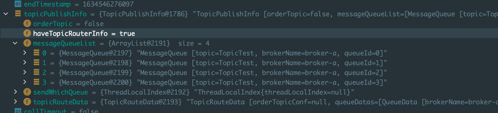


这里可以看到轮询的时候消息队列是按broker排序的，如果上一次选中的是故障broker的第一个消息队列，那么第二次很可能是该broker的第二个队列，这样导致了不必要的重试。由于故障broker信息不会第一时间同步到namesrv，所以要想避免这种情况，可以采用故障延迟机制

```java
// MQFaultStrategy
// 默认为false：不启用Broker故障延迟机制
if (this.sendLatencyFaultEnable) {
  try {
    // 这里每次自增之后取模，选择其中一个消息队列
    int index = tpInfo.getSendWhichQueue().getAndIncrement();
    for (int i = 0; i < tpInfo.getMessageQueueList().size(); i++) {
      int pos = Math.abs(index++) % tpInfo.getMessageQueueList().size();
      if (pos < 0)
        pos = 0;
      MessageQueue mq = tpInfo.getMessageQueueList().get(pos);
      // 判断该broker是否可用
      if (latencyFaultTolerance.isAvailable(mq.getBrokerName())) {
        // 表示上次发送消息的broker
        if (null == lastBrokerName || mq.getBrokerName().equals(lastBrokerName))
          return mq;
      }
    }
    // 从容错队列中选择一个broker
    // 按照可用性排名（是否可用>延迟时间>开始时间）从前半数中RoundRobin选
    final String notBestBroker = latencyFaultTolerance.pickOneAtLeast();
    // 获取该broker中可写消息队列数量
    int writeQueueNums = tpInfo.getQueueIdByBroker(notBestBroker);
    if (writeQueueNums > 0) {
      final MessageQueue mq = tpInfo.selectOneMessageQueue();
      if (notBestBroker != null) {
        mq.setBrokerName(notBestBroker);
        mq.setQueueId(tpInfo.getSendWhichQueue().getAndIncrement() % writeQueueNums);
      }
      return mq;
    } else {
      // 无可写队列则从容错队列中移除
      latencyFaultTolerance.remove(notBestBroker);
    }
  } catch (Exception e) {
    log.error("Error occurred when selecting message queue", e);
  }
  return tpInfo.selectOneMessageQueue();
}
```

基本流程就是：

1. 优先从上一次发送的broker中以RoundRobin形式选择一个可用队列
2. 其次按照可用性排名（是否可用>延迟时间>开始时间）从前半数中RoundRobin选
3. 最次，啥都不管，直接RoundRobin选

这里其实实质就是从上一次发送成功的broker中选择一个队列进行发送。

**故障延迟机制**

```java
// DefaulMQProducerImpl
try {
  beginTimestampPrev = System.currentTimeMillis();
  long costTime = beginTimestampPrev - beginTimestampFirst;
  // 消息发送
  sendResult = this.sendKernelImpl(msg, mq, communicationMode, sendCallback, topicPublishInfo, timeout - costTime);
  endTimestamp = System.currentTimeMillis();
  // 延迟，isolation=false表示使用本次消息发送消耗时间来计算broker规避时长
  this.updateFaultItem(mq.getBrokerName(), endTimestamp - beginTimestampPrev, false);
  ...
} catch (RemotingException e) {
  endTimestamp = System.currentTimeMillis();
  // 故障延迟，isolation=true表示使用默认的30s来作为故障延迟规避时长
  this.updateFaultItem(mq.getBrokerName(), endTimestamp - beginTimestampPrev, true);
  ...
    continue;
}
```

这里分为正常延迟和故障延迟，注意：这里说的是消息正常发送过程中的故障延迟机制，而不是我们在消息发送之前给消息定义的延迟发送时间（或者叫延迟消息）。


**消息发送**

```java
/**
     * @param msg 待发送消息
     * @param mq 消息将发送到该消息队列上
     * @param communicationMode 消息发送模式，SYNC、ASYNC、ONEWAY
     * @param sendCallback 异步消息回调函数
     * @param topicPublishInfo 主题路由信息
     */
private SendResult sendKernelImpl(final Message msg,
                                  final MessageQueue mq,
                                  final CommunicationMode communicationMode,
                                  final SendCallback sendCallback,
                                  final TopicPublishInfo topicPublishInfo,
                                  final long timeout)
```

首先获取broker的网络地址，如果本地没有缓存，那么需要从namesrv获取并更新到本地。

```java
// 获取broker网络地址，如果MQClientInstance的brokerAddrTable未缓存，则需要从
// namesrv获取并更新
String brokerAddr = this.mQClientFactory.findBrokerAddressInPublish(mq.getBrokerName());
if (null == brokerAddr) {
  tryToFindTopicPublishInfo(mq.getTopic());
  brokerAddr = this.mQClientFactory.findBrokerAddressInPublish(mq.getBrokerName());
}
```

为消息分配全局唯一ID ，如果消息体默认超过 4K(compressMsgBodyOverHowmuch), 会对消息体采用zip压缩，并设置消息的系统标记为` MessageSysFlag.COMPRESSED_FLAG`。 如果是事务 Prepared消息，则设置消息的系统标记为 `MessageSysFlag.TRANSACTION_ PREPARED TYPE`。

然后检查消息是否设置了钩子函数，可以注册多个钩子函数

```java
// 如果有发送消息钩子，可以通过DefaultMQProducerImpl#registerSendMessageHook
// 注册多个钩子，其逻辑就是定义发送消息前和发送后执行的逻辑
if (this.hasSendMessageHook()) {
  context = new SendMessageContext();
  context.setProducer(this);
  context.setProducerGroup(this.defaultMQProducer.getProducerGroup());
  context.setCommunicationMode(communicationMode);
  context.setBornHost(this.defaultMQProducer.getClientIP());
  context.setBrokerAddr(brokerAddr);
  context.setMessage(msg);
  context.setMq(mq);
  context.setNamespace(this.defaultMQProducer.getNamespace());
  String isTrans = msg.getProperty(MessageConst.PROPERTY_TRANSACTION_PREPARED);
  if (isTrans != null && isTrans.equals("true")) {
    context.setMsgType(MessageType.Trans_Msg_Half);
  }

  if (msg.getProperty("__STARTDELIVERTIME") != null || msg.getProperty(MessageConst.PROPERTY_DELAY_TIME_LEVEL) != null) {
    context.setMsgType(MessageType.Delay_Msg);
  }
  // 执行钩子函数在消息发送前的逻辑
  this.executeSendMessageHookBefore(context);
}
```

钩子函数起始就是定时在消息发送之前和消息发送之后执行的逻辑

**构建消息包**

主要包含如下重要信息:生产者组、主题名称、默认创建主题Key、该主题在单个Broker 默认队列数、队列ID (队列序号) 、消息系统标记 ( MessageSysFlag)、 消息发送时间、消息标记(RocketMQ对消息中的flag不做任何处理，供应用程序使用)、 消息扩展属性、消息重试次数、是否是批量消息等。

**消息发送**

消费发送分为同步、异步、单向方式。异步发送消息需要提供回调函数，而单向模式其实和异步方式类似，只是不需要提供回调函数，也就是发送方不关心消息发送结果。

异步方 式相比同步方式，消息发送端的发送性能会显著提高，但为了保护消息服务器的负载压力， RocketMQ 对消息发送的异步消息进行了井发控制，通过参数 clientAsyncSemaphoreValue 来控制，默认为 65535。 异步消息发送虽然也可以通过 `DefaultMQProducer#retryTimes­, WhenSendAsyncFailed` 属性来控 制消息重试次数，但是重试的调用人口是在收到服务端响应包时进行的，如果出现网络异常、网络超时等将不会重试。

**broker接受消息**

注意：所有的基本网络请求第一步都是由Netty处理的，rocketMQ在`remoting`模块中封装了Netty网络服务请求。而broker真正对生产者发送过来的消息接受处理是在`SendMessageProcessor#processRequest`中。具体处理时首先对消息进行检查

```java
// AbstractSendMessageProcessor.java
protected RemotingCommand msgCheck(final ChannelHandlerContext ctx,
                                   final SendMessageRequestHeader requestHeader, final RemotingCommand response) {
  // 检查broker是否有写权限
  if (!PermName.isWriteable(this.brokerController.getBrokerConfig().getBrokerPermission())
      && this.brokerController.getTopicConfigManager().isOrderTopic(requestHeader.getTopic())) {
    response.setCode(ResponseCode.NO_PERMISSION);
    response.setRemark("the broker[" + this.brokerController.getBrokerConfig().getBrokerIP1()
                       + "] sending message is forbidden");
    return response;
  }
  // 检查该topic是否可以进行消息发送。因为默认主题不能发送消息，仅供路由查找
  if (!this.brokerController.getTopicConfigManager().isTopicCanSendMessage(requestHeader.getTopic())) {
    String errorMsg = "the topic[" + requestHeader.getTopic() + "] is conflict with system reserved words.";
    log.warn(errorMsg);
    response.setCode(ResponseCode.SYSTEM_ERROR);
    response.setRemark(errorMsg);
    return response;
  }
    this.brokerController.getTopicConfigManager().selectTopicConfig(requestHeader.getTopic());
  ...

    // 如果话题信息在 Name 服务器不存在的话，那么会使用默认话题信息进行消息的发送
    // 生产者和broker建立联系之后在发送消息时，broker可能没有缓存次topic
    // 此时需要检查topic对存在性，如果不存在则需要缓存到本地，并同步给所有的namesrv
    if (null == topicConfig) {
      if (requestHeader.getTopic().startsWith(MixAll.RETRY_GROUP_TOPIC_PREFIX)) {
        topicConfig =
          this.brokerController.getTopicConfigManager().createTopicInSendMessageBackMethod(
          requestHeader.getTopic(), 1, PermName.PERM_WRITE | PermName.PERM_READ,
          topicSysFlag);
      }
    }
    ...
  }
```

检查完毕后进行消息重试次数校验，如果超限，则消息将进入到OLD延迟队列；然后进行消息存储。放在后面进行说明。


### 2.4.4 消息批量发送

消息批量发送是为了提高发送效率，将多个消息包装成一个进行发送，但是并不是包装的消息越多越好，单批次消息发送总长度不能超过 `Default MQProducer#maxMessageSize`。这里先看网络请求命令的封装

```java
// RemotingCommand.java
// 请求命令编码，请求命令类型
private int code;
private LanguageCode language = LanguageCode.JAVA;
// 版本号
private int version = 0;
// 客户端请求序号
private int opaque = requestId.getAndIncrement();
// 标记。倒数第一位表示请求类型，0:请求; 1:返回。倒数第二位，l:表示 oneway
private int flag = 0;
private String remark;
// 扩展属性
private HashMap<String, String> extFields;
// 每个请求对应的请求头信息
private transient CommandCustomHeader customHeader;

private SerializeType serializeTypeCurrentRPC = serializeTypeConfigInThisServer;
// 消息体内容
private transient byte[] body;
```

批量消息发送 ，需要将多条消息体的内容存储在 body 中，如何存储方便服务端正确解析出每条消息呢? RocketMQ采取的方式是，对单条消息内容使用固定格式进行存储

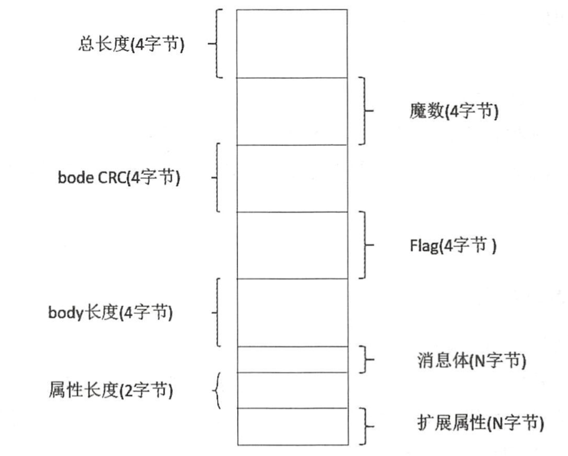

```java
@Override
public SendResult send(
  Collection<Message> msgs) throws MQClientException, RemotingException, MQBrokerException, InterruptedException {
  return this.defaultMQProducerImpl.send(batch(msgs));
}
```

这里会先将消息集合封装成`MessageBatch`，同时将消息体进行编码存入到批量消息的消息体中。具体的发送过程和单条消息的发送基本一致。


## 2.5 消息存储

### 2.5.1 目录、文件结构

一般可以通过配置文件broker.conf设置相关文件的存储路径，如果本地启动没有设置，那么默认是在`$User`目录下的。

```
--store
----commitlog 消息日志，消息主体以及元数据的存储主体，存储生产者写入的消息主体内容
------00000000000000000000 文件名就是offset，默认1G的文件
----consumequeue 逻辑消费队列。存储了commitlog的起始物理offset，目的是提高消息消费的性能
------topicA(订阅topic)
--------0(queueId, 默认四个队列id，每个队列5.72M)
----------file1（一个条目共20字节=8字节的commitlog的offset+4字节的消息长度+8字节tag hashCode；一个文件有30万个条目组成，这就是一个MessageQueue）
----------file2
--------1
--------2
--------3
----index 索引文件，提供了一种可以通过key或时间来查询消息的方法
------file(文件名就是时间戳，包含2000万个索引，约400M，底层实现是hash)
```

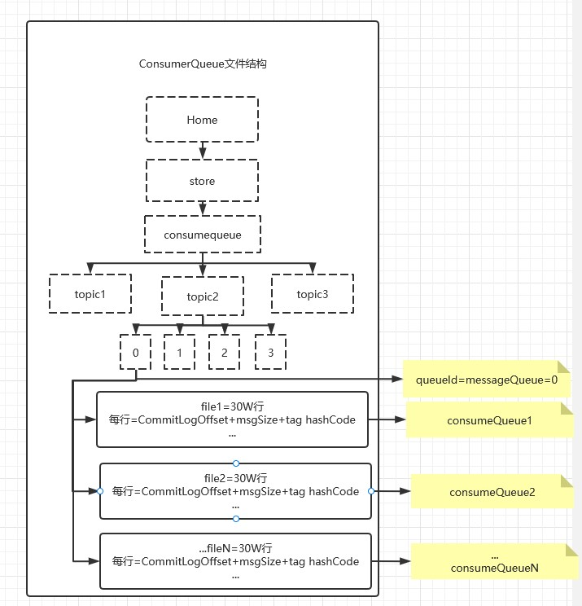


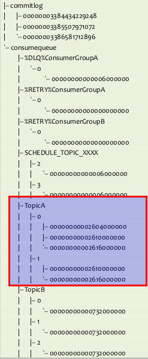

Consume Queue文件组织示意图

consumequeue文件采取定长设计，每一个条目共20个字节，分别为8字节的commitlog物理偏移量、4字节的消息长度、8字节tag hashcode，单个文件由30W个条目组成，可以像数组一样**随机**访问每一个条目，每个ConsumeQueue文件大小约5.72M；

1. 根据`topic`和`queueId`来组织文件，图中TopicA有两个队列0,1，那么TopicA和QueueId=0组成一个ConsumeQueue，TopicA和QueueId=1组成另一个ConsumeQueue。
2. 按照消费端的`GroupName`来分组重试队列，如果消费端消费失败，消息将被发往重试队列中，比如图中的`%RETRY%ConsumerGroupA`。
3. 按照消费端的`GroupName`来分组死信队列，如果消费端消费失败，并重试指定次数后，仍然失败，则发往死信队列，比如图中的`%DLQ%ConsumerGroupA`。

> 死信队列（Dead Letter Queue）一般用于存放由于某种原因无法传递的消息，比如处理失败或者已经过期的消息。

Consume Queue中存储单元是一个20字节定长的二进制数据，顺序写顺序读，如下图所示：

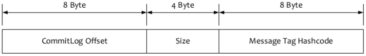

Queue单个存储单元结构

consume queue文件存储单元格式

1. CommitLog Offset是指这条消息在Commit Log文件中的实际偏移量
2. Size存储中消息的大小
3. Message Tag HashCode存储消息的Tag的哈希值：主要用于订阅时消息过滤（订阅时如果指定了Tag，会根据HashCode来快速查找到订阅的消息）

### 2.5.2 消息存储基本结构

```java
public class DefaultMessageStore implements MessageStore {
    private static final InternalLogger log = InternalLoggerFactory.getLogger(LoggerName.STORE_LOGGER_NAME);
    // 消息存储配置属性
    private final MessageStoreConfig messageStoreConfig;
    // CommitLog 文件存储的实现类
    private final CommitLog commitLog;
    // 消息队列存储缓存表，按消息主题分组
    private final ConcurrentMap<String/* topic */, ConcurrentMap<Integer/* queueId */, ConsumeQueue>> consumeQueueTable;
    // 消息队列文件ConsumeQueue刷盘线程
    private final FlushConsumeQueueService flushConsumeQueueService;
    // 清除commitLog文件服务
    private final CleanCommitLogService cleanCommitLogService;
    // 清除ConsumeQueue文件服务
    private final CleanConsumeQueueService cleanConsumeQueueService;
    // 索引文件实现类
    private final IndexService indexService;
    // MappedFile分配服务
    private final AllocateMappedFileService allocateMappedFileService;
    // commitLog消息分发，根据commitLog文件构建ConsumeQueue、IndexFile文件
    private final ReputMessageService reputMessageService;
    // 存储HA机制
    private final HAService haService;
    // 定时消息业务类
    private final ScheduleMessageService scheduleMessageService;
    // 存储统计服务
    private final StoreStatsService storeStatsService;
    // 消息堆内存缓存
    private final TransientStorePool transientStorePool;

    private final RunningFlags runningFlags = new RunningFlags();
    private final SystemClock systemClock = new SystemClock();

    private final ScheduledExecutorService scheduledExecutorService =
        Executors.newSingleThreadScheduledExecutor(new ThreadFactoryImpl("StoreScheduledThread"));
    private final BrokerStatsManager brokerStatsManager;
    // 消息拉取长轮询模式消息达到监听器
    private final MessageArrivingListener messageArrivingListener;
    // broker配置属性
    private final BrokerConfig brokerConfig;

    private volatile boolean shutdown = true;
    // 文件刷盘检测点
    private StoreCheckpoint storeCheckpoint;

    private AtomicLong printTimes = new AtomicLong(0);
    // commitLog文件转发请求
    private final LinkedList<CommitLogDispatcher> dispatcherList;
```


### 2.5.3 存储流程

在之前的消息发送流程中最后是broker对消息进行存储

```java
// SendMessageProcessor.java
putMessageResult = this.brokerController.getMessageStore().putMessage(msgInner);

// DefaulMessageStore.java
public PutMessageResult putMessage(MessageExtBrokerInner msg) {
  // 相关检查
  ...
  long beginTime = this.getSystemClock().now();
  // 消息存储
  PutMessageResult result = this.commitLog.putMessage(msg);
  ...
}
```

这里会进行相关检查，当前broker停止、broker为slave、当前broker不支持写入（一般为磁盘不够导致）、topic长度太长、消息属性长度太长，这些情况都无法写入。然后进行消息存储，这里实现类有两个，即`CommitLog.java、DLedgerCommitLog.java`。后者为多副本CommitLog设计，后面详细说明。这里先看前者。

```java
// 非事务消息
if (tranType == MessageSysFlag.TRANSACTION_NOT_TYPE
    || tranType == MessageSysFlag.TRANSACTION_COMMIT_TYPE) {
  // 延迟消息处理
  // Delay Delivery 消息的延迟级别大于0
  if (msg.getDelayTimeLevel() > 0) {
    if (msg.getDelayTimeLevel() > this.defaultMessageStore.getScheduleMessageService().getMaxDelayLevel()) {
      msg.setDelayTimeLevel(this.defaultMessageStore.getScheduleMessageService().getMaxDelayLevel());
    }
    // 将topic设置为 SCHEDULE_TOPIC
    topic = ScheduleMessageService.SCHEDULE_TOPIC;
    queueId = ScheduleMessageService.delayLevel2QueueId(msg.getDelayTimeLevel());

    // Backup real topic, queueId
    // 将消息真正的topic，queueId存入到属性中
    MessageAccessor.putProperty(msg, MessageConst.PROPERTY_REAL_TOPIC, msg.getTopic());
    MessageAccessor.putProperty(msg, MessageConst.PROPERTY_REAL_QUEUE_ID, String.valueOf(msg.getQueueId()));
    msg.setPropertiesString(MessageDecoder.messageProperties2String(msg.getProperties()));

    msg.setTopic(topic);
    msg.setQueueId(queueId);
  }
}
```

这里首先对消息进行处理，如果是延迟消息，则需要将消息的topic设置为`SCHEDULE_TOPIC`，而将真正的消息topic、queueId存入到属性中。然后创建MappedFile

```java
long eclipseTimeInLock = 0;
MappedFile unlockMappedFile = null;
// 在commitlog目录中新建一个文件，默认为1G，写满后再创建新到。以文件到第一个偏移量为文件名
// 比如 00000000000000000000，00000000001073741824（代表该文件中第一条消息偏移量）
// mappedFileQueue 可以看作是commitlog文件夹，MappedFile可以看作是其中一个文件
// 这里是取最后一个文件
MappedFile mappedFile = this.mappedFileQueue.getLastMappedFile();

// 申请锁，因为消息存储是串行的
putMessageLock.lock(); //spin or ReentrantLock ,depending on store config
try {
  long beginLockTimestamp = this.defaultMessageStore.getSystemClock().now();
  this.beginTimeInLock = beginLockTimestamp;

  // Here settings are stored timestamp, in order to ensure an orderly
  // global 设置消息存储时间
  msg.setStoreTimestamp(beginLockTimestamp);
  // 为空表明是第一次消息发送，需要创建第一个文件，其实偏移为0
  if (null == mappedFile || mappedFile.isFull()) {
    mappedFile = this.mappedFileQueue.getLastMappedFile(0); // Mark: NewFile may be cause noise
  }
  // 创建失败有可能是磁盘不足或者权限不够
  if (null == mappedFile) {
    log.error("create mapped file1 error, topic: " + msg.getTopic() + " clientAddr: " + msg.getBornHostString());
    beginTimeInLock = 0;
    return new PutMessageResult(PutMessageStatus.CREATE_MAPEDFILE_FAILED, null);
  }

  result = mappedFile.appendMessage(msg, this.appendMessageCallback);
```

这里首先看下创建文件，rocketMQ会提供一个专门用来实例话MappedFile文件的服务类 `AllocateMappedFileService`。在内存中，也同时维护了一张请求表 `requestTable` 和一个优先级请求队列 `requestQueue` 。当需要创建文件的时候，Broker 会创建一个 `AllocateRequest` 对象，其包含了文件的路径、大小等信息。然后先将其放入 `requestTable` 表中，再将其放入优先级请求队列 `requestQueue` 中。

```java
// public class AllocateMappedFileService extends ServiceThread {
public void run() {
  log.info(this.getServiceName() + " service started");
  while (!this.isStopped() && this.mmapOperation()) {
  }
  log.info(this.getServiceName() + " service end");
}

/**
     * Only interrupted by the external thread, will return false
     * 一直运行，除非被强制停止
     */
private boolean mmapOperation() {
  boolean isSuccess = false;
  AllocateRequest req = null;
  try {
    // 从队列中取一个请求
    req = this.requestQueue.take();
    AllocateRequest expectedRequest = this.requestTable.get(req.getFilePath());
    if (null == expectedRequest) {
      log.warn("this mmap request expired, maybe cause timeout " + req.getFilePath() + " "
               + req.getFileSize());
      return true;
    }
    if (expectedRequest != req) {
      log.warn("never expected here,  maybe cause timeout " + req.getFilePath() + " "
               + req.getFileSize() + ", req:" + req + ", expectedRequest:" + expectedRequest);
      return true;
    }
    // 创建一个MappedFile
    if (req.getMappedFile() == null) {
      long beginTime = System.currentTimeMillis();

      MappedFile mappedFile;
      // 开启持久化和异步刷盘
      if (messageStore.getMessageStoreConfig().isTransientStorePoolEnable()) {
        try {
          mappedFile = ServiceLoader.load(MappedFile.class).iterator().next();
          mappedFile.init(req.getFilePath(), req.getFileSize(), messageStore.getTransientStorePool());
        } catch (RuntimeException e) {
          log.warn("Use default implementation.");
          mappedFile = new MappedFile(req.getFilePath(), req.getFileSize(), messageStore.getTransientStorePool());
        }
      } else {
        mappedFile = new MappedFile(req.getFilePath(), req.getFileSize());
      }

      long eclipseTime = UtilAll.computeEclipseTimeMilliseconds(beginTime);
      if (eclipseTime > 10) {
        int queueSize = this.requestQueue.size();
        log.warn("create mappedFile spent time(ms) " + eclipseTime + " queue size " + queueSize
                 + " " + req.getFilePath() + " " + req.getFileSize());
      }

      // pre write mappedFile
      if (mappedFile.getFileSize() >= this.messageStore.getMessageStoreConfig()
          .getMapedFileSizeCommitLog()
          &&
          this.messageStore.getMessageStoreConfig().isWarmMapedFileEnable()) {
        mappedFile.warmMappedFile(this.messageStore.getMessageStoreConfig().getFlushDiskType(),
                                  this.messageStore.getMessageStoreConfig().getFlushLeastPagesWhenWarmMapedFile());
      }

      req.setMappedFile(mappedFile);
      this.hasException = false;
      isSuccess = true;
    }
  } catch (InterruptedException e) {
    ....
  } finally {
    if (req != null && isSuccess)
      // 最后计数器减一
      req.getCountDownLatch().countDown();
  }
  return true;
}
```

这里注意，此类是继承Thread类的，创建文件的方法会一直运行，直到强制停止。创建的过程是**首先从队列中取出一个请求**，然后创建，最后将请求中的countDownLatch减一。


下面返回到前面的流程，最开始是从一个MappedFileQueue中取出一个，但是如果取不到，则需要创建

```java
// CommitLog.java
mappedFile = this.mappedFileQueue.getLastMappedFile(0);
```

而创建的关键步骤在

```java
// MappedFileQueue.java
if (this.allocateMappedFileService != null) {
  mappedFile = this.allocateMappedFileService.putRequestAndReturnMappedFile(nextFilePath,
                                               nextNextFilePath, this.mappedFileSize);
}
```

可以看到这里就是往AllocateMappedFileService中的队列中添加了一个创建请求，等待相关创建逻辑执行，创建完之后会将请求从requestTable中删除，然后再添加到MappedFileQueue中去。我们每次取的时候都是取最后一个。


文件创建采用NIO中的文件映射方式MappedByteBuffer，这种方式销效率较高

```java
public class MappedFile extends ReferenceResource {
    public MappedFile(final String fileName, final int fileSize)
        throws IOException {
        init(fileName, fileSize);
    }

    private void init(final String fileName, final int fileSize)
        throws IOException {
        // ...
        this.fileChannel = new RandomAccessFile(this.file, "rw").getChannel();
        this.mappedByteBuffer = this.fileChannel.map(MapMode.READ_WRITE, 0, fileSize);
        // ...
    }
}
```

**消息写入**

然后采用追加的方式将消息写入文件中

```java
// 写消息到commitlog目录下的文件（追加方式写入）
public AppendMessageResult appendMessagesInner(final MessageExt messageExt, final AppendMessageCallback cb) {
  assert messageExt != null;
  assert cb != null;

  // 获取当前可写的位置，如果currentPos大于等于文件大小，表明文件写满
  int currentPos = this.wrotePosition.get();

  if (currentPos < this.fileSize) {
    // 通过slice方法创建一个与MappedFile共享的内存区（NIO中的零拷贝），并设置当前指针
    // CommitLog启动的时候初始化一块内存池(通过ByteBuffer申请的堆外内存)
    // 消息数据首先写入内存池中，然后后台有个线程定时将内存池中的数据commit到FileChannel中
    // 如果是writeBuffer，属于异步。如果是mappedByteBuffer，属于同步
    // 在写入文件时，从FileChannel获取直接内存映射，收到消息后，将数据写入到这块内存中，内存和物理文件的数据交互由操作系统负责
    ByteBuffer byteBuffer = writeBuffer != null ? writeBuffer.slice() : this.mappedByteBuffer.slice();
    byteBuffer.position(currentPos);
    AppendMessageResult result = null;
    if (messageExt instanceof MessageExtBrokerInner) {
      // 单条写入
      result = cb.doAppend(this.getFileFromOffset(), byteBuffer, this.fileSize - currentPos, (MessageExtBrokerInner) messageExt);
    } else if (messageExt instanceof MessageExtBatch) {
      // 批量写入
      result = cb.doAppend(this.getFileFromOffset(), byteBuffer, this.fileSize - currentPos, (MessageExtBatch) messageExt);
    } else {
      return new AppendMessageResult(AppendMessageStatus.UNKNOWN_ERROR);
    }
    this.wrotePosition.addAndGet(result.getWroteBytes());
    this.storeTimestamp = result.getStoreTimestamp();
    return result;
  }
  log.error("MappedFile.appendMessage return null, wrotePosition: {} fileSize: {}", currentPos, this.fileSize);
  return new AppendMessageResult(AppendMessageStatus.UNKNOWN_ERROR);
}
```

在协议的时候首先创建全局唯一的消息id

```java
// CommitLog.java
public AppendMessageResult doAppend(final long fileFromOffset, final ByteBuffer byteBuffer, final int maxBlank, final MessageExtBrokerInner msgInner) {
  // STORETIMESTAMP + STOREHOSTADDRESS + OFFSET <br>
  // PHY OFFSET
  long wroteOffset = fileFromOffset + byteBuffer.position();
  // hostHolder：ip(4字节)+port(4字节)
  this.resetByteBuffer(hostHolder, 8);
  // 创建全局唯一的消息id，ip(4字节)+port(4字节)+8字节偏移量
  String msgId = MessageDecoder.createMessageId(this.msgIdMemory,              msgInner.getStoreHostBytes(hostHolder), wroteOffset);
```

但为了消息 ID可读性，返回给应用程序的 msgld为字符类型，可以通过 `UtilAll.bytes2string`方法将 msgld 字节数组转换成字符串，通过 `Uti1All.string2bytes` 方法将 msgld 字符串还原成 16个字节的字节数组，从而根据提取消息偏移量，可以快速通过 msgld找到 消息内容 。注意：这里的msgId其实就是一个ip+port+偏移量的唯一值。

```java
// Record ConsumeQueue information
keyBuilder.setLength(0);
keyBuilder.append(msgInner.getTopic());
keyBuilder.append('-');
keyBuilder.append(msgInner.getQueueId());
String key = keyBuilder.toString();
Long queueOffset = CommitLog.this.topicQueueTable.get(key);
if (null == queueOffset) {
  queueOffset = 0L;
  // key就是topic+queueId
  CommitLog.this.topicQueueTable.put(key, queueOffset);
}
```

然后根据消息体长度、topic长度、属性长度计算总长度

```java
protected static int calMsgLength(int bodyLength, int topicLength, int propertiesLength) {
  final int msgLen = 4 //TOTALSIZE 该消息总长度值
    + 4 //MAGICCODE 固定值Oxdaa320a7
    + 4 //BODYCRC 消息体crc长度
    + 4 //QUEUEID queueId
    + 4 //FLAG 消息Flag，RocketMQ不处理，供应用程序使用
    + 8 //QUEUEOFFSET 消息在消息队列cosume queue 的偏移量
    + 8 //PHYSICALOFFSET 消息在commitLog文件中的偏移量
    + 4 //SYSFLAG 消息系统Flag， 是否压缩，是否是事务消息等
    + 8 //BORNTIMESTAMP 消息生产者调用消息发送API时间戳
    + 8 //BORNHOST ip+port
    + 8 //STORETIMESTAMP 消息存储时间戳
    + 8 //STOREHOSTADDRESS brokerIP+port
    + 4 //RECONSUMETIMES 消息重试次数
    + 8 //Prepared Transaction Offset 事务消息物理偏移量
    + 4 + (bodyLength > 0 ? bodyLength : 0) //BODY 消息体长度
    + 1 + topicLength //TOPIC topic长度值
    + 2 + (propertiesLength > 0 ? propertiesLength : 0) //propertiesLength 属性长度，表示表示
    // 消息属性长度不能超过65536个字符
    + 0;
  return msgLen;
}
```

如果总长度超限，则会返回END_OF_FILE，重新创建commitLog文件，再次写入

```java
// Determines whether there is sufficient free space
// 如果消息长度+END_FILE_MIN_BLANK_LENGTH 大于 CommitLog文件的空闲空间，
// 则返回 AppendMessageStatus.END_OF_FILE, Broker会重新创建一个新的
// CommitLog文件来存储该消息。从这里可以看出，每个 CommitLog文件最少会空闲
// 8个字节，高4字节存储当前文件剩余空间，低4字节存储魔数: CommitLog.BLANK_MAGIC_CODE 。
if ((msgLen + END_FILE_MIN_BLANK_LENGTH) > maxBlank) {
  this.resetByteBuffer(this.msgStoreItemMemory, maxBlank);
  // 1 TOTALSIZE 剩余空间长度
  this.msgStoreItemMemory.putInt(maxBlank);
  // 2 MAGICCODE
  this.msgStoreItemMemory.putInt(CommitLog.BLANK_MAGIC_CODE);
  // 3 The remaining space may be any value
  // Here the length of the specially set maxBlank
  final long beginTimeMills = CommitLog.this.defaultMessageStore.now();
  byteBuffer.put(this.msgStoreItemMemory.array(), 0, maxBlank);
  // 返回END_OF_FILE后会再次创建commitLog文件然后再次写入
  return new AppendMessageResult(AppendMessageStatus.END_OF_FILE, wroteOffset, maxBlank,                 msgId, msgInner.getStoreTimestamp(), queueOffset, 
            CommitLog.this.defaultMessageStore.now() - beginTimeMills);
}
```

每条消息的存储是按照一个 4 字节的长度来做界限的，这个长度本身就是整个消息体的长度，当读完这整条消息体的长度之后，下一次再取出来的一个 4 字节的数字，便又是下一条消息的长度:


围绕着一条消息，还会存储许多其它内容，我们在这里只需要了解前两位是 4 字节的长度和 4 字节的 MAGICCODE 即可。`MAGICCODE` 的可选值有:

- `CommitLog.MESSAGE_MAGIC_CODE`
- `CommitLog.BLANK_MAGIC_CODE`

当这个文件有能力容纳这条消息体的情况下，其便会存储 `MESSAGE_MAGIC_CODE` 值；当这个文件没有能力容纳这条消息体的情况下，其便会存储 `BLANK_MAGIC_CODE` 值。所以这个 `MAGICCODE` 是用来界定这是空消息还是一条正常的消息。

当判定这个文件不足以容纳整个消息的时候，其将消息体长度设置为这个文件剩余的最大空间长度，将 `MAGICCODE` 设定为这是一个空消息文件 (需要去下一个文件去读)。由此我们可以看出消息体长度 和 `MAGICCODE` 是判别一条消息格式的最基本要求，这也是 `END_FILE_MIN_BLANK_LENGTH` 的值为 8 的原因。

```java
// 将消息内容存储到 ByteBuffer 中，然后创建 AppendMessageResult。 这里只 是将消息存储在
// MappedFile对应的内存映射 Buffer中，并没有刷写到磁盘
AppendMessageResult result = new AppendMessageResult(AppendMessageStatus.PUT_OK, wroteOffset, msgLen, msgId, msgInner.getStoreTimestamp(), queueOffset, CommitLog.this.defaultMessageStore.now() - beginTimeMills);

// 在追加消息完毕之后，通过唤醒这个服务立即检查以下是否需要刷盘
handleDiskFlush(result, putMessageResult, msg);
handleHA(result, putMessageResult, msg);
```

这里将消息写入缓存，释放锁，等待刷盘。

```java
public class AppendMessageResult {
    // Return code 消息追加结果，取值 PUT_OK : 追加成功;
    // END_OF_FILE:超过文件大小;
    // MESSAGE SIZE EXCEEDED :消息长度超过最大允许长度
    // PROPERTIES_SIZE_EXCEEDED :消息、属性超过最大允许长度;
    // UNKNOWN ERROR :未知异常 。
    private AppendMessageStatus status;
    // Where to start writing 消息的物理偏移量
    private long wroteOffset;
    // Write Bytes
    private int wroteBytes;
    // Message ID 消息id
    private String msgId;
    // Message storage timestamp 消息存储时间戳
    private long storeTimestamp;
    // Consume queue's offset(step by one) 消息消费队列逻辑偏移量，类似于数组下标
    private long logicsOffset;
    // 当前未使用
    private long pagecacheRT = 0;
```


**commitlog内消息转储到consumequeue、indexfile**

转储是在服务线程ReputMessageService内进行，该**服务线程随broker启动而启动**，该服务线程每次休眠1ms，接着继续执行转储，这里休眠1ms是避免cps空沦陷导致100%。

在构造DefaultMessageStore会往里面添加两个CommitLogDispatcher，我们定位到DefaultMessageStore的构造函数

```java
this.dispatcherList = new LinkedList<>();
// consumeQueue构建Dispatcher
this.dispatcherList.addLast(new CommitLogDispatcherBuildConsumeQueue());
// IndexFile构建Dispatcher
this.dispatcherList.addLast(new CommitLogDispatcherBuildIndex());
```

DefaultMessageStore#doReput方法中可以看到，这里将读取到的每一条消息构造成一个DispatchRequest，

```java
// DefaultMessageStore.doReput
// 读取一条消息，把消息包装成DispatchRequest请求
DispatchRequest dispatchRequest = 	     DefaultMessageStore.this.commitLog.checkMessageAndReturnSize(
  result.getByteBuffer(), false, false);
// 更新consumequeue里的位置信息，更新indexFile
DefaultMessageStore.this.doDispatch(dispatchRequest);

public void doDispatch(DispatchRequest req) {
  for (CommitLogDispatcher dispatcher : this.dispatcherList) {
    dispatcher.dispatch(req);
  }
}
```

这里进行转储，此时之前添加的转储服务CommitLogDispatcherBuildConsumeQueue和CommitLogDispatcherBuildIndex执行各自的转储逻辑。

这里先看consumequeue转储，根据消息的sysflag来进行转储，如果是事务消息的prepared和rollback消息，则不进行转储，这也说明了为什么事务消息无法被消费者消费的原因，因为事务并没有保存到consumequeue，而消费者是从consumequeue进行消费的。转储时首先找到相关的consumequeue然后再进行转储

```java
public void putMessagePositionInfoWrapper(DispatchRequest request) {
  final int maxRetries = 30;
  boolean canWrite = this.defaultMessageStore.getRunningFlags().isCQWriteable();
  for (int i = 0; i < maxRetries && canWrite; i++) {
    long tagsCode = request.getTagsCode();
    ...
      // 转储
      boolean result = this.putMessagePositionInfo(request.getCommitLogOffset(),
                                                   request.getMsgSize(), tagsCode, request.getConsumeQueueOffset());
    if (result) {
      // 消息offset转储到consumequeue成功，把消息时间戳保存到存盘检测点
      // logicsMsgTimestamp，供broker异常关闭启动时候恢复
      this.defaultMessageStore.getStoreCheckpoint().setLogicsMsgTimestamp(request.getStoreTimestamp());
      return;
    } else {
      // XXX: warn and notify me
      // 转储失败，等待1s继续转储
      log.warn("[BUG]put commit log position info to " + topic + ":" + queueId + " " + request.getCommitLogOffset()
               + " failed, retry " + i + " times");

      try {
        Thread.sleep(1000);
      } catch (InterruptedException e) {
        log.warn("", e);
      }
    }
    ...
  }
```

消息转储到consumeque和消息保存到commitlog类似，都是最终保存到pagecache，那么既然保存到了pagecache，自然就有刷新到磁盘的操作，在FlushConsumeQueueService服务线程内进行刷盘，最终也是调用`org.apache.rocketmq.store.MappedFileQueue.flush(int)`进行刷盘，这个和commitlog异步刷盘基本相同，consumequeue默认是待刷盘数据满足操作系统页2页才刷盘，但是如果超过最大时间，也会强制刷盘，同commitlog异步刷盘。

再看indexFile的转储，保存消息的index到indexfile的入口是`CommitLogDispatcherBuildIndex.dispatch(DispatchRequest)`，前面也说过，indexfile对应一个具体的MappedFile，而IndexService是对应整组MappedFile（即整组indexfile）。这里对于commitlog中的每一个属性都会以属性为key，生成一个index，然后进行存储，主要方法就是

```java
// IndexService.java
private IndexFile putKey(IndexFile indexFile, DispatchRequest msg, String idxKey) {
  // 如果转储失败则进入循环之中
  for (boolean ok = indexFile.putKey(idxKey, msg.getCommitLogOffset(), msg.getStoreTimestamp()); !ok; ) {
    log.warn("Index file [" + indexFile.getFileName() + "] is full, trying to create another one");
    // 如果满量，则需要再次创建一个indexFile文件
    indexFile = retryGetAndCreateIndexFile();
    if (null == indexFile) {
      return null;
    }
    ok = indexFile.putKey(idxKey, msg.getCommitLogOffset(), msg.getStoreTimestamp());
  }
  return indexFile;
}

public boolean putKey(final String key, final long phyOffset, final long storeTimestamp) {
  // 已使用的index数小于2000w，则写入
  if (this.indexHeader.getIndexCount() < this.indexNum) {
    int keyHash = indexKeyHashMethod(key);
    // 取模，获取该key落在哪个slot上
    int slotPos = keyHash % this.hashSlotNum;
    // 计算该索引在indexfile内的slot绝对位置
    int absSlotPos = IndexHeader.INDEX_HEADER_SIZE + slotPos * hashSlotSize;
    FileLock fileLock = null;
    try {

      // fileLock = this.fileChannel.lock(absSlotPos, hashSlotSize,
      // false);
      // 更新indexfile是ReputMessageService单线程操作，无需加锁
      // 获取该key在indexfile绝对位置上的slot值
      int slotValue = this.mappedByteBuffer.getInt(absSlotPos);
      if (slotValue <= invalidIndex || slotValue > this.indexHeader.getIndexCount()) {
        slotValue = invalidIndex;
      }
      // 消息在commitlog存储的时间戳与indexfile第一条消息索引时间戳之间的时间差
      long timeDiff = storeTimestamp - this.indexHeader.getBeginTimestamp();

      timeDiff = timeDiff / 1000;
      // 说明该条消息前没有在该indexfile存储索引，因此该条消息即是该indexfile的第一条索引记录
      if (this.indexHeader.getBeginTimestamp() <= 0) {
        timeDiff = 0;
      } else if (timeDiff > Integer.MAX_VALUE) {
        timeDiff = Integer.MAX_VALUE;
      } else if (timeDiff < 0) {
        // 说明broker异常关闭启动后新消息的时间戳小于该indexfile的
        // 第一条消息时间戳，可能重复创建索引
        timeDiff = 0;
      }
      // 计算该索引要存放在indexfile上索引区域的绝对位置，即slotTable之后的偏移
      int absIndexPos =
        IndexHeader.INDEX_HEADER_SIZE + this.hashSlotNum * hashSlotSize
        + this.indexHeader.getIndexCount() * indexSize;
      // 按照索引格式更新索引位置  20字节
      this.mappedByteBuffer.putInt(absIndexPos, keyHash);
      this.mappedByteBuffer.putLong(absIndexPos + 4, phyOffset);
      // 消息的落盘时间与header里的beginTimestamp的差值(为了节省存储空间，如果直接
      // 存message的落盘时间就得8bytes，这里转换成量int)
      this.mappedByteBuffer.putInt(absIndexPos + 4 + 8, (int) timeDiff);
      // 如果没有hash冲突，slotValue为0，如果hash冲突（即多个index的hash落在同一个slot内）则自增
      this.mappedByteBuffer.putInt(absIndexPos + 4 + 8 + 4, slotValue);
      // 更新slot位置 4字节。这个是难理解地方，也是核心地方，slot上存放的是当前索引的个数，那么进行查找的
      // 时候根据keyhash定位到slot 后，获取了slotValue，该值就是索引数量，那么可以根据该值获取该key对应
      // 的索引在indexfile上索引的真正位置
      this.mappedByteBuffer.putInt(absSlotPos, this.indexHeader.getIndexCount());

      if (this.indexHeader.getIndexCount() <= 1) {
        this.indexHeader.setBeginPhyOffset(phyOffset);
        this.indexHeader.setBeginTimestamp(storeTimestamp);
      }
      // 已使用的hashslot数量+1，这个没具体什么意义
      this.indexHeader.incHashSlotCount();
      // 已经使用的index数量+1，用于判断indexfile是否被写满
      this.indexHeader.incIndexCount();
      // 更新indexheader的结束物理位置为最新的消息的物理位置，每次刷新一条索引，都会更新
      this.indexHeader.setEndPhyOffset(phyOffset);
      // 更新indexheader的结束时间戳为最新的消息的存储时间戳，每次刷新一条索引，都会更新
      this.indexHeader.setEndTimestamp(storeTimestamp);

      return true;
    } catch (Exception e) {
  ...
  return false;
}
```

以下摘自

`https://kunzhao.org/docs/rocketmq/rocketmq-message-indexing-flow/`

以实际例子来说明。假设我们需要依次为键的哈希值为 “{16,29,29,8,16,16}” 这几条消息构建索引，我们在这个地方忽略了索引信息中存储的存储时间和偏移量字段，只是存储**键哈希和下一索引槽信息**，那么:

- 放入 16: 将 “16|0” 存储在第 1 个索引槽中，并更新哈希槽为 16 的值为 1，即哈希槽为 16 的第一个索引块的地址为 1
- 放入 29: 将 “29|0” 存储在第 2 个索引槽中，并更新哈希槽为 29 的值为 2，即哈希槽为 29 的第一个索引块的地址为 2
- 放入 29: 取出哈希槽为 29 中的值 2，然后将 “29|2” 存储在第 3 个索引槽中，并更新哈希槽为 29 的值为 3，即哈希槽为 29 的第一个索引块的地址为 3。而在**找到索引块为 3 的索引信息后，又能取出上一个索引块的地址 2**，构成链表为： “[29]->3->2”
- 放入 8: 将 “8|0” 存储在第 4 个索引槽中，并更新哈希槽为 8 的值为 4，即哈希槽为 8 的第一个索引块的地址为 4
- 放入 16: 取出哈希槽为 16 中的值 1，然后将 “16|1” 存储在第 5 个索引槽中，并更新哈希槽为 16 的值为 5。构成链表为: “[16]->5->1”
- 放入 16: 取出哈希槽为 16 中的值 5，然后将 “16|5” 存储在第 6 个索引槽中，并更新哈希槽为 16 的值为 6。构成链表为: “[16]->6->5->1”

整个过程如下图所示:

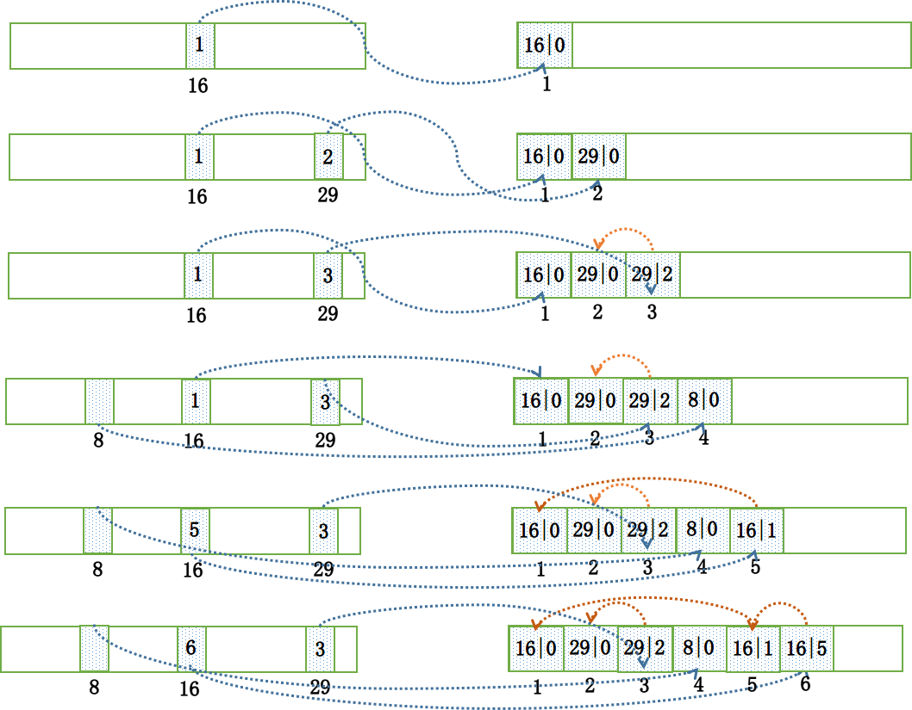


### 2.5.4 文件加载

这里补充说明一下，Broker 在启动的时候，会加载磁盘上的文件到一个 `mappedFiles` 列表中。但是加载完毕后，其还会对这份列表中的消息文件进行**验证 (恢复)**，确保没有错误。

#### 2.5.4.1 commitlog, consumequeue加载

```java
/**
 * RocketMQ跟存储交互的底层封装对象是mappedFile。
 * 而跟CommitLog，ConsumeQueue进行交互的并不是mappedFile，
 * 而是对其进一步封装的MappedFileQueue类。
 */
public class MappedFileQueue {
    private static final InternalLogger log = InternalLoggerFactory.getLogger(LoggerName.STORE_LOGGER_NAME);
    private static final InternalLogger LOG_ERROR = InternalLoggerFactory.getLogger(LoggerName.STORE_ERROR_LOGGER_NAME);

    private static final int DELETE_FILES_BATCH_MAX = 10;
    // 文件的存储路径
    // 对commitlog来说是${rocketmq-store}/commitlog
    // 对consumequeue来说是${rocketmq-store}/consumequeue
    private final String storePath;
    // 单个MappedFile文件对应的磁盘文件的size，对commitlog来说是1G
    // 对consumequeue来说是30w（条目）*20（字节）即600w，约5.72M
    private final int mappedFileSize;
    // 并发线程安全队列存储映射文件
    private final CopyOnWriteArrayList<MappedFile> mappedFiles = new CopyOnWriteArrayList<MappedFile>();
    // 这个对象的作用是根据情况来决定是否需要提前创建好MappedFile对象供后续的直接使用。
    // 而这个参数是在构造MappedFileQueue
    // 对象的时候的一个参数。只有在CommitLog中构造时才会传入AllocateMappedFileService，
    // 在ConsumeQueue并没有传入。
    private final AllocateMappedFileService allocateMappedFileService;
    // 刷新完的位置
    private long flushedWhere = 0;
    // 提交完成的位置
    private long committedWhere = 0;
    // 存储时间
    private volatile long storeTimestamp = 0;
```

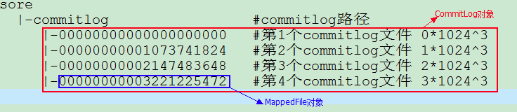

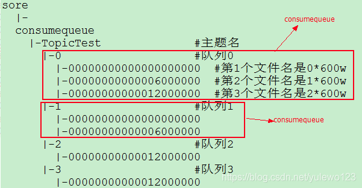

这里，一个ConsumeQueue等同一个MappedFileQueue等同多个MappedFile。broker启动时，对于创建consumequeue对象来说，只是创建MappedFileQueue对象，并不创建具体的文件对象MappedFile，只是在创建commitLog对象时才会创建MappedFile。

```java
// DefaultMessageStore.java加载相关文件
public boolean load() {
  boolean result = true;
  try {
    // load Commit Log 加载commitLog文件
    result = result && this.commitLog.load();
    // load Consume Queue 加载consumeQueue文件
    result = result && this.loadConsumeQueue();
    if (result) {
      // 加载checkpoint文件，该文件是用于异常关闭恢复，保存的是刷盘位置
      this.storeCheckpoint =
        new StoreCheckpoint(StorePathConfigHelper.getStoreCheckpoint(this.messageStoreConfig.getStorePathRootDir()));
      // 加载加载${rocketmq_home}\store\index目录下的文件
      this.indexService.load(lastExitOK);
      // 使用commitLog恢复上次异常/正常关闭的broker
      this.recover(lastExitOK);
    }
  } catch (Exception e) {
  }
  return result;
}

// commitlog加载
//org.apache.rocketmq.store.CommitLog.load()
public boolean load() {
    boolean result = this.mappedFileQueue.load();//加载:\rocketmq\store\commitlog
    log.info("load commit log " + (result ? "OK" : "Failed"));
    return result;
}
// consumequeue加载
private boolean loadConsumeQueue() {
      File dirLogic = new File(StorePathConfigHelper.getStorePathConsumeQueue(this.messageStoreConfig.getStorePathRootDir()));
      File[] fileTopicList = dirLogic.listFiles();
      if (fileTopicList != null) {
        // /遍历topic目录文件
        for (File fileTopic : fileTopicList) {
          String topic = fileTopic.getName();

          File[] fileQueueIdList = fileTopic.listFiles();
          if (fileQueueIdList != null) {
            // //遍历队列目录下的文件
            for (File fileQueueId : fileQueueIdList) {
              int queueId;
              try {
                queueId = Integer.parseInt(fileQueueId.getName());
              } catch (NumberFormatException e) {
                continue;
              }
              //构建ConsumeQueue，该对象对应MappedFileQueue，对应多个MappedFile
              ConsumeQueue logic = new ConsumeQueue(
                topic,
                queueId,
                StorePathConfigHelper.getStorePathConsumeQueue(this.messageStoreConfig.getStorePathRootDir()),
                this.getMessageStoreConfig().getMapedFileSizeConsumeQueue(),
                this);
              this.putConsumeQueue(topic, queueId, logic);
              if (!logic.load()) {
                return false;
              }
            }
          }
        }
      }
  return true;
}
public boolean load() {
    boolean result = this.mappedFileQueue.load();
    log.info("load consume queue " + this.topic + "-" + this.queueId + " " + (result ? "OK" : "Failed"));
    if (isExtReadEnable()) {//false
        result &= this.consumeQueueExt.load();
    }
    return result;
}
```

可以看到都是通过MappedFileQueue进行加载的

```java
public boolean load() {
  File dir = new File(this.storePath);
  File[] files = dir.listFiles();
  if (files != null) {
    // ascending order
    Arrays.sort(files);
    for (File file : files) {
      // 队列映射文件的大小不等于设置的文件类型的大小，
      // 说明加载到了最后的一个文件。比如 如果是commitLog那么对于的大小应该为1G
      if (file.length() != this.mappedFileSize) {
        log.warn(file + "\t" + file.length()
                 + " length not matched message store config value, please check it manually");
        return false;
      }
      try {
        // 创建文件映射
        MappedFile mappedFile = new MappedFile(file.getPath(), mappedFileSize);
        // 新建的MappedFile对象wrotePosition committedPosition flushedPosition
        // 属性都设置为文件名（起始位置）
        mappedFile.setWrotePosition(this.mappedFileSize);
        mappedFile.setFlushedPosition(this.mappedFileSize);
        mappedFile.setCommittedPosition(this.mappedFileSize);
        this.mappedFiles.add(mappedFile);
        log.info("load " + file.getPath() + " OK");
      } catch (IOException e) {
        log.error("load file " + file + " error", e);
        return false;
      }
    }
  }
  return true;
}
```

最终加载的commitlog文件保存到了CommitLog.mappedFileQueue.mappedFiles集合中。而commitlog对象又被包含在DefaultMessageStore，DefaultMessageStore又被包含在BrokerController对象内，最终在broker启动加载commitlog文件就被加载到了broker上。

#### 2.5.4.2 indexfile加载

```java
public boolean load(final boolean lastExitOK) {
  File dir = new File(this.storePath);
  File[] files = dir.listFiles();
  if (files != null) {
    // ascending order
    Arrays.sort(files);
    // 遍历${rocketmq_home}\store\index目录下的indexfile文件
    for (File file : files) {
      try {
        IndexFile f = new IndexFile(file.getPath(), this.hashSlotNum, this.indexNum, 0, 0);
        // 加载indexfile文件，即把前40字节保存到IndexHeader
        f.load();
        // broker上次是异常关闭
        if (!lastExitOK) {
          // 如果indexfile的结束时间戳(保存到indexfile的最后一条消息的时间戳)
          // 大于StoreCheckpoint索引刷盘时间戳，则销毁该indexfile对象，
          // 即释放对应的MappedFile对象（该对象包装了堆外内存，释放堆外内存）。 
          // 为什么要销毁呢？因为StoreCheckpoint是刷盘保存点，用于保存
          // commitlog consumequeue indexfile刷盘的位置，
          // 便于异常关闭恢复。如果indexfile的结束时间戳大于StoreCheckpoint索引刷盘时间戳，
          // 则说明该IndexFile是由于broker异常关闭并没有被刷盘
          if (f.getEndTimestamp() > this.defaultMessageStore.getStoreCheckpoint()
              .getIndexMsgTimestamp()) {
            // 异常关闭，同时还未刷盘，那么indexfile也没有用了，直接销毁
            f.destroy(0);
            continue;
          }
        }
...

//org.apache.rocketmq.store.index.IndexFile.load()
public void load() {
    this.indexHeader.load();
}
//org.apache.rocketmq.store.index.IndexHeader.load()
public void load() {
    this.beginTimestamp.set(byteBuffer.getLong(beginTimestampIndex));//获取indexfile的前8字节，即起始时间戳
    this.endTimestamp.set(byteBuffer.getLong(endTimestampIndex));//结束时间戳 8字节
    this.beginPhyOffset.set(byteBuffer.getLong(beginPhyoffsetIndex));//在commitlog的起始offset 8字节
    this.endPhyOffset.set(byteBuffer.getLong(endPhyoffsetIndex));//在commitlog的结束offset 8字节
    this.hashSlotCount.set(byteBuffer.getInt(hashSlotcountIndex));//已占用的slot数量 4字节
    this.indexCount.set(byteBuffer.getInt(indexCountIndex));//已经使用的index数量 4字节
    if (this.indexCount.get() <= 0) {
        this.indexCount.set(1);
    }
}
```

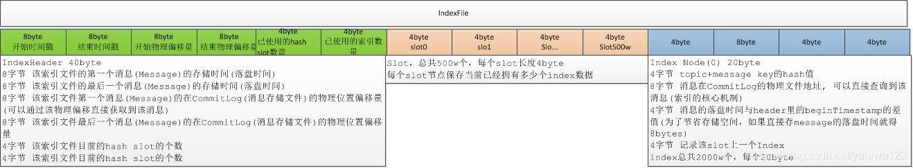

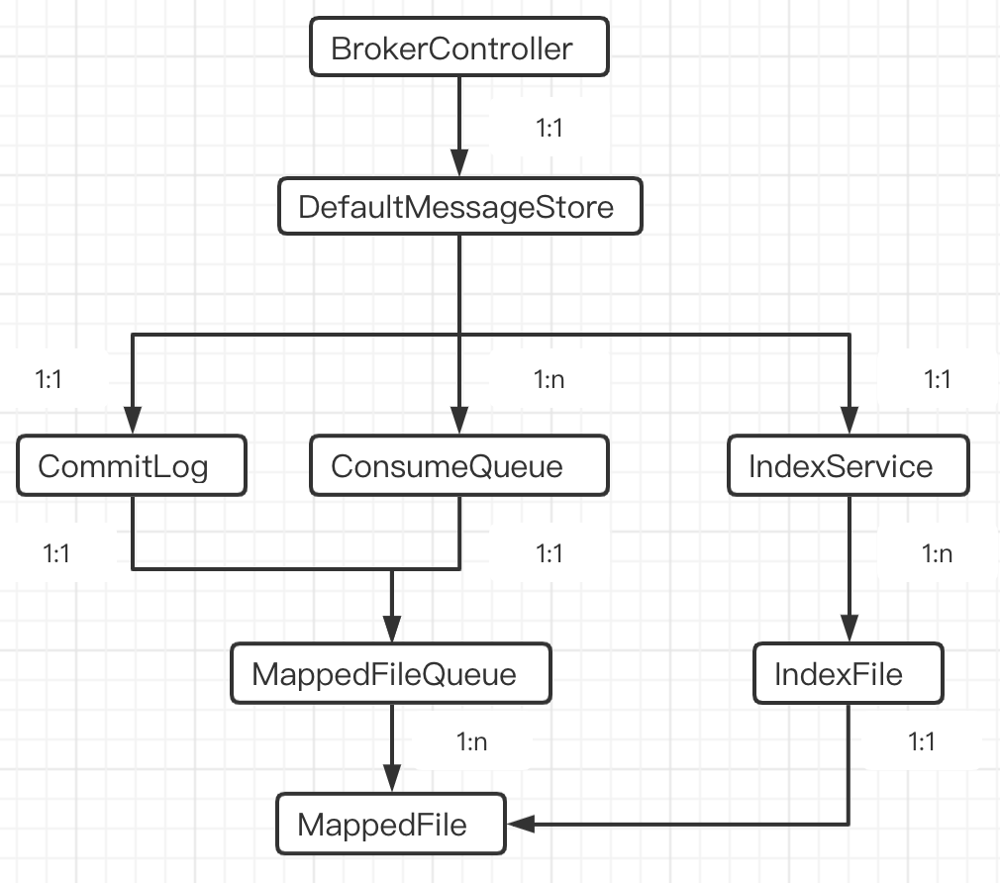


#### 2.5.4.3 broker启动恢复commitlog和consumequeue

```java
//org.apache.rocketmq.store.DefaultMessageStore.recover(boolean)
private void recover(final boolean lastExitOK) {
    long maxPhyOffsetOfConsumeQueue = this.recoverConsumeQueue();//恢复consumerqueue
    if (lastExitOK) {
        this.commitLog.recoverNormally(maxPhyOffsetOfConsumeQueue);//broker上次是正常关闭
    } else {
        this.commitLog.recoverAbnormally(maxPhyOffsetOfConsumeQueue);//broker上次是异常关闭
    }
    this.recoverTopicQueueTable();
}
```

这里先看恢复consumequeue，参考ConsumeQueue#recover方法，其实就是从所有的consumequeue文件的倒数第三个开始遍历恢复。这样一个是可以对虚拟内存做一个预热，同时进行验证，一般只有最后一个文件需要恢复。注意，consumequeue也是顺序写入的。从consumequeue文件循环读取commitlogOffset和msgLen，判断如果commitlogOffset大于等于0同时msgLen大于0，则继续；否则停止循环。然后判断如果一次循环到达文件默认，则继续处理下一个文件。这样处理后一方面有效的文件和物理偏移都已经读取到内存中，而大于有效物理偏移到条目就是无效的，同时后面的文件也是无效的，需要清理掉。

恢复commitlog分为正常关闭和异常关闭两种，同时recoverConsumeQueue返回了已经刷盘到consumequeue的commitlog offset。

**正常关闭**

recoverNormally大体逻辑和recoverConsumeQueue是相同的，不同之处是consumequeue每条记录是固定20字节，而commitlog内每条记录即一条消息，是变长的。这里不细说

**异常关闭**

基本逻辑和正常关闭一致，只是首先需要判断存储时间，只要一个commitlog第一条消息存储的时间戳小于刷盘检测点的刷盘时间，那么表明这个文件是需要恢复的。至于恢复多少，取决于每个消息条目读取的情况。


### 2.5.5 刷盘

```java
public void handleDiskFlush(AppendMessageResult result, PutMessageResult putMessageResult, MessageExt messageExt) {
  // Synchronization flush 同步刷盘
  if (FlushDiskType.SYNC_FLUSH == this.defaultMessageStore.getMessageStoreConfig().getFlushDiskType()) {
    final GroupCommitService service = (GroupCommitService) this.flushCommitLogService;
    // 默认为true，是否一定收到存储消息才返回
    if (messageExt.isWaitStoreMsgOK()) {
      // 即为MappedFile写入消息后的MappedFile.wrotePosition+MappedFile.fileFromOffset，
      // 即为整个commitlog对象（也为MappedFileQueue，因为代表MappedFile集合）上的位置，
      // MappedFileQueue.flushedWhere到该位置之间的数据就是需要刷新到磁盘的
      GroupCommitRequest request = new GroupCommitRequest(result.getWroteOffset() + result.getWroteBytes());
      // 添加一个刷盘请求并唤醒刷盘服务
      service.putRequest(request);
      boolean flushOK = request.waitForFlush(this.defaultMessageStore.getMessageStoreConfig().getSyncFlushTimeout());
      if (!flushOK) {
        // 刷盘超时返回结果为超时
        log.error("do groupcommit, wait for flush failed, topic: " + messageExt.getTopic() + " tags: " + messageExt.getTags()
                  + " client address: " + messageExt.getBornHostString());
        putMessageResult.setPutMessageStatus(PutMessageStatus.FLUSH_DISK_TIMEOUT);
      }
    } else {
      // 这种方式也是类似于异步，但是效率不如异步，还不如直接使用异步刷盘？所以其实没人用
      service.wakeup();
    }
  }
  // Asynchronous flush 异步刷盘
  else {
    if (!this.defaultMessageStore.getMessageStoreConfig().isTransientStorePoolEnable()) {
      flushCommitLogService.wakeup();
    } else {
      commitLogService.wakeup();
    }
  }
}
```


#### 2.5.5.1 异步刷盘

当配置为异步刷盘策略的时候，Broker 会运行一个服务 `FlushRealTimeService` 用来刷新缓冲区的消息内容到磁盘，这个服务使用一个独立的线程来做刷盘这件事情，默认情况下每隔 500ms 来检查一次是否需要刷盘。在追加消息完毕后，通过唤醒这个服务立即检查一下是否需要刷盘。唤醒之后异步处理

```java
//FlushRealTimeService.java
class FlushRealTimeService extends FlushCommitLogService {
  private long lastFlushTimestamp = 0;
  private long printTimes = 0;

  public void run() {
    CommitLog.log.info(this.getServiceName() + " service started");

    while (!this.isStopped()) {
      boolean flushCommitLogTimed = CommitLog.this.defaultMessageStore.getMessageStoreConfig().isFlushCommitLogTimed();
      // 时间间隔500ms
      int interval = CommitLog.this.defaultMessageStore.getMessageStoreConfig().getFlushIntervalCommitLog();
      // 默认操作系统提交页数4
      // 每次刷盘至少要刷多少页内容，每页大小为 4k，默认每次要刷 4 页
      int flushPhysicQueueLeastPages = CommitLog.this.defaultMessageStore.getMessageStoreConfig().getFlushCommitLogLeastPages();
      // 两次刷写之间的最大时间间隔，默认 10s
      int flushPhysicQueueThoroughInterval =
        CommitLog.this.defaultMessageStore.getMessageStoreConfig().getFlushCommitLogThoroughInterval();

     ...
      try {
        long begin = System.currentTimeMillis();
        // 刷新到磁盘
        CommitLog.this.mappedFileQueue.flush(flushPhysicQueueLeastPages);
        long storeTimestamp = CommitLog.this.mappedFileQueue.getStoreTimestamp();
        if (storeTimestamp > 0) {
          // 每次刷盘后把刷盘时间戳保存到StoreCheckpoint.physicMsgTimestamp，
          // 以供broker异常关闭后启动恢复刷盘位置，这里和broker启动进行recover操作对应
          // 存入到 commitlog 中到 storeTimestamp
          CommitLog.this.defaultMessageStore.getStoreCheckpoint().setPhysicMsgTimestamp(storeTimestamp);
        }
        long past = System.currentTimeMillis() - begin;
        if (past > 500) {
          log.info("Flush data to disk costs {} ms", past);
        }
        ...
  }
```

通过上面这段逻辑可知，异步刷盘就在异步线程中，周期性的将内存缓冲区的内容刷到文件中，在消息主流程中，只会唤醒异步刷盘线程，而不会同步等待刷盘结果，所以称为异步刷盘。


#### 2.5.5.2 同步刷盘

当配置为同步刷盘策略的时候，Broker 运行一个叫做 `GroupCommitService` 服务。在这个服务内部维护了一个**写请求**队列requestWrite和一个**读请求**requestRead队列，其中这两个队列每隔 10ms 就交换一下“身份”，这么做的目的其实也是为了**读写分离**，同时也避免锁竞争。在这个服务内部，每隔 10ms 就会检查读请求队列是否不为空，如果不为空，则会将读队列中的所有请求执行刷盘，并清空读请求队列:

```java
class GroupCommitService extends FlushCommitLogService {
    private void doCommit() {
        // 检查所有读队列中的请求
        for (GroupCommitRequest req : this.requestsRead) {
            // 每个请求执行刷盘
            CommitLog.this.mappedFileQueue.flush(0);
            req.wakeupCustomer(flushOK);
        }
        this.requestsRead.clear();
    }
}
```


#### 2.5.5.3 刷盘详解

这里摘自：`https://kunzhao.org/docs/rocketmq/rocketmq-message-store-flow/`

我们在这里已经知道消息刷盘有同步刷盘和异步刷盘策略，对应的是 `GroupCommitService` 和 `FlushRealTimeService` 这两种不同的服务。这两种服务都有定时请求刷盘的机制，但是机制背后最终调用的刷盘方式全部都集中在 `MappedFileQueue#flush` 这个方法上。再继续向下分析这个方法之前，我们先对照着这张图说明一下使用 `MappedByteBuffer` 来简要阐述读和写文件的简单过程：

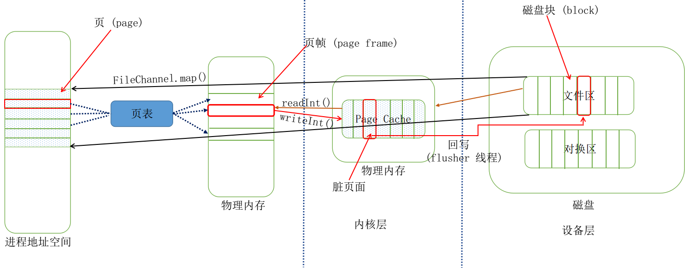

操作系统为了能够使多个进程同时使用内存，又保证各个进程访问内存互相独立，于是为每个进程引入了**地址空间**的概念，地址空间上的地址叫做**虚拟地址**，而程序想要运行必须放到**物理地址**上运行才可以。地址空间为进程**营造出了一种假象**：”整台计算机只有我一个程序在运行，这台计算机内存很大”。一个地址空间内包含着这个进程所需要的全部状态信息。通常一个进程的地址空间会按照逻辑分成好多**段**，比如**代码段、堆段、栈段**等。为了进一步有效利用内存，每一段又细分成了不同的**页 (page)**。与此相对应，计算机的物理内存被切成了**页帧 (page frame)**，文件被分成了**块 (block)**。既然程序实际运行的时候还是得依赖物理内存的地址，那么就需要将虚拟地址转换为物理地址，这个映射关系是由**页表 (page table)**来完成的。

另外在操作系统中，还有一层**磁盘缓存 (disk cache)\**的概念，它主要是用来减少对磁盘的 I/O 操作。磁盘缓存是以页为单位的，内容就是磁盘上的物理块，所以又称之为\**页缓存 (page cache)**。当进程发起一个读操作 （比如，进程发起一个 read() 系统调用），它首先会检查需要的数据是否在页缓存中。如果在，则放弃访问磁盘，而直接从页缓存中读取。如果数据没在缓存中，那么内核必须调度块 I/O 操作从磁盘去读取数据，然后将读来的数据放入页缓存中。系统并不一定要将整个文件都缓存，它可以只存储一个文件的一页或者几页。

如图所示，当调用 `FileChannel.map()` 方法的时候，会将这个文件**映射**进用户空间的地址空间中，注意，建立映射不会拷贝任何数据。我们前面提到过 Broker 启动的时候会有一个消息文件加载的过程，当第一次开始读取数据的时候:

```java
// 首次读取数据
int totalSize = byteBuffer.getInt();
```

这个时候，操作系统通过查询页表，会发现文件的这部分数据还不在内存中。于是就会触发一个缺页异常 (page faults)，这个时候操作系统会开始从磁盘读取这一页数据，然后先放入到页缓存中，然后再放入内存中。在第一次读取文件的时候，操作系统会读入所请求的页面，并读入紧随其后的少数几个页面（**不少于一个页面，通常是三个页面**），这时的预读称为**同步预读** (如下图所示，红色部分是需要读取的页面，蓝色的那三个框是操作系统预先读取的):

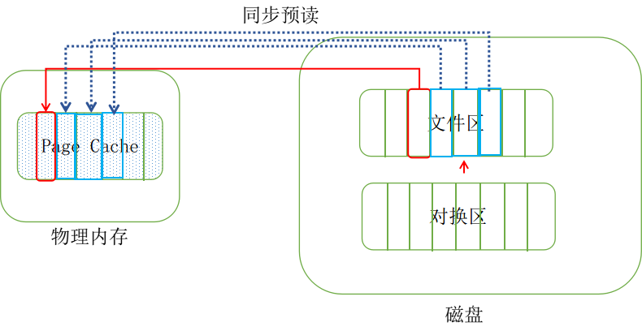

当然随着时间推移，预读命中的话，那么相应的预读页面数量也会增加，但是能够确认的是，一个文件至少有 4 个页面处在页缓存中。当文件一直处于**顺序读取**的情况下，那么基本上可以保证每次**预读命中**:

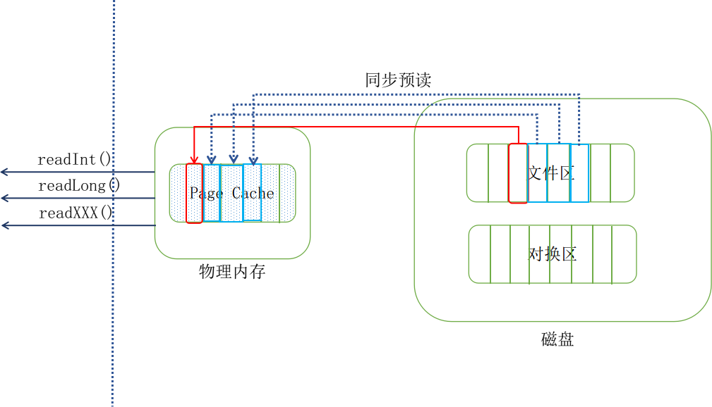

下面我们来说文件写，正常情况下，当尝试调用 `writeInt()` 写数据到文件里面的话，其写到页缓存层，这个方法就会返回了。这个时候数据还没有真正的保存到文件中去，Linux 仅仅将页缓存中的这一页数据标记为“**脏**”，并且被加入到脏页链表中。然后由一群进程（**flusher 回写进程**）周期性将脏页链表中的页写会到磁盘，从而让磁盘中的数据和内存中保持一致，最后清理“脏”标识。在以下三种情况下，脏页会被写回磁盘:

- 空闲内存低于一个特定阈值
- 脏页在内存中驻留超过一个特定的阈值时
- 当用户进程调用 `sync()` 和 `fsync()` 系统调用时

可见，在正常情况下，即使不采用刷盘策略，数据最终也是会被同步到磁盘中去的:

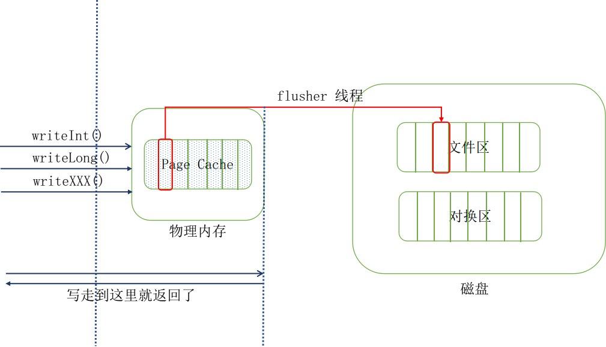

但是，即便有 `flusher` 线程来定时同步数据，如果此时机器断电的话，消息依然有可能丢失。RocketMQ 为了保证消息尽可能的不丢失，为了最大的高可靠性，做了同步和异步刷盘策略，来手动进行同步:

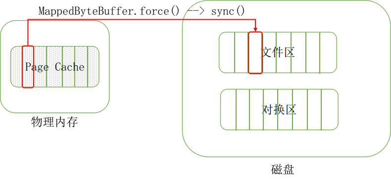

在介绍完上述消息刷盘背后的一些机制和理念后，我们再来分析刷盘整个过程。首先，无论同步刷盘还是异步刷盘，其线程都在一直周期性的尝试执行刷盘，在真正执行刷盘函数的调用之前，Broker 会检查文件的写位置是否大于 `flush` 位置，避免执行无意义的刷盘：


其次，对于异步刷盘来讲，Broker 执行了更为严格的刷盘限制策略，当在某个时间点尝试执行刷盘之后，在接下来 10 秒内，如果想要继续刷盘，那么脏页面数量必须不小于 4 页。

当刷盘完毕之后，首先会更新这个文件的 `flush` 位置，然后再更新 `MappedFileQueue` 的整体的 `flush` 位置:

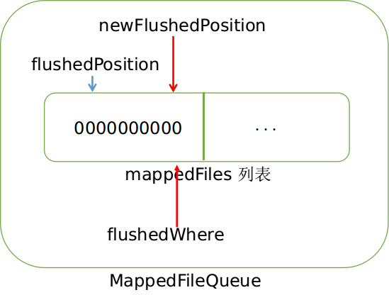

当刷盘完毕之后，便会将结果通知给客户端，告知发送消息成功。至此，整个存储过程完毕。


总结消息存储如下图

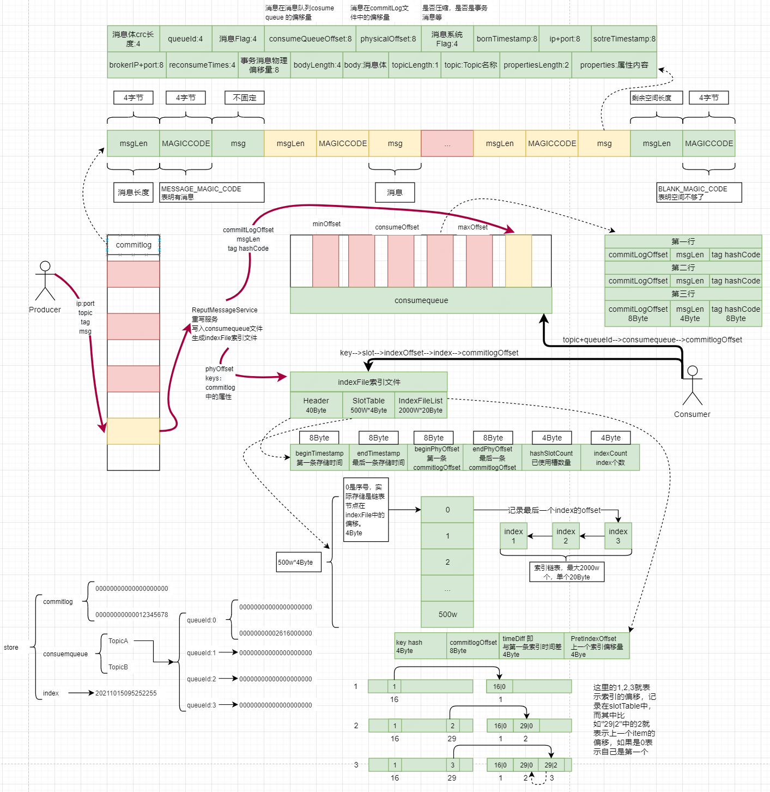


参考

```http
https://kunzhao.org/docs/rocketmq/rocketmq-message-store-flow/
https://www.cnblogs.com/dennyzhangdd/p/15035116.html
https://juejin.cn/post/6844903862147497998
https://www.cnblogs.com/duanxz/p/5020398.html
https://www.cnblogs.com/zhangyjblogs/p/14163380.html#2mappedfilequeue%E7%B1%BB%E8%AF%B4%E6%98%8E
```

