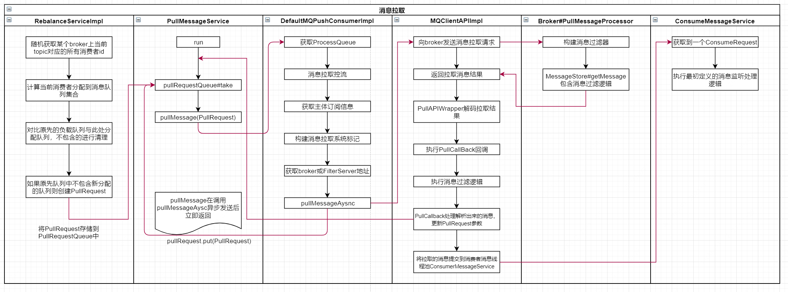
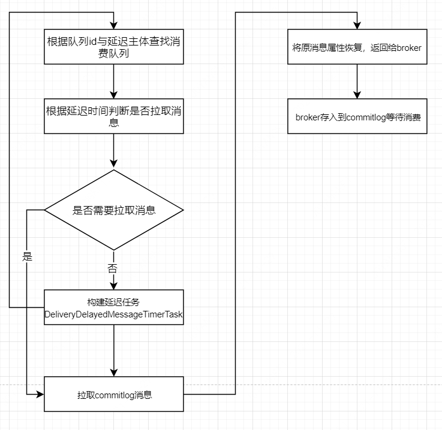

## 2.6 Consumer

### 2.6.1 消费的相关概念

消息消费以组的模式开展， 一个消费组内可以包含多个消费者，每一个消费组可订阅多个主题，消费组之间有集群模式与广播模式两种消费模式 。

 **集群模式**，主题下的同一条消息只允许被其中一个消费者消费，消息消费失败有机会进行重试，消息进度集中保存在Broker端。

> ###### 适用场景&注意事项
>
> - 消费端集群化部署， 每条消息只需要被处理一次。
> - 由于消费进度在服务端维护， 可靠性更高。
> - 集群消费模式下，每一条消息都只会被分发到一台机器上处理。如果需要被集群下的每一台机器都处理，请使用广播模式。
> - 集群消费模式下，不保证每一次失败重投的消息路由到同一台机器上，因此处理消息时不应该做任何确定性假设。

 **广播模式**，主题下的同一条消息将被集群内的所有消 费者消费一次，消息消费失败不会进行重试，消费进度保存在Consumer端。 

> ###### 适用场景&注意事项
>
> - 广播消费模式下不支持顺序消息。
> - 广播消费模式下不支持重置消费位点。
> - 每条消息都需要被相同逻辑的多台机器处理。
> - 消费进度在客户端维护，出现重复的概率稍大于集群模式。
> - 广播模式下，消息队列 RocketMQ 保证每条消息至少被每台客户端消费一次，但是并不会对消费失败的消息进行失败重投，因此业务方需要关注消费失败的情况。
> - 广播模式下，客户端每一次重启都会从最新消息消费。客户端在被停止期间发送至服务端的消息将会被自动跳过， 请谨慎选择。
> - 广播模式下，每条消息都会被大量的客户端重复处理，因此推荐尽可能使用集群模式。
> - 目前仅 Java 客户端支持广播模式。
> - 广播模式下服务端不维护消费进度，所以消息队列 RocketMQ 控制台不支持消息堆积查询、消息堆积报警和订阅关系查询功能。


消息服务器与消费者之间的消息传送也有**两种方式:推模式、拉模式**。 所谓的拉模式，是消费端主动发起拉消息请求，而推模式是消息到达消息服务器后，推送给消息消费者 。 RocketMQ 消息**推模式的实现基于拉模式**，在拉模式上包装一层，一个拉取任务完成后开始下一个拉取任务 。

集群模式下，多个消费者如何对消息队列进行负载呢? 消息队列负载机制遵循一个通用的思想 : 一个消息队列同一 时间只允许被一个消费者消费，一个消费者可以消费多个消息队列 。

RocketMQ 支持局部顺序消息消费，也就是保证同一个消息队列上的消息顺序消费。 不支持消息全局顺序消费， 如果要实现某一主题的全局顺序消息消费， 可以将该主题的队列数设置为 1，牺牲高可用性。

RocketMQ 支持两种消息过滤模式:表达式(TAG、 SQL92)与类过滤模式。

消息拉模式，主要是由客户端手动调用消息拉取 API，而消息推模式是消息服务器主动将消息推送到消息消费端

**消息消费的含义**

> 在RoketMQ中大家通常所说的“消费”是两个步骤的统称，这两个步骤是：

1. Consumer从Broker拉取消息到本地，并保存到本地的消息缓存队列(ProcessQueue)。这个步骤中，消费的主体是RocketMQ的Consumer模块。
2. Consumer从本地的消息缓存队列取出消息，并调用上层应用程序指定的回调函数对消息进行处理。这个步骤中，消费的主体是上层应用程序。

> 不论是拉消息还是推消息模式，底层的实现都是由Consumer从Broker拉取消息。


### 2.6.2 消费启动

基本的消费代码

```java
package org.apache.rocketmq.example.quickstart;

public class Consumer {
    public static void main(String[] args) throws InterruptedException, MQClientException {
        DefaultMQPushConsumer consumer = new DefaultMQPushConsumer("ConsumerGroup");
        consumer.setNamesrvAddr("127.0.0.1:9876");
        consumer.setConsumeFromWhere(ConsumeFromWhere.CONSUME_FROM_FIRST_OFFSET);
        consumer.subscribe("TopicTest", "*");
        // 注册监听器
        consumer.registerMessageListener((MessageListenerConcurrently) (msgs, context) -> {
            System.out.printf("%s Receive New Messages: %s %n", Thread.currentThread().getName(), msgs);
            return ConsumeConcurrentlyStatus.CONSUME_SUCCESS;
        });
        consumer.start();
        System.out.printf("Consumer Started.%n");
    }
}
```

```java
// DefaultMQPushConsumer.java
public void start() throws MQClientException {
  setConsumerGroup(NamespaceUtil.wrapNamespace(this.getNamespace(), this.consumerGroup));
  this.defaultMQPushConsumerImpl.start();
  // 开启消息轨迹跟踪，例如
  // DefaultMQProducer producer = new DefaultMQProducer("ConsumerGroupName",true);
  if (null != traceDispatcher) {
    try {
      traceDispatcher.start(this.getNamesrvAddr(), this.getAccessChannel());
    } catch (MQClientException e) {
      log.warn("trace dispatcher start failed ", e);
    }
  }
}

// DefaultMQPushConsumerImpl.java
public synchronized void start() throws MQClientException {
  switch (this.serviceState) {
    case CREATE_JUST:
      log.info("the consumer [{}] start beginning. messageModel={}, isUnitMode={}", this.defaultMQPushConsumer.getConsumerGroup(),
               this.defaultMQPushConsumer.getMessageModel(), this.defaultMQPushConsumer.isUnitMode());
      this.serviceState = ServiceState.START_FAILED;
      // 检查配置
      this.checkConfig();
      // 复制订阅信息，构建订阅主题消息，如果是集群模式，则还需要构建重试主题消息
      // 重试主题消息主题名为%RETRY%+topic，重试以消费组为单位
      this.copySubscription();

      if (this.defaultMQPushConsumer.getMessageModel() == MessageModel.CLUSTERING) {
        this.defaultMQPushConsumer.changeInstanceNameToPID();
      }

      this.mQClientFactory = MQClientManager.getInstance().getAndCreateMQClientInstance(this.defaultMQPushConsumer, this.rpcHook);

      this.rebalanceImpl.setConsumerGroup(this.defaultMQPushConsumer.getConsumerGroup());
      this.rebalanceImpl.setMessageModel(this.defaultMQPushConsumer.getMessageModel());
      this.rebalanceImpl.setAllocateMessageQueueStrategy(this.defaultMQPushConsumer.getAllocateMessageQueueStrategy());
      this.rebalanceImpl.setmQClientFactory(this.mQClientFactory);

      this.pullAPIWrapper = new PullAPIWrapper(
        mQClientFactory,
        this.defaultMQPushConsumer.getConsumerGroup(), isUnitMode());
      this.pullAPIWrapper.registerFilterMessageHook(filterMessageHookList);

      if (this.defaultMQPushConsumer.getOffsetStore() != null) {
        this.offsetStore = this.defaultMQPushConsumer.getOffsetStore();
      } else {
        switch (this.defaultMQPushConsumer.getMessageModel()) {
            // 集群模式，消费进度保存在broker上
          case BROADCASTING:
            this.offsetStore = new LocalFileOffsetStore(this.mQClientFactory, this.defaultMQPushConsumer.getConsumerGroup());
            break;
            // 广播模式，消费进度保存在消费端
          case CLUSTERING:
            this.offsetStore = new RemoteBrokerOffsetStore(this.mQClientFactory, this.defaultMQPushConsumer.getConsumerGroup());
            break;
          default:
            break;
        }
        this.defaultMQPushConsumer.setOffsetStore(this.offsetStore);
      }
      // 初始化消费进度
      this.offsetStore.load();

      // 根据是否是顺序消费，创建消费端消费线程
      if (this.getMessageListenerInner() instanceof MessageListenerOrderly) {
        // 顺序消费
        this.consumeOrderly = true;
        this.consumeMessageService =
          new ConsumeMessageOrderlyService(this, (MessageListenerOrderly) this.getMessageListenerInner());
      } else if (this.getMessageListenerInner() instanceof MessageListenerConcurrently) {
        // 并行消费
        this.consumeOrderly = false;
        this.consumeMessageService =
          new ConsumeMessageConcurrentlyService(this, (MessageListenerConcurrently) this.getMessageListenerInner());
      }
      // consumeMessageService主要负责消息消费，内部维护一个线程池
      this.consumeMessageService.start();

      // 向MQClientInstance注册消费者（自己）
      boolean registerOK = mQClientFactory.registerConsumer(this.defaultMQPushConsumer.getConsumerGroup(), this);
      if (!registerOK) {
        this.serviceState = ServiceState.CREATE_JUST;
        this.consumeMessageService.shutdown();
        throw new MQClientException("The consumer group[" + this.defaultMQPushConsumer.getConsumerGroup()
                                    + "] has been created before, specify another name please." + FAQUrl.suggestTodo(FAQUrl.GROUP_NAME_DUPLICATE_URL),
                                    null);
      }
     // 启动客户端
      mQClientFactory.start();
      ...
    default:
      break;
  }
  this.updateTopicSubscribeInfoWhenSubscriptionChanged();
  this.mQClientFactory.checkClientInBroker();
  this.mQClientFactory.sendHeartbeatToAllBrokerWithLock();
  this.mQClientFactory.rebalanceImmediately();
}
// mQClientFactory
public void start() throws MQClientException {
  synchronized (this) {
    switch (this.serviceState) {
      case CREATE_JUST:
        this.serviceState = ServiceState.START_FAILED;
        // If not specified,looking address from name server
        if (null == this.clientConfig.getNamesrvAddr()) {
          this.mQClientAPIImpl.fetchNameServerAddr();
        }
        // Start request-response channel
        this.mQClientAPIImpl.start();
        // Start various schedule tasks
        this.startScheduledTask();
        // Start pull service
        this.pullMessageService.start();
        // Start rebalance service
        this.rebalanceService.start();
        // Start push service
        this.defaultMQProducer.getDefaultMQProducerImpl().start(false);
        ...
      default:
        break;
    }
  }
}
```

这里消息轨迹跟踪后面再看。

### 2.6.3 消息拉取

```java
// public class PullMessageService extends ServiceThread {
public void run() {
  log.info(this.getServiceName() + " service started");

  while (!this.isStopped()) {
    try {
      // 获取一个消息拉取的任务
      PullRequest pullRequest = this.pullRequestQueue.take();
      this.pullMessage(pullRequest);
    } catch (InterruptedException ignored) {
    } catch (Exception e) {
      log.error("Pull Message Service Run Method exception", e);
    }
  }
  log.info(this.getServiceName() + " service end");
}
```

先看消息拉取任务存入pullRequestQueue

```java
/**
 * 向pullRequestQueue存入pullRequest
 */
public void executePullRequestImmediately(final PullRequest pullRequest) {
  this.mQClientFactory.getPullMessageService().executePullRequestImmediately(pullRequest);
}
/**
 * 向pullRequestQueue存入pullRequest
 */
public void executeTaskLater(final Runnable r, final long timeDelay) {
  this.mQClientFactory.getPullMessageService().executeTaskLater(r, timeDelay);
}
```

有两个地方会向向pullRequestQueue存入pullRequest，一个是上面启动方法中pullMessage，拉取消息处理后又会将pullRequest存入到pullRequestQueue；另一个就是RebalanceImpl创建时存入。这里先看下pullRequest

```java
public class PullRequest {
    // 消费者组
    private String consumerGroup;
    // 待拉取消费队列
    private MessageQueue messageQueue;
    // 消息处理队列，从broker拉取到到消息先存入此队列，然后再提交到消费者线程池中
    private ProcessQueue processQueue;
    // 待拉取到MessageQueue偏移量
    private long nextOffset;
    // 是否被锁定
    private boolean lockedFirst = false;
}
```

消息拉取

```java
// PullMessageService.java
private void pullMessage(final PullRequest pullRequest) {
  // 获取消费者内部实现类MQConsumerInner
  final MQConsumerInner consumer = this.mQClientFactory.selectConsumer(pullRequest.getConsumerGroup());
  if (consumer != null) {
    // 强制转换成了DefaultMQPushConsumerImpl，这个只为push模式服务
    // 也就是说pull模式，rocketMQ只提供拉取消息到API，具体由应用程序调用
    DefaultMQPushConsumerImpl impl = (DefaultMQPushConsumerImpl) consumer;
    impl.pullMessage(pullRequest);
  } else {
    log.warn("No matched consumer for the PullRequest {}, drop it", pullRequest);
  }
}
```


### 2.6.4 PullRequestQueue机制

**ProcessQueue是MessageQueue在消费端的重现、快照**。 PullMessageService从消息服务器默认每次拉取 32 条消息，按消息的队列偏移量顺序存放在 ProcessQueue 中， PullMessageService然后将消息提交到消费者消费线程池，消息成功消费后从 ProcessQueue中移除 。

```java
public class ProcessQueue {
    public final static long REBALANCE_LOCK_MAX_LIVE_TIME =
        Long.parseLong(System.getProperty("rocketmq.client.rebalance.lockMaxLiveTime", "30000"));
    public final static long REBALANCE_LOCK_INTERVAL = Long.parseLong(System.getProperty("rocketmq.client.rebalance.lockInterval", "20000"));
    private final static long PULL_MAX_IDLE_TIME = Long.parseLong(System.getProperty("rocketmq.client.pull.pullMaxIdleTime", "120000"));
    private final InternalLogger log = ClientLogger.getLog();
    // 读写锁
    private final ReadWriteLock lockTreeMap = new ReentrantReadWriteLock();
    // 消息存储容器，key为消息在ConsumeQueue中的偏移量，value为消息实体
    private final TreeMap<Long, MessageExt> msgTreeMap = new TreeMap<Long, MessageExt>();
    // ProcessQueue中总消息数
    private final AtomicLong msgCount = new AtomicLong();
    // 整个ProcessQueue处理单元的总消息长度
    private final AtomicLong msgSize = new AtomicLong();
    private final Lock lockConsume = new ReentrantLock();
    /**
     * A subset of msgTreeMap, will only be used when orderly consume
     */
    private final TreeMap<Long, MessageExt> consumingMsgOrderlyTreeMap = new TreeMap<Long, MessageExt>();
    private final AtomicLong tryUnlockTimes = new AtomicLong(0);
    // 整个ProcessQueue处理单元的offset最大边界
    private volatile long queueOffsetMax = 0L;
    // 当前processQueue是否被丢弃
    private volatile boolean dropped = false;
    // 上一次开始消息拉取时间戳
    private volatile long lastPullTimestamp = System.currentTimeMillis();
    // 上一次消息消费时间戳
    private volatile long lastConsumeTimestamp = System.currentTimeMillis();
    private volatile boolean locked = false;
    private volatile long lastLockTimestamp = System.currentTimeMillis();
    // 是否正在被消费
    private volatile boolean consuming = false;
    // broker端还有多少条消息没被处理（拉取消息的那一刻）
    private volatile long msgAccCnt = 0;
```

**消息拉取详细流程**

1、客户端封装拉取请求并进行一系列检查校验

```java
// DefaultMQPushConsumerImpl.java
public void pullMessage(final PullRequest pullRequest) {
  // 获取拉取请求中的processQueue
  final ProcessQueue processQueue = pullRequest.getProcessQueue();
  if (processQueue.isDropped()) {
    // 被丢弃
    log.info("the pull request[{}] is dropped.", pullRequest.toString());
    return;
  }
  // 更新最后被拉取的时间戳
  pullRequest.getProcessQueue().setLastPullTimestamp(System.currentTimeMillis());
  try {
    // 检查拉取线程运行状态正常
    this.makeSureStateOK();
  } catch (MQClientException e) {
    log.warn("pullMessage exception, consumer state not ok", e);
    this.executePullRequestLater(pullRequest, PULL_TIME_DELAY_MILLS_WHEN_EXCEPTION);
    return;
  }
  // 线程被挂起，则延迟1s，再将拉取请求存入到processQueue中
  if (this.isPause()) {
    log.warn("consumer was paused, execute pull request later. instanceName={}, group={}", this.defaultMQPushConsumer.getInstanceName(), this.defaultMQPushConsumer.getConsumerGroup());
    this.executePullRequestLater(pullRequest, PULL_TIME_DELAY_MILLS_WHEN_SUSPEND);
    return;
  }
```

为防止消息堆积进行控流操作

```java
// DefaultMQPushConsumerImpl#pullMessage
// 下面主要是进行控流，避免一条消息堆积，消息进度无法向前推进，可能造成大量消息重复消费
long cachedMessageCount = processQueue.getMsgCount().get();
long cachedMessageSizeInMiB = processQueue.getMsgSize().get() / (1024 * 1024);
// 如果processQueue当前处理的消息条数超过量1000，放弃本次拉取，并且该队列下一次
// 拉取任务将在50ms之后才能加入到拉取任务队列中
if (cachedMessageCount > this.defaultMQPushConsumer.getPullThresholdForQueue()) {
  this.executePullRequestLater(pullRequest, PULL_TIME_DELAY_MILLS_WHEN_FLOW_CONTROL);
  // 每触发1000次给出提示
  if ((queueFlowControlTimes++ % 1000) == 0) {
    // minOffset={队列最小偏移量}，maxOffset={队列最大偏移量}，size={消息总条数} MiB,
    // pullRequest={拉取任务}, flowControlTimes={流控触发次数}
    log.warn(
      "the cached message count exceeds the threshold {}, so do flow control, minOffset={}, maxOffset={}, count={}, size={} MiB, pullRequest={}, flowControlTimes={}",
      this.defaultMQPushConsumer.getPullThresholdForQueue(), processQueue.getMsgTreeMap().firstKey(), processQueue.getMsgTreeMap().lastKey(), cachedMessageCount, cachedMessageSizeInMiB, pullRequest, queueFlowControlTimes);
  }
  return;
}
// 当前处理消息长度，不能超过100M，放弃本次拉取，并且该队列下一次
// 拉取任务将在50ms之后才能加入到拉取任务队列中
if (cachedMessageSizeInMiB > this.defaultMQPushConsumer.getPullThresholdSizeForQueue()) {
  this.executePullRequestLater(pullRequest, PULL_TIME_DELAY_MILLS_WHEN_FLOW_CONTROL);
  if ((queueFlowControlTimes++ % 1000) == 0) {
    log.warn(
      "the cached message size exceeds the threshold {} MiB, so do flow control, minOffset={}, maxOffset={}, count={}, size={} MiB, pullRequest={}, flowControlTimes={}",
      this.defaultMQPushConsumer.getPullThresholdSizeForQueue(), processQueue.getMsgTreeMap().firstKey(), processQueue.getMsgTreeMap().lastKey(), cachedMessageCount, cachedMessageSizeInMiB, pullRequest, queueFlowControlTimes);
  }
  return;
}

// 非顺序消费
if (!this.consumeOrderly) {
  // ProcessQueue中队列最大偏移量，默认不能超过consumeConcurrentlyMaxSpan=2000
  if (processQueue.getMaxSpan() > this.defaultMQPushConsumer.getConsumeConcurrentlyMaxSpan()) {
    this.executePullRequestLater(pullRequest, PULL_TIME_DELAY_MILLS_WHEN_FLOW_CONTROL);
    if ((queueMaxSpanFlowControlTimes++ % 1000) == 0) {
      log.warn(
        "the queue's messages, span too long, so do flow control, minOffset={}, maxOffset={}, maxSpan={}, pullRequest={}, flowControlTimes={}",
        processQueue.getMsgTreeMap().firstKey(), processQueue.getMsgTreeMap().lastKey(), processQueue.getMaxSpan(),
        pullRequest, queueMaxSpanFlowControlTimes);
    }
    return;
  }
} else {
  // 被锁住了
  if (processQueue.isLocked()) {
    if (!pullRequest.isLockedFirst()) {
      final long offset = this.rebalanceImpl.computePullFromWhere(pullRequest.getMessageQueue());
      // 当前偏移小于下一次拉取的偏移
      boolean brokerBusy = offset < pullRequest.getNextOffset();
      log.info("the first time to pull message, so fix offset from broker. pullRequest: {} NewOffset: {} brokerBusy: {}",
               pullRequest, offset, brokerBusy);
      if (brokerBusy) {
        log.info("[NOTIFYME]the first time to pull message, but pull request offset larger than broker consume offset. pullRequest: {} NewOffset: {}",
                 pullRequest, offset);
      }

      pullRequest.setLockedFirst(true);
      // 重新设置下一次拉取的偏移位置
      pullRequest.setNextOffset(offset);
    }
  } else {
    this.executePullRequestLater(pullRequest, PULL_TIME_DELAY_MILLS_WHEN_EXCEPTION);
    log.info("pull message later because not locked in broker, {}", pullRequest);
    return;
  }
}
```

拉取主题的订阅信息并设置回调函数

```java
// 拉取该主题的订阅信息
final SubscriptionData subscriptionData = this.rebalanceImpl.getSubscriptionInner().get(pullRequest.getMessageQueue().getTopic());
// 如果为空，则结束本次拉取，下一次拉取任务延迟3s
if (null == subscriptionData) {
  this.executePullRequestLater(pullRequest, PULL_TIME_DELAY_MILLS_WHEN_EXCEPTION);
  log.warn("find the consumer's subscription failed, {}", pullRequest);
  return;
}

final long beginTimestamp = System.currentTimeMillis();
// 设置拉取回调函数
PullCallback pullCallback = new PullCallback() {...}
```

回调函数后面再看，然后进行消息拉取

```java
boolean commitOffsetEnable = false;
long commitOffsetValue = 0L;
// 集群模式
if (MessageModel.CLUSTERING == this.defaultMQPushConsumer.getMessageModel()) {
  // 获取消费进度
  commitOffsetValue = this.offsetStore.readOffset(pullRequest.getMessageQueue(), ReadOffsetType.READ_FROM_MEMORY);
  if (commitOffsetValue > 0) {
    commitOffsetEnable = true;
  }
}

String subExpression = null;
boolean classFilter = false;
// 获取订阅信息
SubscriptionData sd = this.rebalanceImpl.getSubscriptionInner().get(pullRequest.getMessageQueue().getTopic());
if (sd != null) {
  if (this.defaultMQPushConsumer.isPostSubscriptionWhenPull() && !sd.isClassFilterMode()) {
    subExpression = sd.getSubString();
  }

  classFilter = sd.isClassFilterMode();
}
// 构建消息拉取系统标记
int sysFlag = PullSysFlag.buildSysFlag(
  commitOffsetEnable, // commitOffset
  true, // suspend 表示支持挂起
  subExpression != null, // subscription 过滤机制为表达式
  classFilter // class filter 过滤机制为类过滤模式
);
try {
  // 从broker处拉取消息
  this.pullAPIWrapper.pullKernelImpl(
    // 消息队列
    pullRequest.getMessageQueue(),
    // 消息过滤表达式
    subExpression,
    // 消息表达式类型，TAG、SLQ92
    subscriptionData.getExpressionType(),
    subscriptionData.getSubVersion(),
    // 消息拉取偏移量
    pullRequest.getNextOffset(),
    // 本次拉取最大消息条数，默认为32条
    this.defaultMQPushConsumer.getPullBatchSize(),
    sysFlag,
    commitOffsetValue,
    BROKER_SUSPEND_MAX_TIME_MILLIS,
    CONSUMER_TIMEOUT_MILLIS_WHEN_SUSPEND,
    // 消息拉取模式，默认为异步拉取
    CommunicationMode.ASYNC,
    pullCallback
  );
} catch (Exception e) {
  log.error("pullKernelImpl exception", e);
  this.executePullRequestLater(pullRequest, PULL_TIME_DELAY_MILLS_WHEN_EXCEPTION);
}
```

这里要注意的是拉取消息的时候如果是类过滤模式，那么此时会根据topic、broker地址找到注册在broker上的FilterServer地址，从FilterServer上拉取消息，否则就是直接从broker上拉取消息。此时消息发送到了broker，发送到请求编码为PULL_MESSAGE

```java
RemotingCommand request = RemotingCommand.createRequestCommand(RequestCode.PULL_MESSAGE, requestHeader);
```

通过请求编码可以在BrokerController中找到

```java
this.remotingServer.registerProcessor(RequestCode.PULL_MESSAGE, this.pullMessageProcessor, this.pullMessageExecutor);
this.pullMessageProcessor.registerConsumeMessageHook(consumeMessageHookList);
```

可以看到拉取消息的处理就是PullMessageProcessor#processRequest。这里读取就不详细展开了，基本逻辑就是解析出相关头信息，找到对应的consumequeue文件，然后读取返回。同时这里还涉及到过滤器的构造，后面详述。

然后通过之前构建的回调函数处理读取到的消息。在回调函数中首先是处理请求的响应，同时更新请求PullRequest中的相关信息，如下次待读取的偏移等，存入到pullRequestQueue中进行下一次拉取，这就是一个循环拉取的过程。

```java
PullCallback pullCallback = new PullCallback() {
  ...
    // 将相关拉取到到消息存入consumeMessageService供消费者消费
    boolean dispatchToConsume = processQueue.putMessage(pullResult.getMsgFoundList());
  DefaultMQPushConsumerImpl.this.consumeMessageService.submitConsumeRequest(
    pullResult.getMsgFoundList(),
    processQueue,
    pullRequest.getMessageQueue(),
    dispatchToConsume);
  ....
}
```

这里将读取到的消息提交给了DefaultMQPushConsumerImpl.ConsumeMessageService，这个线程池是在consumer（DefaultMQPushConsumerImpl）启动的时候一并启动的，而我们最开始在消费样例中提交过一个消费函数就是提交到该线程池中的。

```java
package org.apache.rocketmq.example.quickstart;

public class Consumer {
        // 注册监听器
        consumer.registerMessageListener((MessageListenerConcurrently) (msgs, context) -> {
            System.out.printf("%s Receive New Messages: %s %n", Thread.currentThread().getName(), msgs);
            return ConsumeConcurrentlyStatus.CONSUME_SUCCESS;
        });
  ...
    }
}
```


### 2.6.5 消息拉取长轮询机制(Push)

**RocketMQ 并没有真正实现推模式，而是消费者主动向消息服务器拉取消息， RocketMQ 推模式是循环向消息服务端发送消息拉取请求，如果消息消费者向 RocketMQ 发送消息拉取时，消息并未到达消费队列，如果不启用长轮询机制，则会在服务端等待 shortPolling­TimeMills 时间后(挂起)再去判断消息是否已到达消息队列，如果消息未到达则提示消息拉取客户端 PULL_NOT_FOUND (消息不存在)**；如果开启长轮询模式， RocketMQ 一方面会每 5s 轮询检查一次消息是否可达 ， 同时一有新消息到达后立马通知挂起线程再次验证新消息是否是自己感兴趣的消息，如果是则从 commitlog文件提取消息返回给消息拉取客户端，否则直到挂起超时，超时时间由消息拉取方在消息拉取时封装在请求参数中， PUSH 模式默认为 15s, PULL模式通过 `DefaultMQPullConsumer#brokerSuspenMaxTimeMillis`设置。 Rocket­ MQ 通过在 Broker端配置 longPollingEnable 为true来开启长轮询模式 。 消息拉取时服务端从 Commitlog 未找到消息时的处理逻辑如下 。

```java
// PullMessageProcessor#processRequest
// 这里是对拉取消息的结果进行判断，判断是否是没有消息可拉取
case ResponseCode.PULL_NOT_FOUND:
// 消息不存在，broker支持挂起
// 如果没有消息，此时将response设置为null，不会立即向客户端写入响应
if (brokerAllowSuspend && hasSuspendFlag) {
  // 挂起超时时间（请求方传入，PUSH默认为15s，PULL通过
  // DefaultMQPullConsumer#brokerSuspenMaxTimeMillis设置，默认20s）
  long pollingTimeMills = suspendTimeoutMillisLong;
  // 如果支持长轮训，挂起超时时间为请求方传入，否则从broker配置中读取
  if (!this.brokerController.getBrokerConfig().isLongPollingEnable()) {
    pollingTimeMills = this.brokerController.getBrokerConfig().getShortPollingTimeMills();
  }

  String topic = requestHeader.getTopic();
  long offset = requestHeader.getQueueOffset();
  int queueId = requestHeader.getQueueId();
  // 创建PullRequest提交到PullRequestHoldService线程中
  PullRequest pullRequest = new PullRequest(request, channel, pollingTimeMills,
  this.brokerController.getMessageStore().now(), offset, subscriptionData, messageFilter);
  this.brokerController.getPullRequestHoldService().suspendPullRequest(topic, queueId, pullRequest);
  response = null;
  break;
}
```

RocketMQ 轮询机制由 两个线程共 同来完成 。
1 ) PullRequestHoldService: 每隔 5s 重试一次 。 

2 ) DefaultM巳ssageStore#ReputMessageService，每处理一次重新拉取，Thread.sleep( 1 ), 继续下一次检查。

```java
// PullRequestHoldService#suspendPullRequest
public void suspendPullRequest(final String topic, final int queueId, final PullRequest pullRequest) {
  // key：topic@queueId
  String key = this.buildKey(topic, queueId);
  ManyPullRequest mpr = this.pullRequestTable.get(key);
  if (null == mpr) {
    mpr = new ManyPullRequest();
    // 将挂起请求存入到ManyPullRequest
    ManyPullRequest prev = this.pullRequestTable.putIfAbsent(key, mpr);
    if (prev != null) {
      mpr = prev;
    }
  }
  mpr.addPullRequest(pullRequest);
}
```

然后会在当前线程中进行处理

```java
// PullRequestHoldService.java
public void run() {
  log.info("{} service started", this.getServiceName());
  while (!this.isStopped()) {
    try {
      if (this.brokerController.getBrokerConfig().isLongPollingEnable()) {
        // broker支持长轮训，5s一次判断消息是否到达
        this.waitForRunning(5 * 1000);
      } else {
        // 否则默认1s检查一次
      this.waitForRunning(this.brokerController.getBrokerConfig().getShortPollingTimeMills());
      }
      long beginLockTimestamp = this.systemClock.now();
      // 检查消息是否到达
      this.checkHoldRequest();
      long costTime = this.systemClock.now() - beginLockTimestamp;
      if (costTime > 5 * 1000) {
        log.info("[NOTIFYME] check hold request cost {} ms.", costTime);
      }
    } catch (Throwable e) {
      log.warn(this.getServiceName() + " service has exception. ", e);
    }
  }
}
```

具体的检查判断如下

```java
private void checkHoldRequest() {
  // 循环遍历，通过topic和queueId获取消费队列最大到偏移量，如果大于待拉取偏移量
  // 则表明有新消息到达
  for (String key : this.pullRequestTable.keySet()) {
    String[] kArray = key.split(TOPIC_QUEUEID_SEPARATOR);
    if (2 == kArray.length) {
      String topic = kArray[0];
      int queueId = Integer.parseInt(kArray[1]);
      final long offset = this.brokerController.getMessageStore().getMaxOffsetInQueue(topic, queueId);
      try {
        // 触发消息拉取
        this.notifyMessageArriving(topic, queueId, offset);
      } catch (Throwable e) {
        log.error("check hold request failed. topic={}, queueId={}", topic, queueId, e);
      }
    }
  }
}
public void notifyMessageArriving(final String topic, final int queueId, final long maxOffset, final Long tagsCode,
long msgStoreTime, byte[] filterBitMap, Map<String, String> properties) {
  String key = this.buildKey(topic, queueId);
  ManyPullRequest mpr = this.pullRequestTable.get(key);
  if (mpr != null) {
    // 同步获取所有挂起到拉取请求
    List<PullRequest> requestList = mpr.cloneListAndClear();
    if (requestList != null) {
      List<PullRequest> replayList = new ArrayList<PullRequest>();
      for (PullRequest request : requestList) {
        long newestOffset = maxOffset;
        if (newestOffset <= request.getPullFromThisOffset()) {
          newestOffset = this.brokerController.getMessageStore().getMaxOffsetInQueue(topic, queueId);
        }
        if (newestOffset > request.getPullFromThisOffset()) {
          boolean match = request.getMessageFilter().isMatchedByConsumeQueue(tagsCode,                                                                   
          new ConsumeQueueExt.CqExtUnit(tagsCode, msgStoreTime, filterBitMap));
          // match by bit map, need eval again when properties is not null.
          if (match && properties != null) {
            match = request.getMessageFilter().isMatchedByCommitLog(null, properties);
          }
          if (match) {
            try {
              // 唤醒挂起线程，将消息返回给消息拉取客户端
              this.brokerController.getPullMessageProcessor().executeRequestWhenWakeup(
                request.getClientChannel(),request.getRequestCommand());
            } catch (Throwable e) {
              log.error("execute request when wakeup failed.", e);
            }
            continue;
          }
        }
        // 如果超时了，则不继续等待，直接返回客户端消息未找到
        if (System.currentTimeMillis() >= (request.getSuspendTimestamp() + request.getTimeoutMillis())) {
          try {
           this.brokerController.getPullMessageProcessor().executeRequestWhenWakeup(
             request.getClientChannel(),request.getRequestCommand());
          } catch (Throwable e) {
            log.error("execute request when wakeup failed.", e);
          }
          continue;
        }
        replayList.add(request);
      }
      if (!replayList.isEmpty()) {
        mpr.addPullRequest(replayList);
      }
    }
  }
}
```

这里要注意，在唤醒挂起线程executeRequestWhenWakeup的时候会再次执行消息拉取方法

```java
final RemotingCommand response = PullMessageProcessor.this.processRequest(channel, request, false);
```

只是这里brokerAllowSuspend=false，也就是说长轮询方式下，第一次会将消息拉取线程挂起，在超时之后如果还是没有新消息，那么不再挂起，直接返回给客户端未找到消息。但是这里有个问题是，线程挂起之后需要等待5s才去检查，实时性不够。于是这里在消息到达的时候会主动触发挂起线程进行一次检查。

主要是在ReputMessageService中处理， ReputMessageService线程主要是根据 Commitlog 将消息转发到 ConsumeQueue、 Index 等文件，在转发方法doReput中有对长轮询进行处理

```java
private void doReput() {
  // 当系统重启的时候，会根据duplicationEnable来决定是否从头开始处理消息还是只处理新来的消息。
  // 在duplicationEnable是true 的情况下，还需要设置CommitLog
  // .confirmOffset才能从头开始处理消息，因为默认情况下系统启动以后CommitLog.confirmOffset
  // 和ReputMessageService.reputFromOffset是相等的
  // 检测偏移量
  if (this.reputFromOffset < DefaultMessageStore.this.commitLog.getMinOffset()) {
    log.warn("The reputFromOffset={} is smaller than minPyOffset={}, this usually indicate that the dispatch behind too much and the commitlog has expired.",
             this.reputFromOffset, DefaultMessageStore.this.commitLog.getMinOffset());
    // 取最小的commitlog偏移量
    this.reputFromOffset = DefaultMessageStore.this.commitLog.getMinOffset();
  }
  for (boolean doNext = true; this.isCommitLogAvailable() && doNext; ) {
    // 允许消息重复，这里的confirmOffset没明白是啥意思？todo
    if (DefaultMessageStore.this.getMessageStoreConfig().isDuplicationEnable()
        && this.reputFromOffset >= DefaultMessageStore.this.getConfirmOffset()) {
      break;
    }
    ...
      
// 非从broker，同时支持长轮询
    if (BrokerRole.SLAVE != DefaultMessageStore.this.getMessageStoreConfig().getBrokerRole()
        && DefaultMessageStore.this.brokerConfig.isLongPollingEnable()) {
      DefaultMessageStore.this.messageArrivingListener.arriving(dispatchRequest.getTopic(),
      dispatchRequest.getQueueId(), dispatchRequest.getConsumeQueueOffset() + 1,
      dispatchRequest.getTagsCode(), dispatchRequest.getStoreTimestamp(),
      dispatchRequest.getBitMap(), dispatchRequest.getPropertiesMap());
    }
```

这里有一点没明白，一个是CommitLog.confirmOffset这个变量的作用是什么？没有相关方法设置其值；后MessageArrivingListener是用来唤醒挂起线程的，BrokerController启动的时候会向DefaultMessageStore传入一个NotifyMessageArrivingListener，这个监听器就是MessageArrivingListener的实现，最终调用其arriving方法唤醒挂起线程。


### 2.6.6 消息队列负载与重新分布机制

前面说过消息在拉取时会有从pullRequestQueue中获取一个PullRequest，然后向broker请求消息拉取，完了之后又会更新PullRequest重新放入队列中，进行一个循环。但是最开始是谁向队列存入一个PullRequest的呢？同时PullRequest是以topic和queueId区分的，这是如何进行负载的呢？

这其实是由RebalanceService线程来完成的，其跟随MQClientInstance启动而启动，注意，这里是在客户端。一个消费者可以监听多个topic，一个topic也可以被多个消费者订阅。

```java
// RebalanceService.java
public void run() {
  while (!this.isStopped()) {
    // 可配置rocketmq.client.rebalance.waitInterval 延时时间
    // 默认20s
    // 还可以使用-Drocketmq.client.rebalance.waitlnterval=xx设置
    this.waitForRunning(waitInterval);
    // 再平衡
    this.mqClientFactory.doRebalance();
  }
}

// MQClientInstance.java
public void doRebalance() {
  // 遍历已注册的消费者，每一个DefaultMQPushConsumerImpl都持有一个单独RebalanceImpl
  // 对象，该方法主要是遍历订阅信息对每个主题对队列进行重新负载
  for (Map.Entry<String, MQConsumerInner> entry : this.consumerTable.entrySet()) {
    MQConsumerInner impl = entry.getValue();
    if (impl != null) {
      try {
        impl.doRebalance();
      } catch (Throwable e) {
        log.error("doRebalance exception", e);
      }
    }
  }
}
```

每个再平衡业务RebalanceServiceImpl针对一个消费客户端来说的，因为该客户端监听到topic所对应的消息分布在多个broker的多个consumequeue上。

```java
// DefaultMQPushConsumerImpl.java
public void doRebalance() {
  if (!this.pause) {
    this.rebalanceImpl.doRebalance(this.isConsumeOrderly());
  }
}

// RebalanceServiceImpl.java
public void doRebalance(final boolean isOrder) {
  // key为topic，subTable在消费者调用DefaultMQPushConsumerImpl#subscribe
  // 时填充，也就是 consumer.subscribe("TopicTest", "*");
  Map<String, SubscriptionData> subTable = this.getSubscriptionInner();
  if (subTable != null) {
    for (final Map.Entry<String, SubscriptionData> entry : subTable.entrySet()) {
      final String topic = entry.getKey();
      try {
        this.rebalanceByTopic(topic, isOrder);
      } catch (Throwable e) {
        if (!topic.startsWith(MixAll.RETRY_GROUP_TOPIC_PREFIX)) {
          log.warn("rebalanceByTopic Exception", e);
        }
      }
    }
  }
  // 清理
  this.truncateMessageQueueNotMyTopic();
}
```

这里根据topic进行重新分配，最后会将非本消费客户端监听的topic的消息清理掉。这里看具体的分配，以集群模式为例

```java
// RebalanceServiceImpl.java
case CLUSTERING: {
  // 获取所有queue
  Set<MessageQueue> mqSet = this.topicSubscribeInfoTable.get(topic);
  // 随机选择一个broker，broker返回其上所有对消费者信息（消费者id集合）
  List<String> cidAll = this.mQClientFactory.findConsumerIdList(topic, consumerGroup);
  if (null == mqSet) {
    if (!topic.startsWith(MixAll.RETRY_GROUP_TOPIC_PREFIX)) {
      log.warn("doRebalance, {}, but the topic[{}] not exist.", consumerGroup, topic);
    }
  }
  if (null == cidAll) {
    log.warn("doRebalance, {} {}, get consumer id list failed", consumerGroup, topic);
  }
  if (mqSet != null && cidAll != null) {
    List<MessageQueue> mqAll = new ArrayList<MessageQueue>();
    mqAll.addAll(mqSet);
    // 排序，确保同一个消费队列不会被多个消费者分配
    Collections.sort(mqAll);
    Collections.sort(cidAll);
    // 分配策略
    AllocateMessageQueueStrategy strategy = this.allocateMessageQueueStrategy;
    // 重新分配
    List<MessageQueue> allocateResult = null;
    try {
      allocateResult = strategy.allocate(
        this.consumerGroup,
        this.mQClientFactory.getClientId(),
        mqAll,
        cidAll);
    } catch (Throwable e) {
      return;
    }

    Set<MessageQueue> allocateResultSet = new HashSet<MessageQueue>();
    if (allocateResult != null) {
      allocateResultSet.addAll(allocateResult);
    }
    // 消息队列发生变化
    boolean changed = this.updateProcessQueueTableInRebalance(topic, allocateResultSet, isOrder);
    if (changed) {
      this.messageQueueChanged(topic, mqSet, allocateResultSet);
    }
  }
  break;
}
```

这里主要注意的是会随机选择一个broker拉取其上的所有消费者客户端id（监听同一个topic），然后进行重新分配，分配策略有几种

RocketMQ 默认提供 5 种分配算法 。
 1 ) AllocateMessageQueueAveragely:平均分配，推荐指数为 5 颗星 。
举例来说，如果现在有 8个消息消费队列 ql,q2,q3,q4,q5,q6,q7,q8, 有 3个消费者 c1,c2,c3，那么根据该负载算法 ，消 息 队列分配如下: 

```
c1:q1,q2,q3
c2:q4,q5,q6
c3:q7,q8
```

 2 ) AllocateMessageQueueAveragelyByCircle:平均轮询分配 ，推荐指数为 5 颗星 。 

举例来说，如果现在有 8个消息消费队列 ql,q2,q3,q4,q5,q6,q7,q8, 有 3个消费者 c1,c2,c3，那么根据该负载算法 ，消 息 队列分配如下: 

```
cl:ql,q4,q7
c2:q2,q5,q8
c3:q3,q6
```

3 ) AllocateMessageQueueConsistentHash: 一致性 hash。 不推荐使用，因为消息队列负载信息不容易跟踪 。

4 ) AllocateMessageQueueByConfig:根据配置，为每一个消费者配置固定的消息队列 。 

5 ) AllocateMessageQueueByMachineRoom:根据 Broker部署机房名，对每个消费者负责不同的 Broker上的队列。

> 消息负载算法如果没有特殊的要求，尽量使用 AllocateMessageQueueAveragely、AllocateMessageQueueAveragelyByCircle，因为分配算法比较直观 。 消息队列分配遵循 一个消费者可以分配多个消息队列，但同一个消息队列只会分配给一个消费者，故如果消费者个数大于消息队列数量，则有些消费者无法消费消息 。

对比消息队列是否发生变化，主要思路是遍历当前负载队列集合，如果队列不在新分配队列集合中，需要将该队列停止消费并保存消费进度; 遍历已分配的队列，如果队列不 在队列负载表中( processQueueTable) 则需要创建该队列拉取任务 PullRequest， 然后添加 到 PullMessageService线程的 pullRequestQueue 中， PulIMessageService才会继续拉取任务

```java
private boolean updateProcessQueueTableInRebalance(final String topic, final Set<MessageQueue> mqSet, final boolean isOrder) {
  boolean changed = false;

  Iterator<Entry<MessageQueue, ProcessQueue>> it = this.processQueueTable.entrySet().iterator();
  while (it.hasNext()) {
    Entry<MessageQueue, ProcessQueue> next = it.next();
    MessageQueue mq = next.getKey();
    ProcessQueue pq = next.getValue();
    // 针对同一个topic进行再分配
    if (mq.getTopic().equals(topic)) {
      // 如果不包含在mqSet中，表示经过本次消息队列负载后，该mq被分配给其他消费者
      // 故需要暂停该消息队列消息对消费。因为每一个消费者有一个rebalanceImpl
      // 这里说的暂停消费是针对此消息队列来说的
      if (!mqSet.contains(mq)) {
        // 设置为true表示该processQueue中对消息将不会再被消费
        pq.setDropped(true);
        // 判断是否将MessageQueue、ProcessQueue从processQueueTable中移除
        // 此方法主要是持久化待移除MessageQueue消息消费进度到broker
        if (this.removeUnnecessaryMessageQueue(mq, pq)) {
          it.remove();
          changed = true;
          log.info("doRebalance, {}, remove unnecessary mq, {}", consumerGroup, mq);
        }
      }
      ...
        
      List<PullRequest> pullRequestList = new ArrayList<PullRequest>();
      for (MessageQueue mq : mqSet) {
        // 没有包含该消息队列，表明这是本次新增的消息队列
        if (!this.processQueueTable.containsKey(mq)) {
          if (isOrder && !this.lock(mq)) {
            log.warn("doRebalance, {}, add a new mq failed, {}, because lock failed", consumerGroup, mq);
            continue;
          }
          // 首先从内存中删除消费进度，然后从磁盘读取消费进度，创建PullRequest
          this.removeDirtyOffset(mq);
          ProcessQueue pq = new ProcessQueue();
          long nextOffset = this.computePullFromWhere(mq);
          if (nextOffset >= 0) {
            ProcessQueue pre = this.processQueueTable.putIfAbsent(mq, pq);
            if (pre != null) {
              log.info("doRebalance, {}, mq already exists, {}", consumerGroup, mq);
            } else {
              log.info("doRebalance, {}, add a new mq, {}", consumerGroup, mq);
              PullRequest pullRequest = new PullRequest();
              pullRequest.setConsumerGroup(consumerGroup);
              pullRequest.setNextOffset(nextOffset);
              pullRequest.setMessageQueue(mq);
              pullRequest.setProcessQueue(pq);
              pullRequestList.add(pullRequest);
              changed = true;
            }
          } else {
            log.warn("doRebalance, {}, add new mq failed, {}", consumerGroup, mq);
          }
        }
      }
      // 添加到PullRequestQueue中进行消息拉取
      this.dispatchPullRequest(pullRequestList);
```

这里可以看到如果本地客户端的processQueueTable没有包含相关的consumequeue，那么会创建PullRequest存入到PullRequestQueue中进行消息拉取，这就和之前的消息拉取对上了，同时**在一个 JVM进程中，同一个消 费组同一个队列只会存在一个 PullRequest对象，也就是一个consumequeue文件顺序消费**。同时在消息拉取之前需要计算一下从哪里开始消费，也就是下一次拉取的消息偏移量是多少。

计算方式有几种，可以通过`DefaultMQPushConsumer#setConsumeFromWhere`方法设置。

* ConsumeFromWhere.CONSUME_FROM_LAST_OFFSET， 从队列最新偏移量开始消费。

  通过offsetStore.readOffset读取消费偏移，如果返回-1，则表示该队列刚创建

* CONSUME_FROM_FIRST_OFFSET:从头开始消费，从头开始消费

* CONSUME_FROM_TIMESTAMP: 从消费者启动 的时间戳对应的消费进度开始消费

最终获取的偏移量如果小于0，则此队列相当于分配失败，暂不拉取消息，等待下一次处理。


### 2.6.7 消息消费机制

在消息拉取的回调函数DefaultMQPushConsumerImpl#pullMessage中，当成功拉取到消息之后在回调函数PullCallback中会将消息提交给ConsumeMessageService去处理

```java
// DefaultMQPushConsumerImpl#pullMessage
boolean dispatchToConsume = processQueue.putMessage(pullResult.getMsgFoundList());
DefaultMQPushConsumerImpl.this.consumeMessageService.submitConsumeRequest(
  pullResult.getMsgFoundList(),
  processQueue,
  pullRequest.getMessageQueue(),
  dispatchToConsume);
```

消息消费分为并行消费和顺序消费，ConsumeMessageConcurrentlyService和ConsumeMessageOrderlyService。这里通过前者来说明消费逻辑

```java
public void submitConsumeRequest(
  final List<MessageExt> msgs,
  final ProcessQueue processQueue,
  final MessageQueue messageQueue,
  final boolean dispatchToConsume) {
  // 消息批次，即一次消费任务ConsumeRequest中包含等消息条数，默认为1，最多32条
  // 通过DefaultMQPushConsumer.pullBatchSize控制
  final int consumeBatchSize = this.defaultMQPushConsumer.getConsumeMessageBatchMaxSize();
  // 消息条数比设置等批次条数小，直接提交消费
  if (msgs.size() <= consumeBatchSize) {
    ConsumeRequest consumeRequest = new ConsumeRequest(msgs, processQueue, messageQueue);
    try {
      this.consumeExecutor.submit(consumeRequest);
    } catch (RejectedExecutionException e) {
      this.submitConsumeRequestLater(consumeRequest);
    }
  } else {
    // 如果实际消息条数比设置大批次数大，那么就分页提交消费
    for (int total = 0; total < msgs.size(); ) {
      List<MessageExt> msgThis = new ArrayList<MessageExt>(consumeBatchSize);
      for (int i = 0; i < consumeBatchSize; i++, total++) {
        if (total < msgs.size()) {
          msgThis.add(msgs.get(total));
        } else {
          break;
        }
      }
      ConsumeRequest consumeRequest = new ConsumeRequest(msgThis, processQueue, messageQueue);
      try {
        this.consumeExecutor.submit(consumeRequest);
      } catch (RejectedExecutionException e) {
        for (; total < msgs.size(); total++) {
          msgThis.add(msgs.get(total));
        }
        this.submitConsumeRequestLater(consumeRequest);
      }
    }
  }
}
```

这里主要就是构建ConsumeRequest，然后提交消费。提交异常情况下延迟5s再次提交。在ConsumeRequest中

```java
public void run() {
  // 这里先检查是否能消费，因为重新分配大时候这里可能会被设置为false，此时就不能消费
  if (this.processQueue.isDropped()) {
    log.info("the message queue not be able to consume, because it's dropped. group={} {}", ConsumeMessageConcurrentlyService.this.consumerGroup, this.messageQueue);
    return;
  }
  // 这就是最开始我们提交的消息监听器
  MessageListenerConcurrently listener = ConsumeMessageConcurrentlyService.this.messageListener;
  ConsumeConcurrentlyContext context = new ConsumeConcurrentlyContext(messageQueue);
  ConsumeConcurrentlyStatus status = null;
  defaultMQPushConsumerImpl.resetRetryAndNamespace(msgs, defaultMQPushConsumer.getConsumerGroup());

  ConsumeMessageContext consumeMessageContext = null;
  // 执行钩子函数
  if (ConsumeMessageConcurrentlyService.this.defaultMQPushConsumerImpl.hasHook()) {
    ...
  ConsumeMessageConcurrentlyService.this.defaultMQPushConsumerImpl.executeHookBefore(consumeMessageContext);
  }

  long beginTimestamp = System.currentTimeMillis();
  boolean hasException = false;
  ConsumeReturnType returnType = ConsumeReturnType.SUCCESS;
  ...
    // 执行具体的消费逻辑
    status = listener.consumeMessage(Collections.unmodifiableList(msgs), context);
  } catch (Throwable e) {
    hasException = true;
  }
  // 执行钩子函数
  if (ConsumeMessageConcurrentlyService.this.defaultMQPushConsumerImpl.hasHook()) {
  ConsumeMessageConcurrentlyService.this.defaultMQPushConsumerImpl.executeHookAfter(consumeMessageContext);
  }

  ConsumeMessageConcurrentlyService.this.getConsumerStatsManager()
    .incConsumeRT(ConsumeMessageConcurrentlyService.this.consumerGroup, messageQueue.getTopic(), consumeRT);
  // 再次检查，如果设置为true，则不对结果进行处理，否则将导致重复消费
  // 设置为false则需要重新计算监听器返回结果
  // status就是消息消费对结果状态
  if (!processQueue.isDropped()) {
    ConsumeMessageConcurrentlyService.this.processConsumeResult(status, context, this);
  } else {
    log.warn("processQueue is dropped without process consume result. messageQueue={}, msgs={}", messageQueue, msgs);
  }
}
```

这里要注意，在最开始和结尾都会检查isDropped，第一次检查如果这个值为true，那么表示消费队列被重新分配了，这里就不再消费。最后一次是我们已经消费了，但是还没处理完的时候此消费队列被重新分配了，此时需要重新计算相关消费结果。具体的消费逻辑就是我们一开始定义然后注册的监听器。然后看一下消费完之后又被重新分配后的处理逻辑

```java
// ConsumeMessageConcurrentlyService.java
public void processConsumeResult(final ConsumeConcurrentlyStatus status,
  final ConsumeConcurrentlyContext context, final ConsumeRequest consumeRequest) {
  // 消息消费的进度，默认为Integer.MAX_VALUE
  int ackIndex = context.getAckIndex();
  if (consumeRequest.getMsgs().isEmpty())
    return;
  switch (status) {
      // 消费成功，前面说了，一般consumeRequest.getMsgs().size()=1，可以修改
    case CONSUME_SUCCESS:
      if (ackIndex >= consumeRequest.getMsgs().size()) {
        // 那ackIndex默认这就就为0
        ackIndex = consumeRequest.getMsgs().size() - 1;
      }
      int ok = ackIndex + 1;
      // failed=0
      int failed = consumeRequest.getMsgs().size() - ok;
      this.getConsumerStatsManager().incConsumeOKTPS(consumerGroup, consumeRequest.getMessageQueue().getTopic(), ok);
      this.getConsumerStatsManager().incConsumeFailedTPS(consumerGroup, consumeRequest.getMessageQueue().getTopic(), failed);
      break;
    case RECONSUME_LATER:
      ackIndex = -1;
      this.getConsumerStatsManager().incConsumeFailedTPS(consumerGroup, consumeRequest.getMessageQueue().getTopic(),
                                                         consumeRequest.getMsgs().size());
      break;
    default:
      break;
  }

  switch (this.defaultMQPushConsumer.getMessageModel()) {
      // 广播模式，如果消费失败，只是打印日志
    case BROADCASTING:
      for (int i = ackIndex + 1; i < consumeRequest.getMsgs().size(); i++) {
        MessageExt msg = consumeRequest.getMsgs().get(i);
        log.warn("BROADCASTING, the message consume failed, drop it, {}", msg.toString());
      }
      break;
      // 集群模式
    case CLUSTERING:
      List<MessageExt> msgBackFailed = new ArrayList<MessageExt>(consumeRequest.getMsgs().size());
      // 按照一般情况下，这里 成功：ackIndex=0, 失败：ackIndex=-1
      for (int i = ackIndex + 1; i < consumeRequest.getMsgs().size(); i++) {
        // 取出消费失败的消息
        MessageExt msg = consumeRequest.getMsgs().get(i);
        // 消息返回给broker，设置为延时消息
        boolean result = this.sendMessageBack(msg, context);
        if (!result) {
          // 发送失败，则添加到msgBackFailed中
          msg.setReconsumeTimes(msg.getReconsumeTimes() + 1);
          msgBackFailed.add(msg);
        }
      }
      if (!msgBackFailed.isEmpty()) {
        consumeRequest.getMsgs().removeAll(msgBackFailed);
        // 返回给broker失败后重新消费
        this.submitConsumeRequestLater(msgBackFailed, consumeRequest.getProcessQueue(), consumeRequest.getMessageQueue());
      }
      break;
    default:
      break;
  }

  long offset = consumeRequest.getProcessQueue().removeMessage(consumeRequest.getMsgs());
  if (offset >= 0 && !consumeRequest.getProcessQueue().isDropped()) {
    // 更新consumequeue的偏移
  this.defaultMQPushConsumerImpl.getOffsetStore().updateOffset(consumeRequest.getMessageQueue(), offset, true);
  }
}
```

如果具体的消费结果为成功CONSUME_SUCCESS，那只需要更新一下broker中consumequeue中的偏移等信息即可，表明消费成功。如果消费失败，返回RECONSUME_LATER，表示需要重新消费。**此时会将消费失败的消息返回给broker，同时设置为延迟消息，如果此时发送给broker失败，那么延迟5s重新消费**。


### 2.6.8 ACK消息确认

如果消息监听器返回的消费结果为 RECONSUME LATER，则需要将这些消息发送 给 Broker延迟消息

```java
// MQClientAPIImpl.java
public void consumerSendMessageBack(
  final String addr,
  final MessageExt msg,
  final String consumerGroup,
  final int delayLevel,
  final long timeoutMillis,
  final int maxConsumeRetryTimes
) throws RemotingException, MQBrokerException, InterruptedException {
  ConsumerSendMsgBackRequestHeader requestHeader = new ConsumerSendMsgBackRequestHeader();
  RemotingCommand request = RemotingCommand.createRequestCommand(RequestCode.CONSUMER_SEND_MSG_BACK, requestHeader);

  requestHeader.setGroup(consumerGroup);
  requestHeader.setOriginTopic(msg.getTopic());
  requestHeader.setOffset(msg.getCommitLogOffset());
  requestHeader.setDelayLevel(delayLevel);
  requestHeader.setOriginMsgId(msg.getMsgId());
  requestHeader.setMaxReconsumeTimes(maxConsumeRetryTimes);

  RemotingCommand response = this.remotingClient.invokeSync(MixAll.brokerVIPChannel(this.clientConfig.isVipChannelEnabled(), addr),request, timeoutMillis);
  assert response != null;
  switch (response.getCode()) {
    case ResponseCode.SUCCESS: {
      return;
    }
    default:
      break;
  }
  throw new MQBrokerException(response.getCode(), response.getRemark());
}
```

delayLevel : 延迟级别， RcketMQ 不支持精确的定时消息调度，而是提供几个延时 级别， `MessagestoreConfig#messageDelayLevel = ”1s 5s 10s 30s lm 2m 3m 4m Sm 6m 7m 8m 9m lOm 20m 30m 1h 2h”`，如果 delayLevel=1表示延迟5s，delayLevel=2 则表示延迟 10s。

maxReconsumeTimes: 最大重新消费次数，默认为 16 次


客户端以同步方式发送 `RequestCode.CONSUMER_SEND`到服务端。 服务端命令处理器: `org.apache.rocketmq.broker.processor.SendMessageProcessor#consumerSendMsgBack`。

这里首先获取订阅配置信息

```java
public class SubscriptionGroupConfig {
    // 消费组名
    private String groupName;
    // 是否可以消费，默认为true
    private boolean consumeEnable = true;
    // 默认为true，是否允许从队列最小偏移开始消费，目前未使用
    private boolean consumeFromMinEnable = true;
    // 默认为true，设置该消费组是否能以广播模式消费，如果为false，则表示只能以集群
    // 模式消费
    private boolean consumeBroadcastEnable = true;
    // 重试队列个数，默认为1，即每个broker上一个重试队列
    private int retryQueueNums = 1;
    // 消费最大重试次数，默认为16
    private int retryMaxTimes = 16;
    // masterBrokerId
    private long brokerId = MixAll.MASTER_ID;
    // 如果消息堵塞（master），将转向该brokerId的服务器上拉取消息，默认为1
    private long whichBrokerWhenConsumeSlowly = 1;
    // 当消费发送变化时是否立即进行消息队列重新负载
    private boolean notifyConsumerIdsChangedEnable = true;
```

如果重试队列数量小于等于0，则直接返回成功。消费组订阅信息配置信息存储在 Broker的`${ROCKET_HOME}/store/config/subscriptionGroup.json`。 默认情况下 `BrokerConfig.autoCreateSubscriptionGroup`默认为 true，表示在第一次使用消费组 配置信息时如果不存在，则使用上述默认值自动创建一个，如果为 false，则只能通过客户端命令 `mqadmin updateSubGroup` 创建后修改相关参数 。

```java
private RemotingCommand consumerSendMsgBack(final ChannelHandlerContext ctx, final RemotingCommand request) throws RemotingCommandException {
  final RemotingCommand response = RemotingCommand.createResponseCommand(null);
  final ConsumerSendMsgBackRequestHeader requestHeader =
 (ConsumerSendMsgBackRequestHeader)request.decodeCommandCustomHeader(ConsumerSendMsgBackRequestHeader.class);
...
  // 获取消费组的订阅配置信息
  SubscriptionGroupConfig subscriptionGroupConfig =
  this.brokerController.getSubscriptionGroupManager().findSubscriptionGroupConfig(requestHeader.getGroup());
  if (null == subscriptionGroupConfig) {
    response.setCode(ResponseCode.SUBSCRIPTION_GROUP_NOT_EXIST);
    response.setRemark("subscription group not exist, " + requestHeader.getGroup() + " "
                       + FAQUrl.suggestTodo(FAQUrl.SUBSCRIPTION_GROUP_NOT_EXIST));
    return response;
  }
...
  // 如果重试队列数量小于0，直接返回成功
  if (subscriptionGroupConfig.getRetryQueueNums() <= 0) {
    response.setCode(ResponseCode.SUCCESS);
    response.setRemark(null);
    return response;
  }
  // 创建重试主题，%RETRY%+消费组名称，并从重试队列中随机选择一个队列
  String newTopic = MixAll.getRetryTopic(requestHeader.getGroup());
  int queueIdInt = Math.abs(this.random.nextInt() % 99999999) % subscriptionGroupConfig.getRetryQueueNums();

  int topicSysFlag = 0;
  if (requestHeader.isUnitMode()) {
    topicSysFlag = TopicSysFlag.buildSysFlag(false, true);
  }
  // 构建主题配置信息
  TopicConfig topicConfig = this.brokerController.getTopicConfigManager().createTopicInSendMessageBackMethod(
    newTopic,
    subscriptionGroupConfig.getRetryQueueNums(),
    PermName.PERM_WRITE | PermName.PERM_READ, topicSysFlag);
  if (null == topicConfig) {
    response.setCode(ResponseCode.SYSTEM_ERROR);
    response.setRemark("topic[" + newTopic + "] not exist");
    return response;
  }
  // 根据消息物理偏从commitlog文件中获取信息，同时将消息的主题存入属性中
  MessageExt msgExt = this.brokerController.getMessageStore().lookMessageByOffset(requestHeader.getOffset());
  if (null == msgExt) {
    response.setCode(ResponseCode.SYSTEM_ERROR);
    response.setRemark("look message by offset failed, " + requestHeader.getOffset());
    return response;
  }

  final String retryTopic = msgExt.getProperty(MessageConst.PROPERTY_RETRY_TOPIC);
  if (null == retryTopic) {
    // msgExt.putProperty(PROPERTY_RETRY_TOPIC, msgExt.getTopic());
    MessageAccessor.putProperty(msgExt, MessageConst.PROPERTY_RETRY_TOPIC, msgExt.getTopic());
  }
  // 重试次数达到最大
  if (msgExt.getReconsumeTimes() >= maxReconsumeTimes
      || delayLevel < 0) {
    // 再次改变消息主题为%DLQ%+消费者组
    // 该主题的权限为只写，消息一旦进入到DLQ队列，rocketMQ将不再负责调度消费
    // 需要人工干预
    newTopic = MixAll.getDLQTopic(requestHeader.getGroup());
    queueIdInt = Math.abs(this.random.nextInt() % 99999999) % DLQ_NUMS_PER_GROUP;
    topicConfig = this.brokerController.getTopicConfigManager().createTopicInSendMessageBackMethod(newTopic,   DLQ_NUMS_PER_GROUP,PermName.PERM_WRITE, 0);
    if (null == topicConfig) {
      response.setCode(ResponseCode.SYSTEM_ERROR);
      response.setRemark("topic[" + newTopic + "] not exist");
      return response;
    }
  } else {
    if (0 == delayLevel) {
      delayLevel = 3 + msgExt.getReconsumeTimes();
    }

    msgExt.setDelayTimeLevel(delayLevel);
  }

  MessageExtBrokerInner msgInner = new MessageExtBrokerInner();
  msgInner.setTopic(newTopic);
  msgInner.setBody(msgExt.getBody());
  msgInner.setFlag(msgExt.getFlag());
  MessageAccessor.setProperties(msgInner, msgExt.getProperties());
  msgInner.setPropertiesString(MessageDecoder.messageProperties2String(msgExt.getProperties()));
  msgInner.setTagsCode(MessageExtBrokerInner.tagsString2tagsCode(null, msgExt.getTags()));
  msgInner.setQueueId(queueIdInt);
  msgInner.setSysFlag(msgExt.getSysFlag());
  msgInner.setBornTimestamp(msgExt.getBornTimestamp());
  msgInner.setBornHost(msgExt.getBornHost());
  msgInner.setStoreHost(this.getStoreHost());
  msgInner.setReconsumeTimes(msgExt.getReconsumeTimes() + 1);

  String originMsgId = MessageAccessor.getOriginMessageId(msgExt);
  MessageAccessor.setOriginMessageId(msgInner, UtilAll.isBlank(originMsgId) ? msgExt.getMsgId() : originMsgId);
  // 根据原先到消息创建一个新的消息对象，重试消息会拥有自己唯一的消息id，并存入到
  // commitlog文件中，并不会去更新原先到消息，而是将原先到主题、消息id存入消息的
  // 属性中，主题名称为重试主题，其他属性与原先消息保持一致
  PutMessageResult putMessageResult = this.brokerController.getMessageStore().putMessage(msgInner);
  ...
  response.setCode(ResponseCode.SYSTEM_ERROR);
  response.setRemark("putMessageResult is null");
  return response;
}
```

这里要注意在存 入 Commitlog 文 件之前，如果消息的延迟级别 delayTimeLevel 大于 0， 替 换消息的主题与队列为定时任务主题“ `SCHEDULE_TOPIC_XXXX` ”，队列 ID 为延迟级别减 1。 再次将消息主题、队列存入消息的属性中，键分别为 : `PROPERTY_REAL_TOPIC、PROPERTY_REAL_QUEUE_ID`。


#### 2.6.9 消费进度管理

消息消费进度在管理方式上广播模式和集群模式是不同的

> 广播模式 : 同一个消费组的所有消息消费者都需要消费主题下的所有消息，也就是同 组内的消费者的消息消费行为是对立的，互相不影响，故消息进度需要独立存储，最理想的存储地方应该是与消费者绑定 。
>
> 集群模式:同一个消费组内的所有消息消费者共享消息主题下的所有消息， 同一条消 息(同一个消息消费队列)在同一时间只会被消费组内的一个消费者消费，并且随着消费队 列的动态变化重新负载，所以消费进度需要保存在一个每个消费者都能访问到的地方 。

在消息消费之后会调用`ConsumeMessageConcurrentlyService#processConsumeResult`处理相关消费结果，在最后会更新相关的消费进度

```java
this.defaultMQPushConsumerImpl.getOffsetStore().updateOffset(consumeRequest.getMessageQueue(), offset, true);
```

这里首先获取OffsetStore，其有两个实现，广播模式LocalFileOffsetStore和集群模式RemoteBrokerOffsetStore

**广播模式下消费进度更新**

```java
public class LocalFileOffsetStore implements OffsetStore {
    // 消息进度存储目录，可以通过Drocketmq.client.localOffsetStoreDir指定
    // 默认为$User/.rocketmq_offsets
    public final static String LOCAL_OFFSET_STORE_DIR = System.getProperty(
        "rocketmq.client.localOffsetStoreDir",
        System.getProperty("user.home") + File.separator + ".rocketmq_offsets");
    private final static InternalLogger log = ClientLogger.getLog();
    // 消息客户端
    private final MQClientInstance mQClientFactory;
    // 消息消费组
    private final String groupName;
    // 消息进度存储文件
    // LOCAL_OFFSET_STORE_DIR/.rocketmq_offsets/{mQClientFactory.getClientId()}
    // /groupName/offsets.json
    private final String storePath;
    // 消息消费进度缓存
    private ConcurrentMap<MessageQueue, AtomicLong> offsetTable =
        new ConcurrentHashMap<MessageQueue, AtomicLong>();
```

先看本地消费进度文件加载

```java
@Override
public void load() throws MQClientException {
  // 先从storePath中尝试加载，如果内容为空，则尝试从storePath+".bak"中加载
  OffsetSerializeWrapper offsetSerializeWrapper = this.readLocalOffset();
  if (offsetSerializeWrapper != null && offsetSerializeWrapper.getOffsetTable() != null) {
    offsetTable.putAll(offsetSerializeWrapper.getOffsetTable());

    for (MessageQueue mq : offsetSerializeWrapper.getOffsetTable().keySet()) {
      AtomicLong offset = offsetSerializeWrapper.getOffsetTable().get(mq);
    }
  }
}
```

进度存储文件如下，就是一个map

```json
{
    "offsetTable": {
        {  
            "brokerName":"broker-a",
            "queueid": 3 ,
            "topic":"TopicTest"
        }:2,
        {
            "brokerNarne":"broker-a", 
            "queueId":2,
            "topic":"TopicTest"
        }:1,
        {
            "brokerName":"broker-a", 
            "queueid": 1 , 
            "topic":"TopicTest"
        }:2,
        { 
            "brokerName":"broker-a", 
            "queueId":0,
            "topic" :"TopicTest "|
        }:1
    }
}
```

在消费进度管理中我们只是看到有更新消费队列消费进度

```java
public void updateOffset(MessageQueue mq, long offset, boolean increaseOnly) {
  if (mq != null) {
    AtomicLong offsetOld = this.offsetTable.get(mq);
    if (null == offsetOld) {
      offsetOld = this.offsetTable.putIfAbsent(mq, new AtomicLong(offset));
    }
    if (null != offsetOld) {
      if (increaseOnly) {
        MixAll.compareAndIncreaseOnly(offsetOld, offset);
      } else {
        offsetOld.set(offset);
      }
    }
  }
}
```

这里只是将相关的消费进度存入到了offsetTable中，persistAll方法就是将其持久化到文件中。持久化消息进度就是将 `ConcurrentMap<MessageQueue, AtomicLong> offsetTable`序列化到磁盘文件中 。 代码不容易理解，关键是什么时候持久化消息消费进度 。 原来在 MQC!ientlnstance 中会启动一个定时任务，默认每 10s持久化一次，可通过 persistConsumer­ Offsetlnterval设置。

```java
// MQClientInstance#startScheduledTask
this.scheduledExecutorService.scheduleAtFixedRate(new Runnable() {
            @Override
            public void run() {
                try {
                    MQClientInstance.this.persistAllConsumerOffset();
                } catch (Exception e) {
                    log.error("ScheduledTask persistAllConsumerOffset exception", e);
                }
            }
        }, 1000 * 10, this.clientConfig.getPersistConsumerOffsetInterval(), TimeUnit.MILLISECONDS);
```


**集群模式下消费进度更新**

基本逻辑和广播模式差不多，只是在持久化方法中RemoteBrokerOffsetStore#persistAll是将相关消费进度发送到broker的RemoteBrokerOffsetStore进行处理。请求命令为 `UPDATE CONSUMER OFFSET`, 更新 ConsumerOffsetManager的 

`ConcurrentMap<String /*topic@group*/， ConcurrentMap<Integer/*消息队列ID*/,Long/*消息消费进度*/>> offsetTable`

, Broker端默认 10s 持久化一次 消息进度，存储文件名:`${RocketMQ_HOME}/store/config/consumerOffset.json`

```json
{
    "offsetTable":{
        "TopicTest@DataSyncConnsumeGroup":{ 0:38,2:37,1:37,3:38},
        "%RETRY%DataSyncConnsumeGroup@DataSyncConnsumeGroup": {0:0}
    }
}
```


## 2.6.10 定时消息机制

RocketMQ 并不支持任意的时间精度， 如果要支持任意时间精度的定时调度，不可避免地需要在 Broker层做消息排序(可以参考 JDK并发包调度线程池 ScheduledExecutorService 的实现原理)，再加上持久化方面的考量，将不可避免地带来具大 的性能消耗，所以 RocketMQ 只支持特定级别的延迟消息。消息延迟级别在 Broker 端通过 messageDelayLevel配置，默认为 `”1s 5s 10s 30s lm 2m 3m 4m 5m 6m 7m 8m 9m lOm 20rrl 30m lh 2h`上文提到的消息重试正是借助定时任务实现的，在将消息存入 commitlog 文件之前需要判断消息的重试次数 ，如果大于 0，则会将消息的主题设置为SCHEDULE_TOPIC_XXXX。

RocketMQ定时消息实现类为`org.apache.rocketmq.store.schedule.ScheduleMessageService`。 该类的实例在 DefaultMessageStore 中创建 ，通过在 DefaultMessageStore 中调用 load 方法加载并调用 start方法进行启动。 

```java
public class ScheduleMessageService extends ConfigManager {
    // 定时消息统一topic
    public static final String SCHEDULE_TOPIC = "SCHEDULE_TOPIC_XXXX";
    // 第一次调度时延迟的时间，默认为1s
    private static final long FIRST_DELAY_TIME = 1000L;
    // 每一延时级别调度一次后延迟该时间间隔后再放入调度池中
    private static final long DELAY_FOR_A_WHILE = 100L;
    // 发送异常后延迟该时间后再继续参与调度
    private static final long DELAY_FOR_A_PERIOD = 10000L;
    // Map<延时级别, 延时时间>
    private final ConcurrentMap<Integer /* level */, Long/* delay timeMillis */> delayLevelTable =
        new ConcurrentHashMap<Integer, Long>(32);
    // 延时级别消息消费进度
    private final ConcurrentMap<Integer /* level */, Long/* offset */> offsetTable =
        new ConcurrentHashMap<Integer, Long>(32);
    // 默认消息存储器
    private final DefaultMessageStore defaultMessageStore;
    private final AtomicBoolean started = new AtomicBoolean(false);
    private Timer timer;
    private MessageStore writeMessageStore;
    // 最大消息延迟级别
    private int maxDelayLevel;
}
```

首先进行加载，然后启动

```java
public boolean load() {
  boolean result = super.load();
  result = result && this.parseDelayLevel();
  return result;
}
```

认存储路径为`${ROCKET一HOME}/store/config/delayOffset.json`，存储格式为

```json
// Map<级别，消费进度>
{
  "offsetTable":{12:0, 4:1}
}
```

```java
public void start() {
  if (started.compareAndSet(false, true)) {
    this.timer = new Timer("ScheduleMessageTimerThread", true);
    for (Map.Entry<Integer, Long> entry : this.delayLevelTable.entrySet()) {
      Integer level = entry.getKey();
      Long timeDelay = entry.getValue();
      Long offset = this.offsetTable.get(level);
      if (null == offset) {
        offset = 0L;
      }
      if (timeDelay != null) {
        // 创建定时任务，每一个延迟级别对应一个消息消费队列
        // 消息队列id = 延迟级别 - 1
        this.timer.schedule(new DeliverDelayedMessageTimerTask(level, offset), FIRST_DELAY_TIME);
      }
    }
    // 持久化
    this.timer.scheduleAtFixedRate(new TimerTask() {
      @Override
      public void run() {
        try {
          if (started.get()) ScheduleMessageService.this.persist();
        } catch (Throwable e) {
          log.error("scheduleAtFixedRate flush exception", e);
        }
      }
    }, 10000, this.defaultMessageStore.getMessageStoreConfig().getFlushDelayOffsetInterval());
  }
}
```

基本的消息消费逻辑如下图




**定时任务调度**

定时消息的第一个设计关键点是 ， 定时消息单独一个主题 :` SCHEDULE_TOPIC_XXXX`， 该主题下队列数量等于 `MessageStoreConfig#messageDelayLevel`配置的延迟级别数 量， 其对应关系为 queueld等于延迟级别减 1。 `ScheduleMessageService`为每一个延迟级别 创建 一个定时 Timer 根据延迟级别对应的延迟时间进行延迟调度 。 在消息发送时，如果消 息的延迟级别 delayLevel 大于 0， 将消息的原主题名称、队列 ID 存入消息的属性中，然后改变消息的 主 题、队列与延迟主题与延迟主题所属队列， 消息将最终转发到延迟队列的消费队列 。

```java
// ScheduleMessageService.java
public void run() {
  try {
    if (isStarted()) {
      // 根据队列id与延迟主题查找消息消费队列
      this.executeOnTimeup();
    }
  } catch (Exception e) {
    ScheduleMessageService.this.timer.schedule(new DeliverDelayedMessageTimerTask(
      this.delayLevel, this.offset), DELAY_FOR_A_PERIOD);
  }
}

public void executeOnTimeup() {
  // 根据队列id与延迟主题查找消息消费队列
  ConsumeQueue cq =
    ScheduleMessageService.this.defaultMessageStore.findConsumeQueue(SCHEDULE_TOPIC,
                                   delayLevel2QueueId(delayLevel));

  long failScheduleOffset = offset;
  if (cq != null) {
    // 根据当前offset去拉取消息进行消费
    SelectMappedBufferResult bufferCQ = cq.getIndexBuffer(this.offset);
    if (bufferCQ != null) {
      try {
        long nextOffset = offset;
        int i = 0;
        ConsumeQueueExt.CqExtUnit cqExtUnit = new ConsumeQueueExt.CqExtUnit();
        // 遍历consumequeue，每个20字节
        for (; i < bufferCQ.getSize(); i += ConsumeQueue.CQ_STORE_UNIT_SIZE) {
          long offsetPy = bufferCQ.getByteBuffer().getLong();
          int sizePy = bufferCQ.getByteBuffer().getInt();
          long tagsCode = bufferCQ.getByteBuffer().getLong();
          // CommitLog计算tagsCode标签码与普通消息不同。对于定时消息，tagsCode
          // 值设置的是这条消息的投递时间（计划消费时间），即建立消费队列文件的时候，
          // tagsCode存储的是这条消息未来在什么时候被投递
          if (cq.isExtAddr(tagsCode)) {
            if (cq.getExt(tagsCode, cqExtUnit)) {
              tagsCode = cqExtUnit.getTagsCode();
            } else {
              long msgStoreTime = defaultMessageStore.getCommitLog().pickupStoreTimestamp(offsetPy, sizePy);
              tagsCode = computeDeliverTimestamp(delayLevel, msgStoreTime);
            }
          }

          long now = System.currentTimeMillis();
          long deliverTimestamp = this.correctDeliverTimestamp(now, tagsCode);
          nextOffset = offset + (i / ConsumeQueue.CQ_STORE_UNIT_SIZE);
          long countdown = deliverTimestamp - now;

          if (countdown <= 0) {
            // 从commitlog中获取实际消息
            MessageExt msgExt =
              ScheduleMessageService.this.defaultMessageStore.lookMessageByOffset(
              offsetPy, sizePy);
            if (msgExt != null) {
              try {
                // 根据消息重新构建新的消息对象，清除消息的延迟级别属性(delayLevel)、
                // 并恢复消息原先的消息主题与消息消费队列，消息的消费次数reconsumeTimes
                // 并不会丢失 。
                MessageExtBrokerInner msgInner = this.messageTimeup(msgExt);
                // 将消息再次存入到commitlog，转发到对应的消息队列上，供消费者消费
                PutMessageResult putMessageResult =
                  ScheduleMessageService.this.writeMessageStore.putMessage(msgInner);
                if (putMessageResult != null
                    && putMessageResult.getPutMessageStatus() == PutMessageStatus.PUT_OK) {
                  continue;
                } else {
                  ScheduleMessageService.this.timer.schedule(
                    new DeliverDelayedMessageTimerTask(this.delayLevel,
                                                       nextOffset), DELAY_FOR_A_PERIOD);
                  ScheduleMessageService.this.updateOffset(this.delayLevel,
                                                           nextOffset);
                  return;
                }
              } catch (Exception e) {
              }
            }
          } else {
            // 没有找到则根据延迟时间构建下一个定时器
            ScheduleMessageService.this.timer.schedule(
              new DeliverDelayedMessageTimerTask(this.delayLevel, nextOffset),
              countdown);
            ScheduleMessageService.this.updateOffset(this.delayLevel, nextOffset);
            return;
          }
        } // end of for
        // 更新延迟队列拉取进度
        nextOffset = offset + (i / ConsumeQueue.CQ_STORE_UNIT_SIZE);
        ScheduleMessageService.this.timer.schedule(new DeliverDelayedMessageTimerTask(
          this.delayLevel, nextOffset), DELAY_FOR_A_WHILE);
        ScheduleMessageService.this.updateOffset(this.delayLevel, nextOffset);
        return;
      } finally {
        bufferCQ.release();
      }
    } // end of if (bufferCQ != null)
    else {
      // 如果没有拉取到消息，则更新下当前消费进度
      long cqMinOffset = cq.getMinOffsetInQueue();
      if (offset < cqMinOffset) {
        failScheduleOffset = cqMinOffset;
        log.error("schedule CQ offset invalid. offset=" + offset + ", cqMinOffset="
                  + cqMinOffset + ", queueId=" + cq.getQueueId());
      }
    }
  } // end of if (cq != null)
  // 表明不存在该延迟级别的消息，创建下一次调度
  ScheduleMessageService.this.timer.schedule(new DeliverDelayedMessageTimerTask(
    this.delayLevel, failScheduleOffset), DELAY_FOR_A_WHILE);
}
```

这里注意，每次构建的DeliverDelayedMessageTimerTask都只是运行一次。具体定时消息流程如下




## 2.7 消息过滤

基本使用就是

```java
DefaultMQPushConsumer consumer = new DefaultMQPushConsumer("CID_EXAMPLE");
consumer.subscribe("TOPIC", "TAGA || TAGB || TAGC");
```

消费客户端启动的时候会将过滤表达式在broker上面注册，而在进行消息拉取的时候也会通过过滤表达式匹配对应的FilterServer，然后通过FilterServer去获取消息。表达式又分为 TAG 和 SQL92，SQL92表达式 以消息 属 性过滤上下文， 实现 SQL 条件过 滤表达式而 TAG 模式就是简单为消息定义标签， 根据消息属性tag进行匹配。

RocketMQ 消息过滤方式不同于其他消息中间件，是在订阅时做过滤

```java
package org.apache.rocketmq.store;

import java.nio.ByteBuffer;
import java.util.Map;

public interface MessageFilter {
    /**
     * 根据consumeQueue判断消息是否匹配
     *
     * @param tagsCode tagsCode 消息tag的hashcode
     * @param cqExtUnit extend unit of consume queue consumequeue条目扩展属性
     */
    boolean isMatchedByConsumeQueue(final Long tagsCode,
        final ConsumeQueueExt.CqExtUnit cqExtUnit);

    /**
     * 根据存储在commitlog文件中的内容判断消息是否匹配
     *
     * @param msgBuffer message buffer in commit log, may be null if not invoked in store.
     * @param properties message properties, should decode from buffer if null by yourself.
     */
    boolean isMatchedByCommitLog(final ByteBuffer msgBuffer,
        final Map<String, String> properties);
}
```

消息发送者在消息发送时如果设置了消息的 tags 属性，存储在消息属性中，先存储在 CommitLog文件中，然后转发到消息消费队列，消息消费队列会用 8个字节存储消息 tag 的 hashcode，之所以不直接存储 tag字符串，是因为将 ConumeQueue设计为定长结构，加快消息消费的加载性能 。 在 Broker 端拉取消息时，遍历 ConsumeQueue， 只对比消息 tag 的 hashcode， 如果匹配则返回 ，否则忽略该消息 。 Consume 在收到消息后，同样需要先对消息进行过滤，只是此时比较的是消息 tag 的值而不再是 hashcode。**这里会过滤两次**

```java
// 注册信息
public class SubscriptionData implements Comparable<SubscriptionData> {
    // 过滤模式，默认为全匹配
    public final static String SUB_ALL = "*";
    // 是否是类过滤模式，默认为false
    private boolean classFilterMode = false;
    private String topic;
    // 过滤表达式，多个用双竖线分隔
    private String subString;
    // 消息过滤的tag集合
    private Set<String> tagsSet = new HashSet<String>();
    // 消息过滤的tag hashcode集合
    private Set<Integer> codeSet = new HashSet<Integer>();
    private long subVersion = System.currentTimeMillis();
    // 过滤类型，TAG或SQL92
    private String expressionType = ExpressionType.TAG;
```

消费者订阅消息主题与消息过滤表达式 。 构建订阅信息并加入到 Rebalancelmpl 中，以便 Rebalancelmpl 进行消息队列负载

```java
// DefaultMQPushConsumerImpl.java
/**
     * 表达式方式
     */
public void subscribe(String topic, String subExpression) throws MQClientException {
  try {
    SubscriptionData subscriptionData = FilterAPI.buildSubscriptionData(
      this.defaultMQPushConsumer.getConsumerGroup(),topic, subExpression);
    this.rebalanceImpl.getSubscriptionInner().put(topic, subscriptionData);
    if (this.mQClientFactory != null) {
      this.mQClientFactory.sendHeartbeatToAllBrokerWithLock();
    }
  } catch (Exception e) {
    throw new MQClientException("subscription exception", e);
  }
}

/**
     * 类过滤模式
     */
public void subscribe(String topic, String fullClassName, String filterClassSource) throws MQClientException {
  try {
    SubscriptionData subscriptionData = FilterAPI.buildSubscriptionData(
      this.defaultMQPushConsumer.getConsumerGroup(),topic, "*");
    subscriptionData.setSubString(fullClassName);
    subscriptionData.setClassFilterMode(true);
    subscriptionData.setFilterClassSource(filterClassSource);
    this.rebalanceImpl.getSubscriptionInner().put(topic, subscriptionData);
    if (this.mQClientFactory != null) {
      this.mQClientFactory.sendHeartbeatToAllBrokerWithLock();
    }
  } catch (Exception e) {
    throw new MQClientException("subscription exception", e);
  }
}
```

这里以表达式方式说明，在消息拉取的过程中

```java
// DefaultMQPushConsumerImpl#pullMessage
String subExpression = null;
boolean classFilter = false;
// 获取订阅信息
SubscriptionData sd = this.rebalanceImpl.getSubscriptionInner().get(pullRequest.getMessageQueue().getTopic());
if (sd != null) {
  if (this.defaultMQPushConsumer.isPostSubscriptionWhenPull() && !sd.isClassFilterMode()) {
    subExpression = sd.getSubString();
  }
  classFilter = sd.isClassFilterMode();
}
// 构建消息拉取系统标记
int sysFlag = PullSysFlag.buildSysFlag(
  commitOffsetEnable, // commitOffset
  true, // suspend 表示支持挂起
  subExpression != null, // subscription 过滤机制为表达式
  classFilter // class filter 过滤机制为类过滤模式
);
```

这里会将消息过滤表达式传给broker，broker在处理的过程中

```java
// PullMessageProcessor#processRequest
// 构建订阅消息实体
subscriptionData = FilterAPI.build(requestHeader.getTopic(),
                   requestHeader.getSubscription(), requestHeader.getExpressionType());
// 如果不是TAG模式，构建过滤数据consumerFilterData
if (!ExpressionType.isTagType(subscriptionData.getExpressionType())) {
  consumerFilterData = ConsumerFilterManager.build(requestHeader.getTopic(), 
    requestHeader.getConsumerGroup(), requestHeader.getSubscription(),
    requestHeader.getExpressionType(), requestHeader.getSubVersion()
  );
  assert consumerFilterData != null;
}
...
MessageFilter messageFilter;
if (this.brokerController.getBrokerConfig().isFilterSupportRetry()) {
  messageFilter = new ExpressionForRetryMessageFilter(
    subscriptionData, consumerFilterData,this.brokerController.getConsumerFilterManager());
} else {
  messageFilter = new ExpressionMessageFilter(subscriptionData, 
                  consumerFilterData,this.brokerController.getConsumerFilterManager());
}

// 获取消息
final GetMessageResult getMessageResult =
  this.brokerController.getMessageStore().getMessage(requestHeader.getConsumerGroup(),            requestHeader.getTopic(),requestHeader.getQueueId(), 
     requestHeader.getQueueOffset(), requestHeader.getMaxMsgNums(), messageFilter);

//
// 通过consumequeue条目匹配
if (messageFilter != null
    && !messageFilter.isMatchedByConsumeQueue(
      isTagsCodeLegal ? tagsCode : null, extRet ? cqExtUnit : null)) {
  if (getResult.getBufferTotalSize() == 0) {
    status = GetMessageStatus.NO_MATCHED_MESSAGE;
  }
  continue;
}
...
// 通过commitlog消息匹配
if (messageFilter != null
    && !messageFilter.isMatchedByCommitLog(selectResult.getByteBuffer().slice(), null)) {
  if (getResult.getBufferTotalSize() == 0) {
    status = GetMessageStatus.NO_MATCHED_MESSAGE;
  }
  // release...
  selectResult.release();
  continue;
}
```

首先通过consumequeue条目进行匹配，如果消息根据 ConsumeQueue 条目通过过滤，则需要从 CommitLog 文件中加载整个消息体，然后根据属性进行过滤。 当然如果过滤方式是 TAG 模式，该方法默认返回 true。根据 ConsumeQueue 进行消息过滤时只对比 tag 的 hashcode，所以基于 TAG 模式消息过滤，还需要在消息消费端对消息 tag 进行精确匹配 。


## 2.8 顺序消息

一般情况下消费都是不按顺序的，而rocketMQ能够对某一个consumequeue实现局部顺序消费。如果需要做到全局顺序消费则可以将主题配置成一个队列，例如数据库 BinLog等要求严格顺序的场景。根据并发消息消费的流程，消息消费包含如下 4 个步骤 : 消息队列负载、 消息拉取、消息消费、消息消费进度存储 。

### 2.8.1 消息队列负载

如上面2.6.6所讲，这里加载方式顺序消费和并发消费并没有太大区别，只是要注意

```java
// Rebalancelmpl#updateProcessQueueTablelnRebalance
if (!this.processQueueTable.containsKey(mq)) {
  if (isOrder && !this.lock(mq)) {
    log.warn("doRebalance, {}, add a new mq failed, {}, because lock failed", consumerGroup, mq);
    continue;
  }
```

这里如果是顺序消费，那么首先要broker获取到锁。


### 2.8.2 消息拉取

消息拉取如DefaultMQPushConsumerlmpl#pullMessage

```java
// 非顺序消费
if (!this.consumeOrderly) {
  ...
} else {
  // 被锁住了
  if (processQueue.isLocked()) {
    // 非首次拉取需要重新计算一下相关的偏移量
    if (!pullRequest.isLockedFirst()) {
      final long offset = this.rebalanceImpl.computePullFromWhere(
        pullRequest.getMessageQueue());
      // 当前偏移小于下一次拉取的偏移
      boolean brokerBusy = offset < pullRequest.getNextOffset();
      }
      pullRequest.setLockedFirst(true);
      // 重新设置下一次拉取的偏移位置
      pullRequest.setNextOffset(offset);
    }
  } else {
  // 如果消息处理队列未被锁定，则延迟 3s 后再将 PullRequest对象放入到拉取任务中
    this.executePullRequestLater(pullRequest, PULL_TIME_DELAY_MILLS_WHEN_EXCEPTION);
    log.info("pull message later because not locked in broker, {}", pullRequest);
    return;
  }
}
```


### 2.8.3 消息消费

如2.6.7中所述，顺序消费由ConsumeMessageOrderlyService完成

```java
// DefaultMQPushConsumerImpl#pullMessage
// 将相关拉取到到消息存入consumeMessageService供消费者消费
boolean dispatchToConsume = processQueue.putMessage(pullResult.getMsgFoundList());
DefaultMQPushConsumerImpl.this.consumeMessageService.submitConsumeRequest(
  pullResult.getMsgFoundList(),
  processQueue,
  pullRequest.getMessageQueue(),
  dispatchToConsume);
```


基本属性

```java
public class ConsumeMessageOrderlyService implements ConsumeMessageService {
    private static final InternalLogger log = ClientLogger.getLog();
    // 每次消费任务最大持续时间，默认为60s，可以通过
    // -Drocketmq.client.maxTimeConsumeContinuously 设置
    private final static long MAX_TIME_CONSUME_CONTINUOUSLY =
        Long.parseLong(System.getProperty("rocketmq.client.maxTimeConsumeContinuously", "60000"));
    private final DefaultMQPushConsumerImpl defaultMQPushConsumerImpl;
    private final DefaultMQPushConsumer defaultMQPushConsumer;
    // 顺序消费监听器
    private final MessageListenerOrderly messageListener;
    // 消息消费任务队列
    private final BlockingQueue<Runnable> consumeRequestQueue;
    // 消息消费线程池
    private final ThreadPoolExecutor consumeExecutor;
    // 消息组名
    private final String consumerGroup;
    // 消费端消息消费队列锁容器
    private final MessageQueueLock messageQueueLock = new MessageQueueLock();
    private final ScheduledExecutorService scheduledExecutorService;
    private volatile boolean stopped = false;
```

相关方法

```java
// ConsumeMessageOrderlyService.java
public ConsumeMessageOrderlyService(DefaultMQPushConsumerImpl defaultMQPushConsumerImpl,
                                    MessageListenerOrderly messageListener) {
  this.defaultMQPushConsumerImpl = defaultMQPushConsumerImpl;
  this.messageListener = messageListener;
  this.defaultMQPushConsumer = this.defaultMQPushConsumerImpl.getDefaultMQPushConsumer();
  this.consumerGroup = this.defaultMQPushConsumer.getConsumerGroup();
  this.consumeRequestQueue = new LinkedBlockingQueue<Runnable>();
  // 这里注意，线程池使用的队列是LinkedBlockingQueue，这会导致
  // 线程池最大线程数失效
  this.consumeExecutor = new ThreadPoolExecutor(
    this.defaultMQPushConsumer.getConsumeThreadMin(),
    this.defaultMQPushConsumer.getConsumeThreadMax(),
    1000 * 60,
    TimeUnit.MILLISECONDS,
    this.consumeRequestQueue,
    new ThreadFactoryImpl("ConsumeMessageThread_"));

  this.scheduledExecutorService = Executors.newSingleThreadScheduledExecutor(new 
                        ThreadFactoryImpl("ConsumeMessageScheduledThread_"));
}

public void start() {
  // 集群模式，只有加锁成功才能进行消费
  if (MessageModel.CLUSTERING.equals(
    ConsumeMessageOrderlyService.this.defaultMQPushConsumerImpl.messageModel())) {
    this.scheduledExecutorService.scheduleAtFixedRate(new Runnable() {
      @Override
      public void run() {
        // 默认每隔ProcessQueue.REBALANCE_LOCK_INTERVAL=20s执行一次
        // 锁定分配给自己的消息消费队列
        ConsumeMessageOrderlyService.this.lockMQPeriodically();
      }
    }, 1000 * 1, ProcessQueue.REBALANCE_LOCK_INTERVAL, TimeUnit.MILLISECONDS);
  }
}
public synchronized void lockMQPeriodically() {
  if (!this.stopped) {
    this.defaultMQPushConsumerImpl.getRebalanceImpl().lockAll();
  }
}

// Rebalancelmpl.java
public void lockAll() {
  // 将消息队列按照broker组织成Map<brokerName, Set<MessageQueue>>
  HashMap<String, Set<MessageQueue>> brokerMqs = this.buildProcessQueueTableByBrokerName();

  Iterator<Entry<String, Set<MessageQueue>>> it = brokerMqs.entrySet().iterator();
  while (it.hasNext()) {
    Entry<String, Set<MessageQueue>> entry = it.next();
    final String brokerName = entry.getKey();
    final Set<MessageQueue> mqs = entry.getValue();

    if (mqs.isEmpty())
      continue;
    FindBrokerResult findBrokerResult = this.mQClientFactory.
      findBrokerAddressInSubscribe(brokerName, MixAll.MASTER_ID, true);
    if (findBrokerResult != null) {
      LockBatchRequestBody requestBody = new LockBatchRequestBody();
      requestBody.setConsumerGroup(this.consumerGroup);
      requestBody.setClientId(this.mQClientFactory.getClientId());
      requestBody.setMqSet(mqs);

      try {
        // 向broker（Master）发送锁定消息队列，返回被当前消费者成功锁定的消费队列
        Set<MessageQueue> lockOKMQSet = this.mQClientFactory.getMQClientAPIImpl().
          lockBatchMQ(findBrokerResult.getBrokerAddr(), requestBody, 1000);

        for (MessageQueue mq : lockOKMQSet) {
          ProcessQueue processQueue = this.processQueueTable.get(mq);
          if (processQueue != null) {
            if (!processQueue.isLocked()) {
              log.info("the message queue locked OK, Group: {} {}", this.consumerGroup, mq);
            }
            // 将消费队列对应的处理队列设置为锁定状态，同时更新加锁时间
            processQueue.setLocked(true);
            processQueue.setLastLockTimestamp(System.currentTimeMillis());
          }
        }
        // 遍历当前处理队列中的消息消费队列，如果当前消费者不持有该消息队列的锁，
        // 将处理队列锁状态设置为false，暂停该消息消费队列的消息拉取和消费
        for (MessageQueue mq : mqs) {
          if (!lockOKMQSet.contains(mq)) {
            ProcessQueue processQueue = this.processQueueTable.get(mq);
            if (processQueue != null) {
              processQueue.setLocked(false);
            }
          }
        }
      } catch (Exception e) {
        log.error("lockBatchMQ exception, " + mqs, e);
      }
    }
  }
}
```

以上就是一些构造、启动以及加锁的逻辑，主要的消费还是在ConsumeRequest中处理

```java
public void run() {
  if (this.processQueue.isDropped()) {
    return;
  }

  final Object objLock = messageQueueLock.fetchLockObject(this.messageQueue);
  synchronized (objLock) {
    if (MessageModel.BROADCASTING.equals(
      ConsumeMessageOrderlyService.this.defaultMQPushConsumerImpl.messageModel())
        || (this.processQueue.isLocked() && !this.processQueue.isLockExpired())) {
...
    } else {
      if (this.processQueue.isDropped()) {
        return;
      }
      ConsumeMessageOrderlyService.this.tryLockLaterAndReconsume(
        this.messageQueue, this.processQueue, 100);
    }
  }
}
```

根据消息队列获取一个对象。 然后消息消费时先申请独占 objLock。 顺序消息消费的并发度为消息队列。 也就是一个消息消费队列同一时刻只会被一个消费线程池中一 个线程消费。这里可以看到如果是广播模式则无需加锁，直接消费，不存在竞争。如果是集群模式，则需要尝试获取锁，消息消费的前提条件是 proceessQueue 被锁定并且锁未超时。也就是说就算此消费队列被重新分配了，在释放锁之前，是不会被另一个消费者消费的，也就是不会出现多个消费者占用同一个消费队列的情况。

```java
// ConsumeRequest#run
if (MessageModel.BROADCASTING.equals(
  ConsumeMessageOrderlyService.this.defaultMQPushConsumerImpl.messageModel())
                  || (this.processQueue.isLocked() && !this.processQueue.isLockExpired())) {
  final long beginTime = System.currentTimeMillis();
  // 每一个 ConsumeRequest消费任务不是以消费消 息条数来计算的，而是根据消费时间，
  // 默认当消费时长大于 MAX TIME CONSUME CONTINUOUSLY，默认60s
  for (boolean continueConsume = true; continueConsume; ) {
    if (this.processQueue.isDropped()) {
      log.warn("the message queue not be able to consume, because it's dropped. {}", this.messageQueue);
      break;
    }

    if (MessageModel.CLUSTERING.equals(
      ConsumeMessageOrderlyService.this.defaultMQPushConsumerImpl.messageModel())
        && !this.processQueue.isLocked()) {
      log.warn("the message queue not locked, so consume later, {}", this.messageQueue);
      ConsumeMessageOrderlyService.this.tryLockLaterAndReconsume(this.messageQueue, this.processQueue, 10);
      break;
    }

    if (MessageModel.CLUSTERING.equals(
      ConsumeMessageOrderlyService.this.defaultMQPushConsumerImpl.messageModel())
        && this.processQueue.isLockExpired()) {
      log.warn("the message queue lock expired, so consume later, {}", this.messageQueue);
      ConsumeMessageOrderlyService.this.tryLockLaterAndReconsume(this.messageQueue, this.processQueue, 10);
      break;
    }

    long interval = System.currentTimeMillis() - beginTime;
    if (interval > MAX_TIME_CONSUME_CONTINUOUSLY) {
      ConsumeMessageOrderlyService.this.submitConsumeRequestLater(processQueue, messageQueue, 10);
      break;
    }

    final int consumeBatchSize = ConsumeMessageOrderlyService.this.defaultMQPushConsumer
      .getConsumeMessageBatchMaxSize();

    List<MessageExt> msgs = this.processQueue.takeMessags(consumeBatchSize);
    defaultMQPushConsumerImpl.resetRetryAndNamespace(msgs,        
                             defaultMQPushConsumer.getConsumerGroup());
    if (!msgs.isEmpty()) {
      final ConsumeOrderlyContext context = new ConsumeOrderlyContext(this.messageQueue);
      ConsumeOrderlyStatus status = null;
      ConsumeMessageContext consumeMessageContext = null;
      if (ConsumeMessageOrderlyService.this.defaultMQPushConsumerImpl.hasHook()) {
        consumeMessageContext = new ConsumeMessageContext();
        consumeMessageContext.setConsumerGroup(
          ConsumeMessageOrderlyService.this.defaultMQPushConsumer.getConsumerGroup());
        consumeMessageContext.setNamespace(defaultMQPushConsumer.getNamespace());
        consumeMessageContext.setMq(messageQueue);
        consumeMessageContext.setMsgList(msgs);
        consumeMessageContext.setSuccess(false);
        // init the consume context type
        consumeMessageContext.setProps(new HashMap<String, String>());
        ConsumeMessageOrderlyService.this.defaultMQPushConsumerImpl
          .executeHookBefore(consumeMessageContext);
      }

      long beginTimestamp = System.currentTimeMillis();
      ConsumeReturnType returnType = ConsumeReturnType.SUCCESS;
      boolean hasException = false;
      try {
        // 申请锁
        this.processQueue.getLockConsume().lock();
        if (this.processQueue.isDropped()) {
          break;
        }
        // 执行具体的消费逻辑
        status = messageListener.consumeMessage(
          Collections.unmodifiableList(msgs), context);
      } catch (Throwable e) {
        hasException = true;
      } finally {
        this.processQueue.getLockConsume().unlock();
      }
...
      long consumeRT = System.currentTimeMillis() - beginTimestamp;
      if (null == status) {
        if (hasException) {
          returnType = ConsumeReturnType.EXCEPTION;
        } else {
          returnType = ConsumeReturnType.RETURNNULL;
        }
      } else if (consumeRT >= defaultMQPushConsumer.getConsumeTimeout() * 60 * 1000) {
        returnType = ConsumeReturnType.TIME_OUT;
      } else if (ConsumeOrderlyStatus.SUSPEND_CURRENT_QUEUE_A_MOMENT == status) {
        returnType = ConsumeReturnType.FAILED;
      } else if (ConsumeOrderlyStatus.SUCCESS == status) {
        returnType = ConsumeReturnType.SUCCESS;
      }

      if (ConsumeMessageOrderlyService.this.defaultMQPushConsumerImpl.hasHook()) {
        consumeMessageContext.getProps().put(MixAll.CONSUME_CONTEXT_TYPE, returnType.name());
      }

      if (null == status) {
        status = ConsumeOrderlyStatus.SUSPEND_CURRENT_QUEUE_A_MOMENT;
      }

      if (ConsumeMessageOrderlyService.this.defaultMQPushConsumerImpl.hasHook()) {
        consumeMessageContext.setStatus(status.toString());
        consumeMessageContext.setSuccess(
          ConsumeOrderlyStatus.SUCCESS == status || ConsumeOrderlyStatus.COMMIT == status);
        ConsumeMessageOrderlyService.this.defaultMQPushConsumerImpl
          .executeHookAfter(consumeMessageContext);
      }

      ConsumeMessageOrderlyService.this.getConsumerStatsManager()
        .incConsumeRT(ConsumeMessageOrderlyService.this.consumerGroup, 
                      messageQueue.getTopic(), consumeRT);
      // 返回消费结果
      continueConsume = ConsumeMessageOrderlyService.this.processConsumeResult(
        msgs, status, context, this);
    } else {
      continueConsume = false;
    }
  }
}
```

这里注意，如果消息消费结果为`ConsumeOrderlyStatus.SUCCESS`，执行ProceeQueue的 commit 方法，并返回待更新的消息消费进度 

```java
// ProcessQueue#commit
case SUCCESS:
  //提交，将该批消息从ProcessQueue中移除，维护msgCount
	commitOffset = consumeRequest.getProcessQueue().commit();
	this.getConsumerStatsManager().incConsumeOKTPS(consumerGroup, 	consumeRequest.getMessageQueue().getTopic(), msgs.size());
	break;
```

后面再更新下消费进度。


### 2.8.4 锁实现

顺序消息消费的各个环节基本都是围绕消息消费队列( MessageQueue)与消息处理队 列 ( ProceeQueue) 展开的 。 消息消费进度拉取，消息进度消费都要判断 ProceeQueue 的 locked 是否为 true，设置 ProceeQueue为 true 的前提条件是消息消费者( cid)向 Broker 端 发送锁定消息队列的请求并返回加锁成功 。 broker服务端关于 MessageQueue 加锁处理类: `org.apache.rocketmq.broker.client.rebalance.RebalanceLockManager`


## 2.8 主从同步


## 2.9 事务消息


## 2.10 ACL权限控制


参考

```http
https://kunzhao.org/docs/rocketmq/rocketmq-message-store-flow/
https://www.cnblogs.com/dennyzhangdd/p/15035116.html
https://juejin.cn/post/6844903862147497998
https://www.cnblogs.com/duanxz/p/5020398.html
https://www.cnblogs.com/zhangyjblogs/p/14163380.html#2mappedfilequeue%E7%B1%BB%E8%AF%B4%E6%98%8E
https://www.baiyp.ren/RocketMQ%E6%B6%88%E8%B4%B9%E6%B6%88%E6%81%AF.html
《RocketMQ技术内幕》
```

