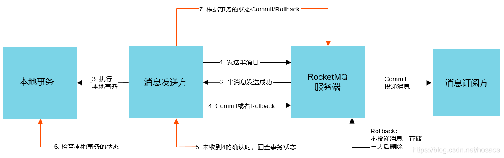

# 一、事务消息

## 1.1 基本实现

基本生产者例子

```java
package org.apache.rocketmq.example.transaction;
public class TransactionProducer {

    public static void main(String[] args) throws MQClientException, InterruptedException {
        TransactionListener transactionListener = new TransactionListenerImpl();
        TransactionMQProducer producer = new TransactionMQProducer("TransactionProducerGroup");
        ExecutorService executorService = new ThreadPoolExecutor(
            2, 5, 100, TimeUnit.SECONDS,
            new ArrayBlockingQueue<>(2000), r -> {
            Thread thread = new Thread(r);
            thread.setName("client-transaction-msg-check-thread");
            return thread;
        });

        producer.setExecutorService(executorService);
        producer.setTransactionListener(transactionListener);
        producer.setNamesrvAddr("192.168.67.2:9876");
        producer.start();

        String[] tags = new String[]{"TagA", "TagB", "TagC", "TagD", "TagE"};
        for (int i = 0; i < 10; i++) {
            try {
                Message msg = new Message("TransactionTopicTest", tags[i % tags.length],
                    "KEY" + i,
                    ("Hello RocketMQ " + i).getBytes(RemotingHelper.DEFAULT_CHARSET));
                SendResult sendResult = producer.sendMessageInTransaction(msg, null);
                System.out.printf("%s%n", sendResult);

                Thread.sleep(10);
            } catch (MQClientException | UnsupportedEncodingException e) {
                e.printStackTrace();
            }
        }

        for (int i = 0; i < 100000; i++) {
            Thread.sleep(1000);
        }
        producer.shutdown();
    }
}
```

TransactionMQProducer继承了DefaultMQProducer，只是多了一个TransactionListener和执行的线程池。启动

```java
// TransactionMQProducer
@Override
public void start() throws MQClientException {
  this.defaultMQProducerImpl.initTransactionEnv();
  super.start();
}
```

这里基本逻辑就是DefaultMQProducer的，上面一步主要是检查是否有传入线程池，如果没有传入，则需要创建一个。下面看其发送逻辑

```java
public TransactionSendResult sendMessageInTransaction(final Message msg,
       final LocalTransactionExecuter localTransactionExecuter, final Object arg)
  throws MQClientException {
  // 事务监听器
  TransactionListener transactionListener = getCheckListener();
  if (null == localTransactionExecuter && null == transactionListener) {
    throw new MQClientException("tranExecutor is null", null);
  }
  Validators.checkMessage(msg, this.defaultMQProducer);

  SendResult sendResult = null;
  // 标识这条消息的属性：TRANSACTION_PREPARED
  MessageAccessor.putProperty(msg, MessageConst.PROPERTY_TRANSACTION_PREPARED, "true");
  MessageAccessor.putProperty(msg, MessageConst.PROPERTY_PRODUCER_GROUP, this.defaultMQProducer.getProducerGroup());
  try {
    // 消息发送
    sendResult = this.send(msg);
  } catch (Exception e) {
    throw new MQClientException("send message Exception", e);
  }

  LocalTransactionState localTransactionState = LocalTransactionState.UNKNOW;
  Throwable localException = null;
  switch (sendResult.getSendStatus()) {
    case SEND_OK: {
      try {
        // 回填事务id
        if (sendResult.getTransactionId() != null) {
          msg.putUserProperty("__transactionId__", sendResult.getTransactionId());
        }
        String transactionId = msg.getProperty(MessageConst.PROPERTY_UNIQ_CLIENT_MESSAGE_ID_KEYIDX);
        if (null != transactionId && !"".equals(transactionId)) {
          msg.setTransactionId(transactionId);
        }
        // 执行本地事务
        if (null != localTransactionExecuter) {
          localTransactionState = localTransactionExecuter.executeLocalTransactionBranch(msg, arg);
        } else if (transactionListener != null) {
          log.debug("Used new transaction API");
          localTransactionState = transactionListener.executeLocalTransaction(msg, arg);
        }
        if (null == localTransactionState) {
          localTransactionState = LocalTransactionState.UNKNOW;
        }

        if (localTransactionState != LocalTransactionState.COMMIT_MESSAGE) {
          log.info("executeLocalTransactionBranch return {}", localTransactionState);
          log.info(msg.toString());
        }
      } catch (Throwable e) {
        log.info("executeLocalTransactionBranch exception", e);
        log.info(msg.toString());
        localException = e;
      }
    }
      break;
    case FLUSH_DISK_TIMEOUT:
    case FLUSH_SLAVE_TIMEOUT:
    case SLAVE_NOT_AVAILABLE:
      localTransactionState = LocalTransactionState.ROLLBACK_MESSAGE;
      break;
    default:
      break;
  }

  try {
    //
    this.endTransaction(sendResult, localTransactionState, localException);
  } catch (Exception e) {
    log.warn("local transaction execute " + localTransactionState + ", but end broker transaction failed", e);
  }

  TransactionSendResult transactionSendResult = new TransactionSendResult();
  transactionSendResult.setSendStatus(sendResult.getSendStatus());
  transactionSendResult.setMessageQueue(sendResult.getMessageQueue());
  transactionSendResult.setMsgId(sendResult.getMsgId());
  transactionSendResult.setQueueOffset(sendResult.getQueueOffset());
  transactionSendResult.setTransactionId(sendResult.getTransactionId());
  transactionSendResult.setLocalTransactionState(localTransactionState);
  return transactionSendResult;
}
```

基本流程就是

* 将相关事务id和消息唯一id存入到消息中
* 发送消息
* 处理本地事务
* 返回事务结果

这里先看发送消息，基本流程和非事务消息差别不大，主要是消息属性标识为了事务消息

```java
// DefualtMQProducerImpl#sendKernelImpl
// 事务消息设置
final String tranMsg = msg.getProperty(MessageConst.PROPERTY_TRANSACTION_PREPARED);
if (tranMsg != null && Boolean.parseBoolean(tranMsg)) {
  sysFlag |= MessageSysFlag.TRANSACTION_PREPARED_TYPE;
}
```

再看broker端收到消息的处理逻辑

```java
// SendMessageProcessor#sendMessage
PutMessageResult putMessageResult = null;
Map<String, String> oriProps = MessageDecoder.string2messageProperties(requestHeader.getProperties());
// 这里表明消息是prepared状态
String traFlag = oriProps.get(MessageConst.PROPERTY_TRANSACTION_PREPARED);
if (traFlag != null && Boolean.parseBoolean(traFlag)) {
  if (this.brokerController.getBrokerConfig().isRejectTransactionMessage()) {
    response.setCode(ResponseCode.NO_PERMISSION);
    response.setRemark(
      "the broker[" + this.brokerController.getBrokerConfig().getBrokerIP1()
      + "] sending transaction message is forbidden");
    return response;
  }
  putMessageResult = this.brokerController.getTransactionalMessageService().prepareMessage(msgInner);
} else {
  // 消息存储
  putMessageResult = this.brokerController.getMessageStore().putMessage(msgInner);
}
return handlePutMessageResult(putMessageResult, response, request, msgInner, responseHeader, sendMessageContext, ctx, queueIdInt);
```

这里判断是否是事务消息，然后进行处理

```java
// TransactionalMessageServiceImpl
@Override
public PutMessageResult prepareMessage(MessageExtBrokerInner messageInner) {
  return transactionalMessageBridge.putHalfMessage(messageInner);
}
// TransactionalMessageBridge
public PutMessageResult putHalfMessage(MessageExtBrokerInner messageInner) {
  return store.putMessage(parseHalfMessageInner(messageInner));
}
private MessageExtBrokerInner parseHalfMessageInner(MessageExtBrokerInner msgInner) {
  // 将原topic和原queueId存入到属性中
  MessageAccessor.putProperty(msgInner, MessageConst.PROPERTY_REAL_TOPIC, msgInner.getTopic());
  MessageAccessor.putProperty(msgInner, MessageConst.PROPERTY_REAL_QUEUE_ID,
                              String.valueOf(msgInner.getQueueId()));
  msgInner.setSysFlag(
    MessageSysFlag.resetTransactionValue(msgInner.getSysFlag(), MessageSysFlag.TRANSACTION_NOT_TYPE));
  // 构建新的topic：RMQ_SYS_TRANS_HALF_TOPIC和queueId：0
  msgInner.setTopic(TransactionalMessageUtil.buildHalfTopic());
  msgInner.setQueueId(0);
  msgInner.setPropertiesString(MessageDecoder.messageProperties2String(msgInner.getProperties()));
  return msgInner;
}
```

后面再将消息持久化到broker上（这里由于topic和queueId都不是原来的，所以也不能直接被原消费者消费。当然了，肯定是会有一个专门的定时任务[`TransactionalMessageService`]来处理这类消息的，这和定时消息是一个道理），返回结果。然后执行本地事务，

```java
localTransactionState = transactionListener.executeLocalTransaction(msg, arg);
```

并且返回本地事务状态为LocalTransactionState，枚举值如下：

- COMMIT_MESSAGE,
- ROLLBACK_MESSAGE,
- UNKNOW

注意：`TransactionListener#executeLocalTransaction`是在发送者成功发送PREPARED消息后，会执行本地事务方法，然后返回本地事务状态；如果PREPARED消息发送失败，则不会调用`TransactionListener#executeLocalTransaction`，并且本地事务消息，设置为`LocalTransactionState.ROLLBACK_MESSAGE`，表示消息需要被回滚。

```java
// DefaultMQProducerImpl#sendMessageInTransaction
try {
this.endTransaction(sendResult, localTransactionState, localException);
} catch (Exception e) {
log.warn("local transaction execute " + localTransactionState + ", but end broker transaction failed", e);
}

// DefaultMQProducerImpl#endTransaction
EndTransactionRequestHeader requestHeader = new EndTransactionRequestHeader();
requestHeader.setTransactionId(transactionId);
requestHeader.setCommitLogOffset(id.getOffset());
switch (localTransactionState) {
    case COMMIT_MESSAGE:
         requestHeader.setCommitOrRollback(MessageSysFlag.TRANSACTION_COMMIT_TYPE);
         break;
    case ROLLBACK_MESSAGE:
         requestHeader.setCommitOrRollback(MessageSysFlag.TRANSACTION_ROLLBACK_TYPE);
         break;
     case UNKNOW:
         requestHeader.setCommitOrRollback(MessageSysFlag.TRANSACTION_NOT_TYPE);
         break;
     default:
         break;
}
requestHeader.setProducerGroup(this.defaultMQProducer.getProducerGroup());
requestHeader.setTranStateTableOffset(sendResult.getQueueOffset());
requestHeader.setMsgId(sendResult.getMsgId());

String remark = localException != null ? ("executeLocalTransactionBranch exception: " + localException.toString()) : null;
this.mQClientFactory.getMQClientAPIImpl().endTransactionOneway(brokerAddr, requestHeader, remark, this.defaultMQProducer.getSendMsgTimeout());
```

这里根据不同情况设置不同的请求命令，只调用一次，不重试

```java
public void endTransactionOneway(
        final String addr,
        final EndTransactionRequestHeader requestHeader,
        final String remark,
        final long timeoutMillis
) throws RemotingException, MQBrokerException, InterruptedException {
  RemotingCommand request = RemotingCommand.createRequestCommand(RequestCode.END_TRANSACTION, requestHeader);

  request.setRemark(remark);
  this.remotingClient.invokeOneway(addr, request, timeoutMillis);
}
```

也就是说先发送到broker存储起来，然后根据结果执行相关逻辑。这里发送的命令为END_TRANSACTION。其实相当于这里处理来一半。broker在收到此命令请求后使用EndTransactionProcessor来处理

```java
public RemotingCommand processRequest(ChannelHandlerContext ctx, RemotingCommand request) throws
  RemotingCommandException {
  final RemotingCommand response = RemotingCommand.createResponseCommand(null);
  final EndTransactionRequestHeader requestHeader =
    (EndTransactionRequestHeader)request.decodeCommandCustomHeader(EndTransactionRequestHeader.class);
  LOGGER.info("Transaction request:{}", requestHeader);
  // slave不支持此类请求 RequestCode.END_TRANSACTION
  if (BrokerRole.SLAVE == brokerController.getMessageStoreConfig().getBrokerRole()) {
    response.setCode(ResponseCode.SLAVE_NOT_AVAILABLE);
    LOGGER.warn("Message store is slave mode, so end transaction is forbidden. ");
    return response;
  }
  OperationResult result = new OperationResult();
  // 提交
  if (MessageSysFlag.TRANSACTION_COMMIT_TYPE == requestHeader.getCommitOrRollback()) {
    result = this.brokerController.getTransactionalMessageService().commitMessage(requestHeader);
    if (result.getResponseCode() == ResponseCode.SUCCESS) {
      RemotingCommand res = checkPrepareMessage(result.getPrepareMessage(), requestHeader);
      if (res.getCode() == ResponseCode.SUCCESS) {
        // 恢复原始消息
        MessageExtBrokerInner msgInner = endMessageTransaction(result.getPrepareMessage());
        msgInner.setSysFlag(MessageSysFlag.resetTransactionValue(msgInner.getSysFlag(), requestHeader.getCommitOrRollback()));
        msgInner.setQueueOffset(requestHeader.getTranStateTableOffset());
        msgInner.setPreparedTransactionOffset(requestHeader.getCommitLogOffset());
        msgInner.setStoreTimestamp(result.getPrepareMessage().getStoreTimestamp());
        // 重新把消息存入，以便消费端消费
        RemotingCommand sendResult = sendFinalMessage(msgInner);
        if (sendResult.getCode() == ResponseCode.SUCCESS) {
         this.brokerController.getTransactionalMessageService()
           .deletePrepareMessage(result.getPrepareMessage());
        }
        return sendResult;
      }
      return res;
    }
  } else if (MessageSysFlag.TRANSACTION_ROLLBACK_TYPE == requestHeader.getCommitOrRollback()) {
    // 回滚
    result = this.brokerController.getTransactionalMessageService()
      .rollbackMessage(requestHeader);
    if (result.getResponseCode() == ResponseCode.SUCCESS) {
      RemotingCommand res = checkPrepareMessage(result.getPrepareMessage(), requestHeader);
      if (res.getCode() == ResponseCode.SUCCESS) {
        // 直接将事务消息删除
        this.brokerController.getTransactionalMessageService()
          .deletePrepareMessage(result.getPrepareMessage());
      }
      return res;
    }
  }
  response.setCode(result.getResponseCode());
  response.setRemark(result.getResponseRemark());
  return response;
}
```

现在就很清楚了，首先将原始消息变换为事务消息存入，成功后执行本地事务，如果本地事务执行成功，再恢复原始消息供消费者消费。

事务消息存储在消息服务器时主题被替换为`RMQ_SYS_TRANS_HALF_ TOPIC`，执行完本地事务返回本地事务状态为 `UN_KNOW` 时，结束事务时将不做任何处理， 而是通过事务状态定时回查以期得到发送端明确的 事务操作(提交事务或 回滚事务) 。

同时假如 Client 执行本地事务，运行时间过长，或者发送了 `COMMIT` 消息或者 `ROLLBACK` 消息，但是这条消息由于网络原因等没有到达 Server 端，那么可能会导致出于 `PREPARED` 的消息越来越多。因此 Broker 会在后台定期给 Client 发送**检查事务状态**的消息。

RocketMQ 通过 TransactionalMessageCheckService 线程定时去检测 `RMQ_SYS_TRANS_HALF TOPIC` 主题中的消息，回查消息的事务状态 。 TransactionalMessageCheckService 的检测频率默认为一分钟，可通过在 broker.conf文件中设置 `transactionChecklnterval`来改变默认值，单位为毫秒 。

```java
public class TransactionalMessageCheckService extends ServiceThread {
  @Override
  public void run() {
    long checkInterval = brokerController.getBrokerConfig().getTransactionCheckInterval();
    while (!this.isStopped()) {
      this.waitForRunning(checkInterval);
    }
  }
  @Override
  protected void onWaitEnd() {
    long timeout = brokerController.getBrokerConfig().getTransactionTimeOut();
		// 最多检查多少次：15
    int checkMax = brokerController.getBrokerConfig().getTransactionCheckMax();
    // 检查事务状态
    this.brokerController.getTransactionalMessageService().check(timeout, checkMax,     
               this.brokerController.getTransactionalMessageCheckListener());
  }
}
```

这里先插入一点，broker其实是将自己作为一个客户端去订阅消费 `RMQ_SYS_TRANS_OP_HALF_TOPIC` 话题中的消息。那如何知道什么时候消费或者说从哪里开始消费呢？这也就是通过上面的服务循环进行检查来实现的。

下面看一下检查的逻辑TransactionalMessageCheckService#check

```java
public void check(long transactionTimeout, int transactionCheckMax,
                  AbstractTransactionalMessageCheckListener listener) {
  try {
    // RMQ_SYS_TRANS_HALF_TOPIC：prepare消息的主题，事务消息首先进入该主题
    // RMQ_SYS_TRANS_OP_HALF_TOPIC：当消息服务器收到事务消息的提交或回滚
    // 请求后，会将消息存储在该主题下
    String topic = MixAll.RMQ_SYS_TRANS_HALF_TOPIC;
    // 获取所有事务消息
    Set<MessageQueue> msgQueues = transactionalMessageBridge.fetchMessageQueues(topic);
    if (msgQueues == null || msgQueues.size() == 0) {
      log.warn("The queue of topic is empty :" + topic);
      return;
    }
    log.debug("Check topic={}, queues={}", topic, msgQueues);
    for (MessageQueue messageQueue : msgQueues) {
      long startTime = System.currentTimeMillis();
      // 拿到对应opQueue
      MessageQueue opQueue = getOpQueue(messageQueue);
      // 获取prepare消息的起始偏移量，这个偏移量起始是存储config/consumerOffset.json中
      // 基本格式就是"offsetTable":{"RMQ_SYS_TRANS_HALF_TOPIC@CID_RMQ_SYS_TRANS":{0:9}}
      long halfOffset = transactionalMessageBridge.fetchConsumeOffset(messageQueue);
      // 已处理消息，这里是去获取已处理消息的offset
      long opOffset = transactionalMessageBridge.fetchConsumeOffset(opQueue);
      log.info("Before check, the queue={} msgOffset={} opOffset={}", messageQueue, halfOffset, opOffset);
      if (halfOffset < 0 || opOffset < 0) {
        log.error("MessageQueue: {} illegal offset read: {}, op offset: {},skip this queue", messageQueue,halfOffset, opOffset);
        continue;
      }

      List<Long> doneOpOffset = new ArrayList<>();
      HashMap<Long, Long> removeMap = new HashMap<>();
      // 根据当前进度依次从已处理队列拉取32条消息，方便判断当前处理的消息是否已经处理过
      // 如果处理过则无须再次发送事务状态回查请求
      PullResult pullResult = fillOpRemoveMap(removeMap, opQueue, opOffset, halfOffset, doneOpOffset);
      if (null == pullResult) {
        log.error("The queue={} check msgOffset={} with opOffset={} failed, pullResult is null", messageQueue, halfOffset, opOffset);
        continue;
      }
      // single thread
      int getMessageNullCount = 1;
      long newOffset = halfOffset;
      long i = halfOffset;
      while (true) {......}
      if (newOffset != halfOffset) {
        transactionalMessageBridge.updateConsumeOffset(messageQueue, newOffset);
      }
      long newOpOffset = calculateOpOffset(doneOpOffset, opOffset);
      if (newOpOffset != opOffset) {
        transactionalMessageBridge.updateConsumeOffset(opQueue, newOpOffset);
      }
    }
  } catch (Exception e) {
    e.printStackTrace();
    log.error("Check error", e);
  }
}
```

这里首先会获取所有prepare类型的半消息（topic：RMQ_SYS_TRANS_HALF_TOPIC）队列，然后循环处理。循环处理时首先根据某个半消息队列获取对应的所有的opQueue。

> 这里首次查询的时候opQueue应该是空的，创建一个，然后将其存入到opQueueMap，key：半消息messageQueue，value：opQueue

获取半消息队列halfQueueOffset和opQueueOffset，如果这两个偏移量有其中一个小于0表明非法，不处理，跳过。其实每次消息处理的进度都会保存在`config/consumeOffset.json`中。

根据上面的偏移拉取32条op消息，

* RMQ SYS_TRANS_HALF_TOPIC: prepare消息的主题，事务消息首先进入到该主题。 
* RMQ_SYS_TRANS_OP_HALF_TOPIC : 当消息服务器收到事务消息的提交或因滚请求后， 会将消息存储在该主题下

```java
// TransactionalMessageCheckService#check
PullResult pullResult = fillOpRemoveMap(removeMap, opQueue, opOffset, halfOffset, doneOpOffset);

private PullResult fillOpRemoveMap(HashMap<Long, Long> removeMap,
   MessageQueue opQueue, long pullOffsetOfOp, long miniOffset, List<Long> doneOpOffset) {
  // 拉取32条消息
  PullResult pullResult = pullOpMsg(opQueue, pullOffsetOfOp, 32);
  if (null == pullResult) {
    return null;
  }
  List<MessageExt> opMsg = pullResult.getMsgFoundList();
  if (opMsg == null) {
    log.warn("The miss op offset={} in queue={} is empty, pullResult={}", pullOffsetOfOp, opQueue, pullResult);
    return pullResult;
  }
  for (MessageExt opMessageExt : opMsg) {
    // 这里取出来的是half queue offset
    Long queueOffset = getLong(new String(opMessageExt.getBody(), TransactionalMessageUtil.charset));
    log.info("Topic: {} tags: {}, OpOffset: {}, HalfOffset: {}", opMessageExt.getTopic(),
             opMessageExt.getTags(), opMessageExt.getQueueOffset(), queueOffset);
    // 已打标的消息，都是要删除的半消息
    if (TransactionalMessageUtil.REMOVETAG.equals(opMessageExt.getTags())) {
      // 如果当前half offset小于最小的half offset，那么表明此消息已处理完毕，防止重复处理
      // 处理完待删除的op消息
      if (queueOffset < miniOffset) {
        doneOpOffset.add(opMessageExt.getQueueOffset());
      } else {
        // 否则存入removeMap,key:halfQueueOffset,value:opQueueOffset
        // 消息已处理过
        removeMap.put(queueOffset, opMessageExt.getQueueOffset());
      }
    } else {
      log.error("Found a illegal tag in opMessageExt= {} ", opMessageExt);
    }
  }
  return pullResult;
}
```

这里的主要功能就是判断消息是否已经处理过了，避免重复处理。正常情况下本地事务处理完成之后client会通知broker处理状态，然后由broker进行处理。但是如果出现一些异常情况，这个通知没有到达broker，那么这里检查过后broker是会回查client消息处理状态的。**对于最后一段逻辑有点迷惑，处理过的消息都会打上tag，但是为什么会区分为“处理过，待删除”和“处理过”两种状态呢？这样的区分有啥作用？而且如果消费进度比最小的offset都小肯定是已经处理过的，但是为啥反过来也是处理过的？**

检查过后继续处理

```java
while (true) {
  // 事务消息状态回查，每次不超过一分钟
  if (System.currentTimeMillis() - startTime > MAX_PROCESS_TIME_LIMIT) {
    log.info("Queue={} process time reach max={}", messageQueue, MAX_PROCESS_TIME_LIMIT);
    break;
  }
  // 已经处理过，跳过
  if (removeMap.containsKey(i)) {
    log.info("Half offset {} has been committed/rolled back", i);
    removeMap.remove(i);
  } else {
    GetResult getResult = getHalfMsg(messageQueue, i);
    MessageExt msgExt = getResult.getMsg();
    if (msgExt == null) {
      if (getMessageNullCount++ > MAX_RETRY_COUNT_WHEN_HALF_NULL) {
        break;
      }
    }
    // 超过15次丢弃,或者消息过期来（超过来设置的文件保存时间:3天）
    if (needDiscard(msgExt, transactionCheckMax) || needSkip(msgExt)) {
      listener.resolveDiscardMsg(msgExt);
      newOffset = i + 1;
      i++;
      continue;
    }
    if (msgExt.getStoreTimestamp() >= startTime) {
      log.debug("Fresh stored. the miss offset={}, check it later, store={}", i,
                new Date(msgExt.getStoreTimestamp()));
      break;
    }
    List<MessageExt> opMsg = pullResult.getMsgFoundList();
    // 判断是否超过了transactionTimeout
    boolean isNeedCheck = (opMsg == null && valueOfCurrentMinusBorn > checkImmunityTime)
      || (opMsg != null && (opMsg.get(opMsg.size() - 1).getBornTimestamp() - startTime > transactionTimeout))
      || (valueOfCurrentMinusBorn <= -1);

    if (isNeedCheck) {
      // 这里就是将消息重新拷贝一份追加到MappedFile末尾
      if (!putBackHalfMsgQueue(msgExt, i)) {
        continue;
      }
      // 发送检查事务状态的请求
      listener.resolveHalfMsg(msgExt);
    } else {
      // 超时了也就不用处理了
      pullResult = fillOpRemoveMap(removeMap, opQueue, pullResult.getNextBeginOffset(), halfOffset, doneOpOffset);
      log.info("The miss offset:{} in messageQueue:{} need to get more opMsg, result is:{}", i,messageQueue, pullResult);
      continue;
    }
  }
  newOffset = i + 1;
  i++;
}
```

这里有几个检查点

- 首先对于 `while (true)` 的时间设定了限制，不能超过 `MAX_PROCESS_TIME_LIMIT` 这个值。
- 其次，`needDiscard()` 这个方法检查的就是从消息的 `MessageConst.PROPERTY_TRANSACTION_CHECK_TIMES` 属性中，获取到这个消息已经检查了多少次，如果超过 `transactionCheckMax`，那么就需要丢弃。
- `needSkip()` 函数判断的是这条消息自诞生以来，在 Broker 端放置的时间是否超过了 3 天，如果超过 3 天，这条消息也没有必要检查了，因为 RocketMQ 默认存储消息的最长时间就是 3 天。
- `isNeedCheck` 看的主要就是消息诞生的时间是否超过了 `transactionTimeout`。
- `putBackHalfMsgQueue` 主要就是将当前的消息，最新修改的属性等，重新拷贝一份，然后将**新的消息**追加到 `MappedFile` 的末尾。
- `resolveHalfMsg` 就是在线程池中执行发送检查事务状态的任务：

```java
public void resolveHalfMsg(final MessageExt msgExt) {
    executorService.execute(new Runnable() {
        @Override
        public void run() {
            try {
                sendCheckMessage(msgExt);
            } catch (Exception e) {
                LOGGER.error("Send check message error!", e);
            }
        }
    });
}
```

这里就是broker发送 `CHECK_TRANSACTION_STATE` 报文给 Client，完事之后更新本地处理进度。

而client也会对此命令进行处理

```java
public class ClientRemotingProcessor extends AsyncNettyRequestProcessor implements NettyRequestProcessor {
    @Override
    public RemotingCommand processRequest(ChannelHandlerContext ctx,
        RemotingCommand request) throws RemotingCommandException {
        switch (request.getCode()) {
            case RequestCode.CHECK_TRANSACTION_STATE:
                return this.checkTransactionState(ctx, request);
        }
    }
}
```

其实就是解析出相关事务消息信息，检查本地事务的状态，反馈给broker。整体流程如下




# ACK权限控制

RocketMQ 从 4.4.0 版本引入了 ACL 权限控制功能。**可以给话题指定权限，只有拥有权限的消费者才可以进行消费**。其余 ACL 特性请查看[权限控制](https://github.com/apache/rocketmq/blob/develop/docs/cn/acl/user_guide.md)。


